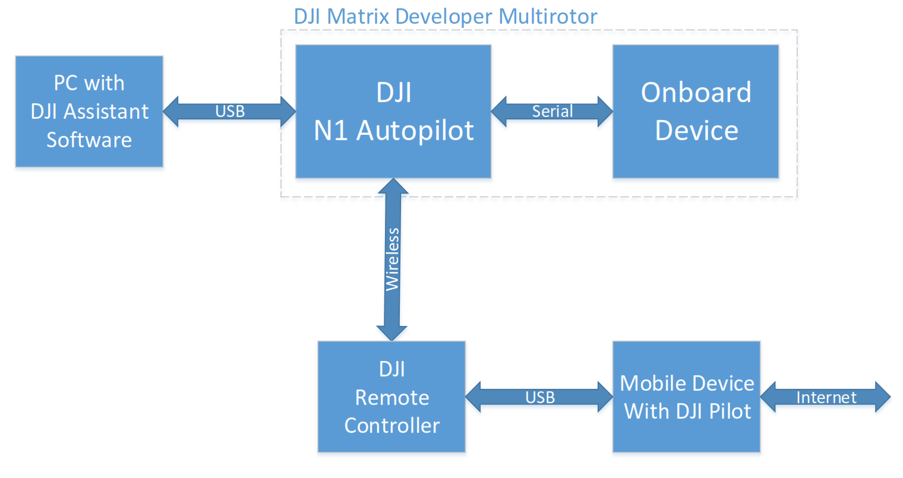
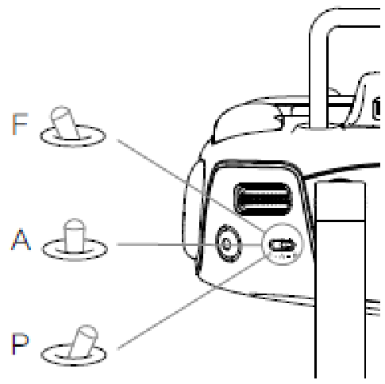

#DJI Onboard API Document 

last update: 07/28/2015

*In case of any mistake or bug, please report to us using Github issue or DJI forum or email. You are welcome to send your pull request helping us fix issue. However, all pull requests related to document must follow the [document style](https://github.com/dji-sdk/onboard/issues/8#issuecomment-115976289)*
<br>
<br>

---
DJI offers two powerful APIs for developers to create custom applications: the Mobile Device API, and the UAV Onboard API. The Mobile Device API is part of the DJI Mobile SDK and lets developers monitor and control the UAV from a mobile device running iOS or Android that is connected to the remote controller. The UAV Onboard API allows developers to monitor and control the UAV from any wired connected system through the serial (UART) interface. 

This document introduces the onboard API. It consists of two parts. A quick start gives introduction to the main components of the onboard API, and a programming guide describes all development related information.  

---

##Content

+ Quick Start
  + Introduction
    + Key Features of Onboard API
    + General System Description
    + Remote Controller, Onboard API & Mobile API
    + Command Authorization Levels
  + [ROS based] Wireless control of DJI MATRICE 100
    + Hardware Checklist
    + Software Checklist
    + Setup Steps
+ Onboard API Programming Guide
  1. Protocol Description
    1. Protocol Frame Format
    2. Protocol Frame Explanation
    3. Protocol Data Field Explanation
    4. Session
    5. API Example
  2. Command Set Explanation
    1. Command Set and Authorization Level
    2. Command Sets
  3. Additional Explanation for Flight Control
    1. Explanation of Coordinate Frames
    2. Explanation of control mode flag

---

##Quick Start

In the quick start, we first introduce the onboard API and explain some terminology. Then a sample code is used to demonstrate key steps to get started. 

<br>
### Introduction

DJI MATRICE 100 is a specially designed quadrotor UAV that has a wide dock to put various equipment onboard. Its detachable battery compartment, expansion bars, expansion bays and extra XT60 power ports give developer great convenience to design a compact UAV application system. DJI Onboard API is for developers who want to directly control MATRICE 100 via a serial interface.  

<br>
#### Key Features of Onboard API

+ Reliable Communication

  Session-based link protocol to prevent package loss with 32-bit CRC.
  
+ Flexible Control Inputs

  Different control methods including position, velocity and attitude control.
  
+ Configurable Monitoring Data

  Flight data can be obtained with configurable number of items and frequency.
  
+ Autonomous Application Oriented

  Flight mode control and flight data are designed to aid autonomous control and navigation.

<br>  
####General System Description

The core components are MATRICE 100 and a device installed on it. The onboard device connects to the autopilot of MATRICE 100 (N1 Autopilot) by a serial cable. The onboard device can be any small sized computing device that is able to perform serial communication and AES encryption.

DJI N1 PC assistant software can configure MATRICE 100 serial port and upgrade firmware of MATRICE 100. It is a tool similar to other DJI PC-based software. This software is simplified  to have only a few functions that cannot be done by DJI new generation assistant software - DJI Pilot, such as firmware upgrade and serial port configuration.

Due to the safety concern, since onboard API allows developers to implement autonomous UAV systems beyond line-of-sight, DJI has to impose more restricted control registration methods for MATRICE 100. Before using MATRICE 100, a developer must register his personal information on _dev.dji.com_ and then activate his MATRICE 100. DJI Server will provide an APP ID and an AES key to the developer. Most parts of the communication between the onboard device and MATRICE 100 is encrypted by this key, which reaches MATRICE 100 separately during activation progress. The activation and encryption will be explained in detail in the "Active Command Set" section.

Diagram of System Structure:


Diagram of registration and activation process:


An important concept in the activation process is the Device Available Number (DAN). It has following properties:
+ Each APP ID has a DAN, which means the maximum number of autopilots to be activated to support the APP by developer with the same APP ID.
+ By default, DAN is limited to 5 for a new APP ID.
+ When autopilot reaches DJI Server during an activation process, the DAN of the APP ID increases 1. If the DAN equals to the limit, new activation request will not be permitted.
+ Developers should apply on _dev.dji.com_ to increase the limit of DAN of their APP IDs.

<br>
####Remote Controller, Onboard API & Mobile API

DJI Matrice Multirotor is designed to be controlled by Remote Controller (RC), onboard device and mobile device. The standard assistant software “DJI Pilot” for DJI Inspire 1 and Phantom 3 can also be used on the platform. Also DJI Mobile SDK is applicable to the platform, so the platform can be controlled via mobile API (please visit _dev.dji.com_ to learn more about DJI Mobile SDK). Since there are three possible control inputs, it is necessary to prioritize them.  

RC is designed to be the primary input source. It can decide whether the flight control is allowed to grant control authority to onboard device and mobile device or not. The F (stands for function) position of the RC controls the flight controller to enter several functions including IOC and API control mode. The flight controller can enter API control mode if the following settings are done:

1. “enable API control” box is ticked in PC assistant software (See example below for more details).
2. IOC mode is turned off (Use DJI Pilot App to check this setting).
3. RC mode selection bar to F position (see the below figure).

If RC allows the flight controller to enable API control, onboard API and mobile API can request control authority using their API request functions. Mobile API is designed to have higher control priority than onboard API. If mobile API has the control authority, onboard API cannot obtain the control authority.




This document focuses on introducing the onboard API. It assumes mobile API is not used along with onboard API.

**In the current version, hybrid control (using both mobile API and onboard API) is not fully supported.** 

<br>
####Command Authorization Levels

When a developer registers on _dev.dji.com_, an authorization level will be assigned to him according to his programming experience and the application requirements. The developer must save his authorization level (app_api_level) to the onboard device. This app_api_level will be checked during activation process.  

Different authorization levels unlock different commands the developer can use.  

+ Level 0, activation related commands
+ Level 1, monitor and non-flight control, including camera and gimbal control, flight data monitoring. This level does not involve direct control of craft motion.
+ Level 2, flight control. It contains not only motion control, but also some flight mode changing control commands. 

In future onboard API, we will release more commands with different authorization levels. 
 
<br>
###[ROS based] Wireless control of DJI MATRICE 100 

This example uses sample code `dji_keyboard_ctrl` to control MATRICE 100 remotely. The code is based on ROS package `keyboardteleopjs`. We have created a simple HTML GUI to make developers familiar with controlling MATRICE 100 using keyboard and mouse.  
 
<br>
####Hardware Checklist

1. DJI Matrice Developer Multirotor MATRICE 100
2. DJI serial cable (included in the MATRICE 100 accessories)
3. [DuPont line](http://miniimg.rightinthebox.com/images/384x384/201211/mfbiot1354248218185.jpg) 10-20pcs (can be purchased from any electronic components distributor)
4. [433(434)](http://www.seeedstudio.com/depot/434Mhz-Wireless-Serial-Transceiver-Module-40-Meters-p-1732.html) wireless serial transceiver module 2pcs 
5. [USB to TTL](http://www.adafruit.com/product/954) serial cable 1pc <br>
**Note**: PL2303 driver is needed to use the USB to TTL serial cable on Windows/Mac. 
6. [5V DC-DC Converter](http://www.adafruit.com/products/1385) <br>
**Note**:  MATRICE 100 does not provide 5V power, so the serial transceiver module must be powered with external DC-DC converter. 

<br>
####Software Checklist

1. Windows PC with DJI N1 PC assistant software.
2. Mobile Device with DJI Pilot (newest version) installed. The device must have Internet access.
3. Linux PC (or embedded device) with Ubuntu 14.04 (or higher) and ROS Indigo (or higher). The sample code is tested on ROS Indigo only.
4. ROS package rosbridge_server 
5. Sample code "dji_sdk" and "dji_keyboard_ctrl"

<br>
####Setup Step

#####Prepare MATRICE 100

Power on MATRICE 100 and connect it to PC. DJI N1 PC assistant software allows users to update firmware and configure MATRICE 100 in order to enable API control mode.

On tab `Basic`, developers can select `enable API control` to enable remote controller and make MATRICE access functions related to API control. Developers may alter the serial baud rate and data package content in `Baud Rate & Message Setting`.


After API control mode enabled, developers can switch to mode selection bar on remote controller into the middle position (F position) to enable API control.

<br>
#####Establish communication link

Configure the 433 transceivers to the baud rate 115200 (different transceivers may have different initialization steps). Connect one transceiver to PC through the USB to TTL cable and the other transceiver to the autopilot of MATRICE using DJI serial cable. Be careful with the transceiver on MATRICE 100, whose power must come from the 5V DC-DC converter and it can draw power from MATRICE 100 battery.

<br>
#####Run sample code

1. Compile ROS package dji_sdk.
2. Start roscore, and then start rosbridge server in a new terminal.

        roslaunch rosbridge_server rosbridge_websocket.launch
3. Use the launch file in the sample code to start dji_sdk_node.

  Following is the sample launch file
  
  ```xml
  <launch>
  <node pkg="dji_sdk" type="dji_sdk_node" name="dji_sdk_node" output="screen">
  <!-- node parameters -->
  <param name="serial_name" type="string" value="/dev/ttySAC0"/> 
  <param name="baud_rate" type="int" value="115200"/>
  <param name="app_id" type="int" value="<!-- your appid -->"/>
  <param name="app_api_level" type="int" value="<!-- your app level -->"/>
  <param name="app_version" type="int" value="<!-- your app version -->"/>
  <param name="app_bundle_id" type="string" value="<!-- your app bundle id ->"/>
  <param name="enc_key" type="string" value="<!-- your app enc key -->"/> 
  </node>
  </launch> 
  ```
 The node parameters are:
 
 |Name|Type|Explanation|
 |----|----|-----------|
 |serial_name|String|Serial device's name. Usually it looks like `/dev/ttyUSBx` but different Linux Distribution may have different device name. `ls /dev/` and `dmesg | tail` commands can be used to identify the device name.|
 |baud_rate|Int|The serial port baud rate. It must be the same as the one in MATRICE 100's configuration.|
 |app_id|Int|The APP ID assigned by _dev.dji.com_ server to developer when registration.|
 |app_api_level|Int|The APP API control level assigned by _dev.dji.com_ server to developer when registration.|
 |app_version|Int|Developer assigned application version|
 |app_bundle_id|String|The APP bundle ID assigned by _dev.dji.com_ server to developer when registration.|
 |enc_key|String|The encryption key assigned by dev.dji.com server to developer when registration.|
 
 **Note: This command must be run as root. (i.e. `sudo su` first).**
     
      sudo su
      roslaunch dji_sdk sdk_demo.launch

4. Edit `sdk_keyboard_demo.html`. Change the address in the URL to the Linux machine hostname, localhost/127.0.0.1 when single machine and the LAN IP when running ROS multi-machine.

    ```c
    function init() {
      // Connecting to ROS.
      var ros = new ROSLIB.Ros({
      url: 'ws://127.0.0.1:9090'
      });
    } 
    ```

5. Open `sdk_keyboard_demo.html` in web browser. `rosbridge_server` will print log showing new client connected. If not, please check your connection settings in step 4. After the html page is connected to `rosbridge_server`, the web GUI will display flight status and it is also possible to check flight status directly by `rostopic`.

<br>
#####Test communication link
On the web GUI, click button `Activation`. If the communication link is ready to use, MATRICE 100 will acknowledge the GUI. If not, please debug your transceivers and MATRICE 100 settings.

<br>
#####Activate MATRICE 100 to use API
Using DJI Pilot APP to connect the mobile device with the remote controller of MATRICE 100 and make sure the mobile device has Internet access. Then the activation process will be executed automatically after clicking the `Activation` button.

<br>
#####Control MATRICE 100
The web GUI has control buttons as shown below. Moreover, key `W`,`A`,`S`,`D` allows MATRICE move horizontally, `Z`, `C` changes vertical velocity and `Q`,`E` controls yaw movement. Developers can try these functionalities via web GUI but please make sure you have enough testing space first.

The horizontal movement is controlled by angle command associated with button `W`,`A`,`S`,`D`. The angular speed is `5*speed_level`. `speed_level` is an inner variable with default value 1. The value can be changed using key `123456`. Be careful when you are working with high angular speed, MATRICE 100 will accelerate quickly.


<br>
#####Safety Flight

MATRICE 100 only responses to serial control command when the remote controller’s mode selection bar is at its middle position (F position).  Anytime when user switches the mode away from F position, the API control mode is turned off. We recommend two developers work together during the testing. One developer controls the web GUI, while the other developer hold the remote controller for emergency use.  
If the user wants to switch back to F position and reenter the API mode, onboard application does not need to send control request again to get control authority. If the mode selection bar is already at F position when MATRICE 100 is powered on, then user must switch back and forth to enable API control mode. This mechanism can prevent MATRICE 100 from executing automatic applications without user permission.  
 
---
<br>
## Onboard API Programming Guide

This part discusses the protocol programming when communicating with MATRICE 100.
We recommend developers follow quick start first to run our sample code before reading this programming guide.

<br>
### Protocol Description

#### Protocol Frame Format
   ```
   |<--------------Protocol Frame Header---------------->|<--Protocol Frame Data-->|<--Protocol Frame Checksum-->|
   |SOF|LEN|VER|SESSION|A|RES0|PADDING|ENC|RES1|SEQ|CRC16|          DATA           |            CRC32            |
   ```
 
<br> 
#### Protocol Frame Explanation
<table>
<tr>
  <th>Field</th>
  <th>Byte Index</th>
  <th>Size(bit)</th>
  <th>Description</th>
</tr>

<tr>
  <td>SOF</td>
  <td>0</td>
  <td>8</td>
  <td>Frame start byte, fixed to be 0xAA</td>
</tr>

<tr>
  <td>LEN</td>
  <td rowspan="2">1</td>
  <td>10</td>
  <td>Frame length, maximum length is 1023 (12+1007+4) bytes</td>
</tr>

<tr>
  <td>VER</td>
  <td>6</td>
  <td>Version of the protocol</td>
</tr>

<tr>
  <td>SESSION</td>
  <td rowspan="3">3</td>
  <td>5</td>
  <td>The session ID used during communication</td>
</tr>

<tr>
  <td>A</td>
  <td>1</td>
  <td>Frame Type: <ol start="0"><li>data</li><li>acknowledgement</li></ol></td>
</tr>

<tr>
  <td>RES0</td>
  <td>2</td>
  <td>Reserved bits, fixed to be 0</td>
</tr>

<tr>
  <td>PADDING</td>
  <td rowspan="2">4</td>
  <td>5</td>
  <td>The length of additional data added in link layer. It comes from the encryption process</td>
</tr>

<tr>
  <td>ENC</td>
  <td>3</td>
  <td>Frame data encryption type: <ol start="0"><li>no encryption</li><li>AES encryption</li></ol></td>
</tr>

<tr>
  <td>RES1</td>
  <td>5</td>
  <td>24</td>
  <td>Reserved bits, fixed to be 0</td>
</tr>

<tr>
  <td>SEQ</td>
  <td>8</td>
  <td>16</td>
  <td>Frame sequence number</td>
</tr>

<tr>
  <td>CRC16</td>
  <td>10</td>
  <td>16</td>
  <td>Frame header CRC16 checksum</td>
</tr>

<tr>
  <td>DATA</td>
  <td>12</td>
  <td>---</td>
  <td>Frame data, maximum length 1007 bytes</td>
</tr>

<tr>
  <td>CRC32</td>
  <td>---</td>
  <td>32</td>
  <td>Frame CRC32 checksum</td>
</tr>
</table>

Frame data size varies, 1007 is the maximum length. The index of the CRC32 depends on the length of data field.

<br>
#### Protocol Data Field Explanation

All serial packages exchanged between MATRICE 100 and the onboard device can be classified into three types:
1. Command Package. From the onboard device to MATRICE 100. It mainly contains flight control commands.
2. Message Package. From MATRICE 100 to the onboard device. It contains the autopilot data.
3. Acknowledgement Package (ACK package). From MATRICE 100 to the onboard device. It contains execution results of commands.

<br>
##### Package from the onboard device to MATRICE 100 (Command Package)
```
|<-------Protocol Frame Data------->|
|COMMAND SET|COMMAND ID|COMMAND DATA|
```
|Data Field|Byte Index|Size(byte)|
|----------|----------|----------|
|COMMAND SET|0|1|
|COMMAND ID|1|1|
|COMMAND DATA|2|depends on the exact command|

For the detailed description, please refer to `Command Set Explanation: control commands`

<br>
##### Package from the autopilot to onboard device (Message Package)
```
|<-------Protocol Frame Data------->|
|COMMAND SET|COMMAND ID|COMMAND DATA|
```

|Data Field|Byte Index|Size(byte)|
|----------|----------|----------|
|COMMAND SET|0|1|
|COMMAND ID|1|1|
|COMMAND DATA|2|depends on the exact command|
For the detailed description, please refer to `Command Set Explanation: monitor commands`

<br>
##### Package from the autopilot to onboard device (ACK package)

```
|<-Protocol Frame Data->|
|COMMAND RETURN|ACK DATA|
```

|Data Field|Byte Index|Size(byte)|Description|
|----------|----------|----------|-----------|
|COMMAND RETURN|0|2|The return code of the command result|
|ACK DATA|2|depends on the exact command|Return data|

<br>
#### Session
An important requirement of autonomous control is the communication reliability. We design a "session mechanism" to make sure command packages and ACK packages are exchanged successfully.

When developers compiles a message package in the onboard device program, a session ID should be used depending on the reliability requirement. Different session IDs correspond to different communication channels, i.e. sessions. Onboard API serial link layer has three types of sessions (for brevity, in the following table, we use Sender referring onboard device and Receiver as the autopilot of MATRICE 100).

|Session Mode|SESSION|Description|
|------------|-------|-----------|
|Mode 1|0|Sender do not need acknowledgement|
|Mode 2|1|Sender need acknowledgement, but can tolerate ACK package loss.|
|Mode 3|2-31|Sender wants to make sure the ACK is reliably sent. For these sessions, Receiver saves the sequence number in the command package and send an  ACK package upon receiving it. If ACK package loss happened, Sender may request Receiver again using the same command package with the same sequence number, and Receiver will reply by sending saved acknowledge result. Unless Sender sends a new sequence number, Receiver will not forget the last command acknowledge result|

<br>
#### API Example

Use the following enum to represent the session mode:
```c
enum SESSION_MODE {
  SESSION_MODE1,
  SESSION_MODE2,
  SESSION_MODE3
}
```

And define a callback function to handle the return data of the command:

    typedef void (*CMD_CALLBACK_FUNC)(const void* p_data, unsigned int n_size)

Finally we define 

    unsigned int Linklayer_Send(SESSION_MODE session_mode, const void* p_data, unsigned int n_size, char enc_type, unsigned short ack_timeout, unsigned char retry_time, CMD_CALLBACK_FUNC cmd_callback)

Arguments explained:

|Argument|Description|
|--------|-----------|
|p_data|The start pointer to the datastream|
|n_size|The size of datastream|
|enc_type|Whether this package is encrypted or not|
|ack_timeout|When using session 3, this parameter decides how long to resend command|
|retry_time|When using session 3, this parameter decides how many times to retry|
|cmd_callback|The function pointer to the callback function|

**Note: Here a dummy link layer send interface is defined for demonstration purpose. Since Session Mode 3 is reliable, the communication function interface should contain parameters such as length of timeout and number of resending times.**

<br>
### Command Set Explanation

#### Command Set and Authorization Level

The DJI onboard API has three sets or categories of commands:

|Category|Description|Command Set ID|
|--------|-----------|--------------|
|Activation related|All commands used to activate API|0x00|
|Control related|Commands to control MATRICE 100|0x01|
|Monitoring related|Commands that contains autopilot data|0x02|

Each command set has a unique set ID. All commands belong to one command set have different command ID.

All control commands have an associated authorization level. In the current version, we have set up 5 stable control commands and several unstable commands. All these controls command are level 2 API. In the standard version and future versions, more control commands will be opened up at different authorization levels. A tentative level schedule is shown as follow:

|API Levels|Brief Plan|
|----------|----------|
|0|API activation commands|
|1|Camera and gimbal control commands|
|2|Flight control commands|

<br>
####Command Sets

#####Activation Command Set: 0x00

To activate the API, session ID 2-31 can be used to guarantee ACK packages are returned. All commands in this command set has authorization level 0. Therefore, all users can use these commands to activate MATRICE 100 and debug the connection status. The activation process allows MATRICE 100 to connect to Internet via DJI Pilot and of course a mobile device with Internet access is needed.

<br>
###### Command ID 0x00: Get API version
<table>
<tr>
  <th>Data Type</th>
  <th>Offset</th>
  <th>Size</th>
  <th>Description</th>
</tr>

<tr>
  <td>Request Data</td>
  <td>1</td>
  <td>1</td>
  <td>Arbitrary number</td>
</tr>

<tr>
  <td rowspan="3">Return Data</td>
  <td>0</td>
  <td>2</td>
  <td>Return Code</td>
</tr>

<tr>
  <td>2</td>
  <td>4</td>
  <td>The CRC code of version string</td>
</tr>

<tr>
  <td>6</td>
  <td>32</td>
  <td>SDK version string</td>
</tr>
</table>


Recommended receiving C/C++ struct
```c
typedef struct {
  unsigned short version_ack;
  unsigned int varsion_crc;
  signed char version_number[32];
} version_query_data_t;
```

Set the callback function of getting API version be:
```c
void print_sdk_version(const void* p_data, unsigned int n_size) {
  version_quesry_data_t* p_version = (version_query_data_t*)p_data;
  if (p_version->version_ack == 0) {
    printf("%s\n",p_version->version_name);
  }
}
```

To send getting API version package, we can use the following code:
```c
unsigned char cmd_buf[3];
cmd_buf[0] = 0x00; //command set
cmd_buf[1] = 0x00; //command id
cmd+buf[2] = 0x00; //command data, an arbitrary number as said above
Linklayer_Send(SESSION_MODE3,
                cmd_buf,
                3,
                0,
                200.
                3,
                print_sdk_version
};
```  

Session Mode 3 is used to get API version. After the autopilot receives request and responses, function print\_sdk\_version will executed and print the version information:

    SDK vX.X XXXX

<br>
###### Command ID 0x01: Activate API

<table>
<tr>
  <th>Data Type</th>
  <th>Offset</th>
  <th>Size</th>
  <th>Description</th>
</tr>

<tr>
  <td rowspan="4">Request Data</td>
  <td>0</td>
  <td>4</td>
  <td>app_id, a number obtained when user registers as a developer</td>
</tr>

<tr>
  <td>4</td>
  <td>4</td>
  <td>api_level, authorization level</td>
</tr>

<tr>
  <td>8</td>
  <td>4</td>
  <td>app_ver, the version of onboard application</td>
</tr>

<tr>
  <td>12</td>
  <td>32</td>
  <td>bundle_id, the name of the application, set by developer</td>
</tr>

<tr>
  <td>Return Data</td>
  <td>0</td>
  <td>2</td>
  <td>Return code: <ol start="0"><li>Success</li><li>Invalid parameters</li><li>Cannot recognize encrypted package</li><li>Attempt to activate</li><li>DJI Pilot APP no response</li><li>DJI Pilot APP no Internet</li><li>Server rejected activation attempt</li><li>Insufficient authority level</li></ol></td>
</tr>

</table>

<br>
Recommended sending C/C++ struct
```c
typedef __attribute_((__packed__)) struct { //1 byte aligned
  unsigned int app_id;
  unsigned int ap_api_level;
  unsigned int app_ver;
  unsigned char app_bundle_id[32];
} activation_data_t;
```
**Note: All the structs in the document requires 1 byte alignment (for example using `typedef __attribute__((__packed__))` struct. Developers must make sure their structs are 1-byte aligned.**

Recommended receive C/C++ enum data:

```c
enum ErrorCodeForActivatie {
  errActivateSuccess,
  errActivateInvalidParamLength,
  errActivateDataIsEncrypted,
  errActivateNewDevice,
  errActivateDJIAppNotConnected.
  errActivateDJIAppNoInternet,
  errActivateDJIServerReject,
  errActivateLevelError
};
```

Let the API activation callback function be
```c
void activation_callback(const void* p_data, unsigned int n_size) {

}
```

To send API activation package, we can use following code piece:
```c
unsigned char com_buf[46];
activation_data_t activation_request_data;
//USER TODO...
//activation_request_data.app_id        =0x00;
//activation_request_data.app_api_level =0x00;
//activation_request_data.app_ver       =0x00;
//memset(activation_request_data.app_bundle_id,0,32)
cmd_buf[0] = 0x00; //command set
cmd_buf[1] = 0x01; //command id
memcpy((void*)&cmd_buf[2], (void*)&activation_request_data),sizeof(activation_data_t));
Linklayer_Send(SESSION_MODE3,
                cmd_buf,
                46,
                0,
                200,
                3,
                activation_callback
  );
  
```

Session Mode 3 is used to activate API. After the autopilot receives request and responses, function `activation_callback` will be executed, in which developers can check whether API activation is successful or not.

<br>
###### Command ID 0xFE Data Transparent Transmission (from airborne equipment to mobile device)

The downstream bandwidth from airborne equipment to mobile device is around 8KB/s

|Data Type|Offset|Size|Description|
|---------|------|----|-----------|
|Request Data|0|1~100|User defined data|
|Return Data|0|2|Return code 0: success|

```c
char cmd_buf[10];
cmd_buf[0] = 0x00;
cmd_buf[1] = 0xFE;
memcpy(&cmd_buf[2], "Hello!", 7);
Linklayer_Send(SESSION_MODE3,
                cmd_buf,
                9,
                0,
                200,
                3,
                0
);
```

<br>
##### Control Command: Set 0x01

###### Command ID 0x00: Control Authority Request

|Data Type|Offset|Size|Description|
|---------|------|----|-----------|
|Request Data|0|1|<ul><li>1 = request to get control authority</li><li>0 = request to release control authority</li></ul>|
|Return Data|0|2|Return Code <ul><li>0x0001 = successfully released control authority</li><li>0x0002 = successfully obtained control authority</li><li>0x0003 = control authority failed to change</li></ul>

There are three types of control devices:
1. Remote Controller
2. Mobile Device
3. Onboard Device

The control priority is `Remote Controller > Mobile Device > Onboard Device`. Mobile devices connects to MATRICE via mobile API. A similar control authority request command exists in the mobile API command set. Therefore it is possible that when onboard device request control authority through serial API, control authority is already been granted to the mobile application. So according to the priority list, mobile device will fail to obtain control. Besides, mobile API control request can interrupt ongoing onboard API control.

In the current  version, **hybrid control (using both mobile API and onboard API) is not fully supported.** Developer should take care of the priority issue when developing hybrid control application. A monitoring data `CTRL_DEVICE` can be used to check the control authority (see `Monitor Command Set 0x02`).

0x0003 happens when the mode selection bar of the remote controller is not in F position or control authority is already obtained by mobile application.

Set the callback function for obtaining control authority is:
```c
void get_control_callback(const void* p_data, unsigned int n_size) {

}
```

To send control request package, we can use following code piece 
```c
unsigned char cmd_buf[46];
cmd_buf[0] = 0x01; //command set
cmd_buf[1] = 0x00; //command id
cmd_buf[2] = 0x01; //get control
Linklayer_send(SESSION_MODE3,
                cmd_buf,
                3,
                1,
                200,
                3,
                get_control_callback
);
```
Session Mode 3 is used to obtain control. After the autopilot receives request and responses, function `get_control_callback` will be executed, in which developer can check whether control authority is successfully changed or not.

<br>
###### Command ID 0x01-0x02 Flight Mode Control

To control the flight mode of MATRICE 100, onboard device should use two commands to make sure the mode changing control works properly.

Firstly, the command 0x01 should be sent to trigger the mode changing logic:

<table>
<tr>
  <th>Data Type</th>
  <th>Offset</th>
  <th>Size</th>
  <th>Description</th>
</tr>

<tr>
  <td rowspan="2">Request Data</td>
  <td>0</td>
  <td>1</td>
  <td>Command Sequence Number</td>
</tr>

<tr>
  <td>1</td>
  <td>1</td>
  <td>Request mode<ui><li>1 = request go home</li><li>4 = request auto take off</li><li>6 = request auto landing</li></ui></td>
</tr>

<tr>
  <td>Return Data</td>
  <td>0</td>
  <td>1</td>
  <td>Return code<ui><li>0x0001 = the command is received but rejected</li><li>0x0002 = start to execute the command</li></ui></td>
</tr>

</table>

Once MATRICE 100 receive command 0x01, an immediate ACK package contains either `0x0001` "reject" or `0x0002` "start to execute" will be sent. If the autopilot is already executing a flight mode command, a "reject" command is sent. In normal case, after sending the "start to execute" package, the autopilot will try to change its flight mode and making sure the changing is firmly done. The execution result will be saved.

The second command is a query from the onboard device to obtain the execution result.

|Data Type|Offset|Size|Description|
|---------|------|----|-----------|
|Request Data|0|1|Command Sequence Number|
|Return Data|0|1|Return code<ui><li>0x0001 = query failed, current command is not the query command</li><li>0x0003 = command is executing</li><li>0x0004 = command failed</li><li>0x0005 = command succeed</li></ui>

These two commands, together with the "session mechanism", can guarantee the flight control command is executed and its execution result reaches the onboard device reliably.

<br>
###### Command ID 0x03 Movement Control
**Please read the instructions carefully before sending commands.**

<table>
<tr>
  <th>Data Type</th>
  <th>Offset</th>
  <th>Size</th>
  <th>Description</th>
</tr>

<tr>
  <td rowspan="5">Request Data</td>
  <td>0</td>
  <td>1</td>
  <td>Control mode flag (detailed description in `Additional Explanation for Flight Control`)</td>
</tr>

<tr>
  <td>1</td>
  <td>4</td>
  <td>Roll control value or X-axis control value</td>
</tr>

<tr>
  <td>5</td>
  <td>4</td>
  <td>Pitch control value or Y-axis control value</td>
</tr>

<tr>
  <td>9</td>
  <td>4</td>
  <td>Yaw control value</td>
</tr>

<tr>
  <td>13</td>
  <td>4</td>
  <td>Vertical control value or Z-axis control value</td>
</tr>

<tr>
  <td>Return Data</td>
  <td>0</td>
  <td></td>
  <td>No ACK</td>
</tr>

</table>

<br>
Recommend sending structure in C/C++
```c
typedef __attribute__((__packed__)) struct { // 1 byte aligned
  unsigned char ctrl_flag;
  float roll_or_x;
  float pitch_or_y;
  float yaw;
  float throttle_or_z;
} control_input;
```

**Note: All the structs in the document requires 1 byte alignment (for example using `typedef __attribute__((__packed__))` struct. Developers must make sure their structs are 1-byte aligned.**

Notice that depending on the value of ctrl\_flag, the four control inputs can have different meanings and represent control inputs in either body frame or ground frame. In the "Additional Explanation for Flight Control", body frame, ground frame and ctrl\_flag are elaborated.


**CAUTION！VERY IMPORTANT：control mode has entering conditions：**

- Only when GPS signal is good (health\_flag >=3)，horizontal **position** control (HORI_POS) related control modes can be used.
- Only when GPS signal is good (health\_flag >=3)，or when Gudiance system is working properly (right connection and power provided)，horizontal **velocity** control（HORI_VEL）related control modes can be used.

**About the gps health flag, please read "Command ID 0x00 Message Package"**
**About control modes that contains position and velocity control，please read "Additional Explanation for Flight Control"**


<br>
##### Monitor Command Set: 0x02

###### Command ID 0x00 Message Package

Message Package content and frequency can be configured by DJI N1 assistant software. Each data item in the message package has individual frequency. The maximum message frequency is equal to the message's highest data item update frequency.

<table>
<tr>
  <th>Data Type</th>
  <th>Offset</th>
  <th>Size</th>
  <th>Description</th>
</tr>

<tr>
  <td rowspan="13">Request Data</td>
  <td>0</td>
  <td>2</td>
  <td>Item presence flag<br>bit 0: flag of time stamp<br>bit 1: flag of attitude quaternion<br>bit 2:flag of linear acceleration in ground frame<br>bit 3:flag of linear velocity in ground frame<br>bit 4: flag of angular velocity in body frame<br>bit 5: flag of GPS location, altitude and healthiness<br>bit 6: flag of magnetometer<br>bit 7: flag of remote controller data<br>bit 8: flag of gimbal yaw,pitch,roll<br>bit 9: flag of flight status<br>bit 10:flag of battery info<br>bit 11: flag of control device<br>bit[12:15]: reserved<br><br>Bit with value 1 means the message package contains corresponding data item</td>
</tr>

<tr>
  <td>2</td>
  <td>4</td>
  <td>Time stamp</td>
</tr>

<tr>
  <td>6</td>
  <td>16</td>
  <td>Attitude quaternion item</td>
</tr>

<tr>
  <td>22</td>
  <td>12</td>
  <td>Linear acceleration item</td>
</tr>

<tr>
  <td>34</td>
  <td>12</td>
  <td>Linear velocity item</td>
</tr>

<tr>
  <td>46</td>
  <td>12</td>
  <td>Angular velocity item</td>
</tr>

<tr>
  <td>58</td>
  <td>24</td>
  <td>GPS position, altitude, height and healthiness</td>
</tr>

<tr>
  <td>82</td>
  <td>12</td>
  <td>Magnetometer data</td>
</tr>

<tr>
  <td>94</td>
  <td>10</td>
  <td>Remote controller channels</td>
</tr>

<tr>
  <td>104</td>
  <td>12</td>
  <td>Gimbal yaw, pitch, roll</td>
</tr>

<tr>
  <td>116</td>
  <td>1</td>
  <td>Flight status</td>
</tr>

<tr>
  <td>117</td>
  <td>1</td>
  <td>Battery percentage</td>
</tr>

<tr>
  <td>118</td>
  <td>1</td>
  <td>Control device</td>
</tr>

<tr>
  <td>Return Data</td>
  <td>0</td>
  <td></td>
  <td>No return data</td>
</tr>
</table>

**Note: The first data item is time stamp. Following data items may or may not present in the message packages, so their offsets are *not fixed*. Here we only list the offsets when all data items are sent.**

<br>

Each data item in the message package is explained below:

<table>
<tr>
  <td colspan="5" align="middle"> Data Item List</td>
</tr>
<tr>
  <td>Item Name</td>
  <td>Variables</td>
  <td>Type</td>
  <td>Description</td>
  <td>Default Frequency</td>
</tr>

<tr>
  <td>Time</td>
  <td>time_stamp</td>
  <td>uint32_t</td>
  <td>Time in tick (tick interval 1/600s)</td>
  <td>100Hz</td>
</tr>
<tr>
  <td rowspan="4">Q</td>
  <td>q0</td>
  <td>float32</td>
  <td rowspan="4">Attitude quaternion (From ground to body frame)</td>
  <td rowspan="4">100Hz</td>
</tr>
<tr>
  <td>q1</td>
  <td>float32</td>
</tr>
<tr>
  <td>q2</td>
  <td>float32</td>
</tr>
<tr>
  <td>q3</td>
  <td>float32</td>
</tr>

<tr>
  <td rowspan="3">ACC</td>
  <td>agx</td>
  <td>float32</td>
  <td rowspan="3">Linear acceleration in ground frame</td>
  <td rowspan="3">100Hz</td>
</tr>
<tr>
  <td>agy</td>
  <td>float32</td>
</tr>
<tr>
  <td>agz</td>
  <td>float32</td>
</tr>

<tr>
  <td rowspan="3">VEL</td>
  <td>vgx</td>
  <td>float32</td>
  <td rowspan="3">Linear velocity in ground frame</td>
  <td rowspan="3">100Hz</td>
</tr>
<tr>
  <td>vgy</td>
  <td>float32</td>
</tr>
<tr>
  <td>vgz</td>
  <td>float32</td>
</tr>

<tr>
  <td rowspan="3">W</td>
  <td>wx</td>
  <td>float32</td>
  <td rowspan="3">Angular velocity in body frame</td>
  <td rowspan="3">100Hz</td>
</tr>
<tr>
  <td>wy</td>
  <td>float32</td>
</tr>
<tr>
  <td>wz</td>
  <td>float32</td>
</tr>

<tr>
  <td rowspan="5">POS</td>
  <td>longti</td>
  <td>double</td>
  <td rowspan="2">GPS location</td>
  <td rowspan="5">100Hz</td>
</tr>
<tr>
  <td>lati</td>
  <td>double</td>
</tr>
<tr>
  <td>alti</td>
  <td>float32</td>
  <td>Altitude (measured by barometer)</td>
</tr>
<tr>
  <td>height</td>
  <td>float32</td>
  <td>Height to ground (measured by barometer, may fuse with ultrasonic if sensor added)</td>
</tr>
<tr>
  <td>health_flag</td>
  <td>uint8_t</td>
  <td>GPS healthiness (0-5, 5 is the best condition)</td>
</tr>

<tr>
  <td rowspan="3">MAG</td>
  <td>mx</td>
  <td>float32</td>
  <td rowspan="3">Magnetometer readings</td>
  <td rowspan="3">0Hz</td>
</tr>
<tr>
  <td>my</td>
  <td>float32</td>
</tr>
<tr>
  <td>mz</td>
  <td>float32</td>
</tr>

<tr>
  <td rowspan="6">RC</td>
  <td>roll</td>
  <td>int16_t</td>
  <td>Remote controller roll channel</td>
  <td rowspan="6">50Hz</td>
</tr>
<tr>
  <td>pitch</td>
  <td>int16_t</td>
  <td>Remote controller pitch channel</td>
</tr>
<tr>
  <td>yaw</td>
  <td>int16_t</td>
  <td>Remote controller yaw channel</td>
</tr>
<tr>
  <td>throttle</td>
  <td>int16_t</td>
  <td>Remote controller throttle channel</td>
</tr>
<tr>
  <td>mode</td>
  <td>int16_t</td>
  <td>Remote controller mode channel</td>
</tr>
<tr>
  <td>gear</td>
  <td>int16_t</td>
  <td>Remote controller gear channel</td>
</tr>

<tr>
  <td rowspan="3">GIMBAL</td>
  <td>roll</td>
  <td>float32</td>
  <td>Gimbal roll data</td>
  <td rowspan="3">50Hz</td>
</tr>
<tr>
  <td>pitch</td>
  <td>float32</td>
  <td>Gimbal pitch data</td>
</tr>
<tr>
  <td>yaw</td>
  <td>float32</td>
  <td>Gimbal yaw data</td>
</tr>

<tr>
  <td>FLIGHT_STATUS</td>
  <td>status</td>
  <td>uint8_t</td>
  <td>Flight status</td>
  <td>10Hz</td>
</tr>

<tr>
  <td>BATTERY</td>
  <td>status</td>
  <td>uint8_t</td>
  <td>Battery percentage</td>
  <td>1Hz</td>
</tr>

<tr>
  <td>CTRL_DEVICE</td>
  <td>status</td>
  <td>uint8_t</td>
  <td>Current Control Device<br>0->RC<br>1->APP<br>2->onboard device</td>
  <td>0Hz</td>
</tr>
</table>

<br>
Onboard device can use following code to receive the standard message package sent by the autopilot
```c
typedef struct {
  float q0;
  float q1;
  float q2;
  float q3;
}sdk_q_data_t;

typedef struct {
  float x;
  float y;
  float z;
}sdk_common_data_t;

typedef struct {
  double lati;
  double longti;
  float alti;
  float height;
  short health_flag;
}sdk_gps_height_data_t;

typedef struct {
  signed short roll;
  signed short pitch;
  signed short yaw;
  signed short throttle;
  signed short mode;
  signed short gear;
}sdk_rc_data_t;

typedef struct {
  signed short x;
  signed short y;
  signed short z;
}sdk_mag_data_t;

typedef __attribute_((__packed__)) struct { //1 byte aligned
  unsigned int time_stamp;
  sdk_q_data_t          q;
  sdk_common_data_t     a;
  sdk_common_data_t     v;
  sdk_common_data_t     w;
  sdk_gps_height_data   pos;
  sdk_mag_data_t        msg;
  sdk_rc_data_t         rc;
  sdk_common_data_t     gimbal;
  unsigned char         status;
  unsigned char         battery_remaining_capacity;
  unsigned char         ctrl_device;
}sdk_std_data_t;

#define _recv_std_data(_flag, _enable, _data, _buf, _datalen) \
    if(_flag * _enable) { \
      memcpy ((unsigned char*) &(_data), (unsigned char*)(_buf)+(_datalen), sizeof(_data)); \
      _datalen += sizeof(_data); \
    }

static sdk_std_data_t recv_sdk_std_data = {0};

void recv_std_package (unsigned char* pbuf, unsigned int len) {
  unsigned short *valid_flag = (unsigned short*) pbuf;
  unsigned short data_len = 2;
  
  _recv_std_data(*valid_flag, 0x0001, recv_sdk_std_data.time_stamp,                 pbuf,data_len);
  _recv_std_data(*valid_flag, 0x0002, recv_sdk_std_data.q,                          pbuf,data_len);
  _recv_std_data(*valid_flag, 0x0004, recv_sdk_std_data.a,                          pbuf,data_len);
  _recv_std_data(*valid_flag, 0x0008, recv_sdk_std_data.v,                          pbuf,data_len);
  _recv_std_data(*valid_flag, 0x0010, recv_sdk_std_data.w,                          pbuf,data_len);
  _recv_std_data(*valid_flag, 0x0020, recv_sdk_std_data.pos,                        pbuf,data_len);
  _recv_std_data(*valid_flag, 0x0040, recv_sdk_std_data.mag,                        pbuf,data_len);
  _recv_std_data(*valid_flag, 0x0001, recv_sdk_std_data.rc,                         pbuf,data_len);
  _recv_std_data(*valid_flag, 0x0001, recv_sdk_std_data.gimbal,                     pbuf,data_len);
  _recv_std_data(*valid_flag, 0x0001, recv_sdk_std_data.statis,                     pbuf,data_len);
  _recv_std_data(*valid_flag, 0x0001, recv_sdk_std_data.battery_remaining_capacity, pbuf,data_len);
  _recv_std_data(*valid_flag, 0x0001, recv_sdk_std_data.ctrl_device,                pbuf,data_len);
}
```
**Note: All the structs in the document requires 1 byte alignment (for example using `typedef __attribute__((__packed__))` struct. Developers must make sure their structs are 1-byte aligned.**

<br>

** Further Explanation to The Content **

_alti_ is the result of barometer-IMU fusion in the unit of pressure. While _height_ fuses ultrasonic sensor, barometer and IMU, it means the relative distance in meter from Matrice 100 to the takeoff spot. If the Matrice 100 has no ultrasonic sensor (no Gudiance installed), or it has ultrasonic sensor but its distance to the ground is larger than 3 meters (the measurement of ultrasonic sensor will be unstable at this distance), than _height_ is supported by barometer and IMU only. So developers may notice that Matrice 100 will draft at height above 3 meters, because barometer is very inaccurate indoor. It is very important to remember if developer wants to do indoor flight control.

Since _height_ is a relative distance, so it wouldn't refreash to meaningful value if Matrice does not takeoff after being powered on.

The unit of _lati_, _longti_ in _GPS_ information is **radian**.

The acceleration and angular velocity sent from IMU is processed by signal processing algorithm. We will add flags in the furture version to enable sending raw data out. 

<br>
###### Command ID 0x01: Control Authority Change Notification

Onboard device has the lowers control priority. Its control authority can be taken over by RC and mobile device at any time. Once the control authority changed, a notification message will be sent to the onboard device by the autopilot.

|Data Type|Offset(byte)|Size(byte)|Description|
|---------|------------|----------|-----------|
|Request Data|0|1|Fixed number 0x04|
|Return Data|0|0|No return data|

<br>
###### Command ID 0x02: Data transparent transmission (from mobile device to airborne equipment)

The upstream bandwidth from mobile device to airborne equipment is around 1KB/s

|Data Type|Offset(byte)|Size(byte)|Description|
|---------|------------|----------|-----------|
|Request Data|0|1~100|User defined data|
|Return Data|0|0|No return data|

---
<br>
## Additional Explanation for Flight Control

### Explanation of Coordinate Frames

1. Body Frame

  

2. Ground Frame
  + North - x axis
  + East - y axis
  + Down - z axis

Therefore, in the ground frame, a general definition for craft orientation is North = 0 degree, East = 90 degree, West = -90 degree and South can be either 180 degree or -180 degree.

**Note: The direction of ground frame is not natural for height control. So we adjust the direction of vertical control in order to make height and vertical velocity to be positive upwards, in other words, positive velocity makes MATRICE 100 ascend. This adjustment does not change the direction and the order of the other two axis.**

<br>
### Explanation of ctrl mode flag

To control the spatial movement of MATRICE 100, we split control inputs into three parts: horizontal control, vertical control and yaw control. Each part has several sub modules.

<table>
<tr>
  <th>Category</th>
  <th>Mode</th>
  <th>Explanation</th>
</tr>
<tr>
  <td rowspan="3">Vertical</td>
  <td>VERT_POS</td>
  <td>Control the height of MATRICE 100</td>
</tr>
<tr>
  <td>VERT_VEL</td>
  <td>Control the vertical speed of MATRICE 100, upward is positive</td>
</tr>
<tr>
  <td>VERT_THRUST</td>
  <td>Directly control the thrust (lifting force expressed as 0%-100% percentage) of MATRICE 100</td>
</tr>

<tr>
  <td rowspan="3">Horizontal</td>
  <td>HORI_ATTI_TILT_ANG</td>
  <td>Pitch & roll angle, <b>referenced to either the ground or body frame</b></td>
</tr>
<tr>
  <td>HORI_POS</td>
  <td>Position offsets of pitch & roll directions, <b>referenced to either the ground or body frame</b></td>
</tr>
<tr>
  <td>HORI_VEL</td>
  <td>Velocities on pitches & roll directions, <b>referenced to either the ground or body frame</b></td>
</tr>

<tr>
  <td rowspan="2">Yaw</td>
  <td>YAW_ANG</td>
  <td>Yaw angle referenced to the ground frame</td>
</tr>
<tr>
  <td>YAW_RATE</td>
  <td>Yaw angular rate. It can either be <b>referenced to either the ground frame or the body frame</b></td>
</tr>
</table>

The ctrl mode flag is divided into 8 bits:
<table>
<tr>
  <td rowspan="5">ctrl_mode_flag<br>1byte</td>
  <td>bit[7:6]</td>
  <td>0b00: horizontal angle<br>0b01: horizontal velocity<br>0b10:horizontal position</td>
</tr>
<tr>
  <td>bit[5:4]</td>
  <td>0b00: vertical velocity<br>0b01: vertical position<br>0b10: vertical thrust</td>
</tr>
<tr>
  <td>bit[3]</td>
  <td>0b0: yaw angle<br>0b1: yaw angular rate</td>
</tr>
<tr>
  <td>bit[2:1]</td>
  <td>0b00: horizontal frame is ground frame<br>0b01: horizontal frame is body frame</td>
</tr>
<tr>
  <td>bit[0]</td>
  <td>0b0: yaw frame is ground frame<br>0b1: yaw frame is body frame</td>
</tr>
<table>

`HORI_FRAME` and `YAW_FRAME` can be an arbitrary if the corresponding mode does not need a specify frame. 

By specifying `ctrl_mode_flag`, 14 control modes can be constructed (`ctrl_mode_flag` is represented as an 8-bit binary number here. The bit position with X means that this certain mode doesn't depend on the bit of this position, it can be either 0 or 1. Here "0b" means we represent the flag with binary number, the last 8 bits constructs a 0-255 integer):

|No.|Combinations|Input Data Range<br>(throttle/pitch&roll/yaw)|ctrl_mode_flag|
|---|------------|---------------------------------------------|--------------|
|1|VERT_VEL<br>HORI_ATTI_TILT_ANG<br>YAW_ANG|-4 m/s ~ 4 m/s<br>-30 degree ~ 30 degree<br>-180 degree ~ 180 degree|0b000000XX|
|2|VERT_VEL<br>HORI_ATTI_TILT_ANG<br>YAW_RATE|-4 m/s ~ 4 m/s<br>-30 degree ~ 30 degree<br>-100 degree/s ~ 100 degree/s|0b000010XX|
|3|VERT_VEL<br>HORI_VEL<br>YAW_ANG|-4 m/s ~ 4 m/s<br>-10 m/s ~ 10 m/s<br>-180 degree ~ 180 degree|0b010000XX|
|4|VERT_VEL<br>HORI_VEL<br>YAW_RATE|-4 m/s ~ 4 m/s<br>-10 m/s ~ 10 m/s<br>-100 degree/s ~ 100 degree/s|0b010010XX|
|5|VERT_VEL<br>HORI_POS<br>YAW_ANG|-4 m/s ~ 4 m/s<br>offset in meters (no limit)<br>-180 degree ~ 180 degree|0b100000XX|
|6|VERT_VEL<br>HORI_POS<br>YAW_RATE|-4 m/s ~ 4 m/s<br>offset in meters (no limit)<br>-100 degree/s ~ 100 degree/s|0b100010XX|
|7|VERT_POS<br>HORI_ATTI_TILT_ANG<br>YAW_ANG|0m to height limit<br>-30 degree ~ 30 degree<br>-180 degree ~ 180 degree|0b000100XX|
|8|VERT_POS<br>HORI_ATTI_TILT_ANG<br>YAW_RATE|0m to height limit<br>-30 degree ~ 30 degree<br>-100 degree/s ~ 100 degree/s|0b000110XX|
|9|VERT_POS<br>HORI_VEL<br>YAW_ANG|0m to height limit<br>-10 m/s ~ 10 m/s<br>-180 degree ~ 180 degree|0b010100XX|
|10|VERT_POS<br>HORI_VEL<br>YAW_RATE|0m to height limit<br>-10 m/s ~ 10 m/s<br>-100 degree/s ~ 100 degree/s|0b010110XX|
|11|VERT_POS<br>HORI_POS<br>YAW_ANG|0m to height limit<br>offset in meters (no limit)<br>-180 degree ~ 180 degree|0b100100XX|
|12|VERT_POS<br>HORI_POS<br>YAW_RATE|0m to height limit<br>offset in meters (no limit)<br>-100 degree/s ~ 100 degree/s|0b100110XX|
|13|VERT_THRUST<br>HORI_ATTI_TILT_ANG<br>YAW_ANG|10 ~ 100 (use with precaution)<br>-30 degree ~ 30 degree<br>-180 degree ~ 180 degree|0b001000XX|
|14|VERT_THRUST<br>HORI_ATTI_TILT_ANG<br>YAW_RATE|10 ~ 100 (use with precaution)<br>-30 degree ~ 30 degree<br>-100 degree/s ~ 100 degree/s|0b001010XX|

The input of HORI_POS is a position offset instead a actual position. This design aims to take both GPS flight and vision-based flight into account. If the developer wants to use GPS navigation, the GPS information sent by Matrice 100 can be used to calculate position offset. While in vision-based flight application, developers should have their own positioning device (along with Gudiance or GPS to provide velocity measurement) to do position control. For example, [xuhao1 SDK package](https://github.com/xuhao1/dji_sdk/blob/master/src/modules/dji_services.cpp) realizes a GPS-based position control where target position can be passed as GPS coordinate.

We suggest developers do not user VERT_POS control mode indoor when Matrice 100 does not have Guidance installed or the flight height is larget than 3 meters. Because in indoor environment, barometer can be very inaccurate, the vertical controller may fail to keep the height of Matrice 100. 

**CAUTION！VERY IMPORTANT：control mode has entering conditions：**

- Only when GPS signal is good (health\_flag >=3)，horizontal **position** control (HORI_POS) related control modes can be used.
- Only when GPS signal is good (health\_flag >=3)，or when Gudiance system is working properly (right connection and power provided)，horizontal **velocity** control（HORI_VEL）related control modes can be used.
