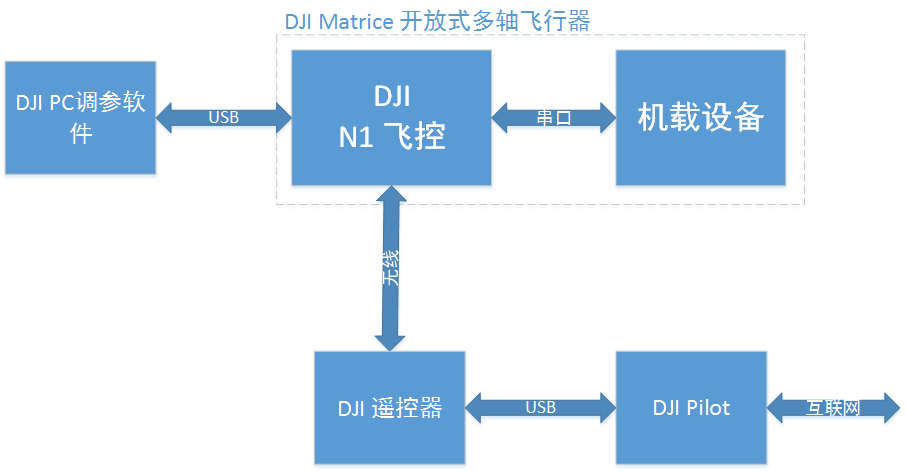
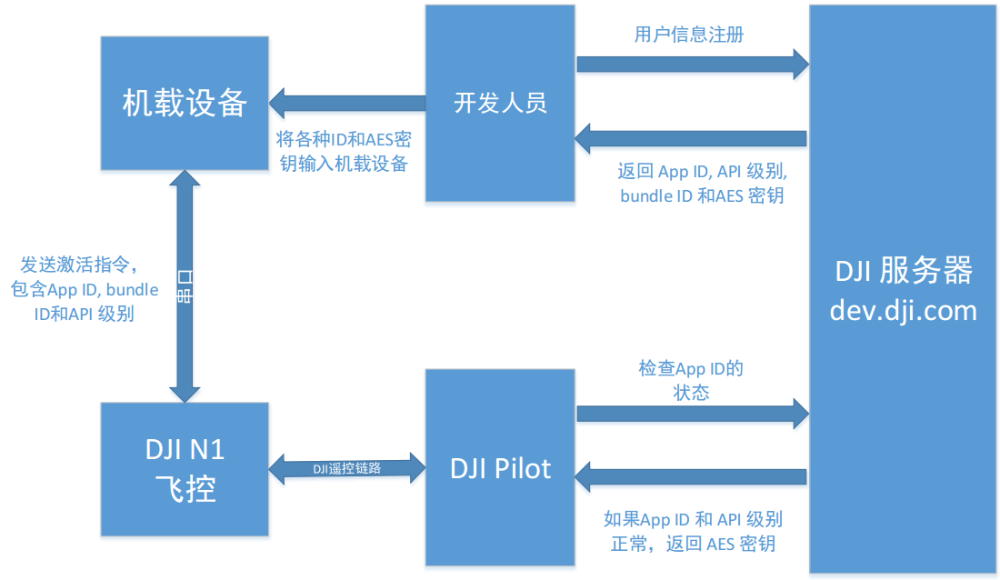

#DJI Onboard API 说明文档

最后更新: 2015年08月19日

*如发现任何错误，请通过Github issue或开发者论坛或邮件反馈给我们。欢迎提交pull request来帮助我们修正问题，关于文档的修改需要符合[格式标准](https://github.com/dji-sdk/onboard/issues/8#issuecomment-115976289)*

<br>
<br>
---
DJI 为开发者提供两种功能完善的飞行控制 API 帮助开发飞行应用：Mobile API 和 Onboard API。Mobile API 是 DJI Mobile SDK 的核心部分，开发者可以基于 iOS/Android 系统上的 SDK
库编写控制飞行器的移动端应用。而 Onboard API 则提供串行接口（UART），允许开发者将 自己的计算设备挂载到飞行器上，通过有线的方式直接控制飞行器。 

本文档介绍 Onboard API。文档包括四个部分：第一部分是快速入门，包括一些主要功能的 介绍；第二部分是协议说明，介绍所有进行程序控制所需的知识。第三部分是控制模式说明，介绍sdk的控制模式接口。第四部分是编程指南

## 目录

+  快速入门
  +  概述
      +  Onboard API 的主要特性
      + 系统综述
      + 遥控器、Onboard API 和 Mobile 
      + 命令权限等级
  + [ROS]通过无线串口控制 MATRICE 100
      + 必备硬件
      + 必备软件
      + 步骤
+ 协议说明
     + 协议格式
     + 协议帧头格式说明
     + 协议数据段说明
     + 通信会话机制
        + 命令集说明
        + 命令及权限
        + 数据包命令集和命令码集合图表
     + 通信会话加密机制
     + 标准数据包含义说明
+ 控制模式说明
   + 模式标志位说明
  + 坐标系说明
+ API编程说明 

  
---
<br> 

##一 . 快速入门

在快速入门中，我们首先对 API 做一个整体的介绍，并且定义一些关键的术语。然后我们用一份示例代码介绍使用 Onboard API 的主要步骤。

<br> 
### 1.1 概述 

DJI Matrice 100 开发者飞行器（以下简称 MATRICE 100）是一个为二次开发专门设计的四轴飞行器。这款飞行器有宽阔的甲板可用于安装机载设备。它的可拆卸电池仓、扩展设备安装架、额外的电源接口都允许用户设计紧凑、功能强大的飞行器应用。Onboard API 则是为了辅助 MATRICE 100 的使用而设计的串口 API。

<br> 
#### 1.1.1 Onboard API 的主要特性

+ 可靠的通讯协议
  
  基于会话的通信可以防止数据丢包。32bit 的 CRC 进一步降低通信异常的可能性。
  
+ 灵活的控制方式
  
  可对飞行器输入多种控制量，包括位置、速度和姿态控制
  
+ 可配置的外发数据
  
  飞控外发的数据可以进行种类和频率的配置，节省带宽

+ 考虑自动飞行的设计

  飞行状态控制指令和外发指令的设计都考虑到自动导航应用的实际需求
  
<br> 
#### 1.1.2 系统综述
 
整个系统的核心设备是 MATRICE 100 以及装载在 MATRICE 100 上的机载设备。机载设备与MATRICE 100 的飞控（N1 飞控）通过串口线连接。机载设备可以是任何能够进行串口通信和 AES 加解密的计算设备。

DJI N1 PC 调参软件用于配置 MATRICE 100 的串口和 MATRICE 100 固件的升级。这款调参软件与 DJI 的其他 PC 软件使用方法相同。由于新一代的 DJI 产品主要通过手机软件 DJI Pilot 进行配置，PC 调参软件只保留了一些无法通过手机软件实现的功能，比如固件升级和串口配置。

根据相关的法律法规，由于 Onboard API 可以让用户设计超视距飞行的自动系统，DJI 必须对 MATRICE 100 采用更严格的监管制度。在使用 MATRICE 100 之前，开发者必须在 dev.dji.com 网站（以下简称 DJI 服务器）上进行注册，然后激活飞行器。DJI 服务器会为开发者生成 AppID 和 AES 密钥。机载设备和 MATRICE 100 之间的大部分通信必须进行加密，这个密钥会在激活过程中由 DJI 服务器发给机载设备。激活和加密过程会在“编程指南-命令集 0x00”中详细介绍。

系统架构框图：



注册和激活的过程图：



激活过程中的一个重要概念是设备许可数量（DAN）。它有以下性质：
+ 每个 App ID 对应一个 DAN。它表示着这个 App ID 可以激活的飞控数量。
+ 每个新的 App ID 的 DAN 上限默认为 5。
+ 在激活过程中，每一个新的飞控都会让 App ID 的 DAN 增加 1。如果某个 App ID 的 DAN 达到上限，那么激活就会失败，新的飞控不能激活。
+ 开发者可以在 dev.dji.com 上申请增加 DAN 的上限。

<br> 
#### 1.1.3 遥控器、Onboard API 和 Mobile API

MATRICE 100 被设计为可以使用遥控器、机载设备和移动设备进行控制。为 Inspire 1 和Phantom3 系列设计的标准 DJI 辅助软件“DJI Pilot”也可以在 MATRICE 100 上使用。另外 DJIMobile SDK 也适用于MATRICE 100（请访问 dev.dji.com了解关于DJI Mobile SDK 的更多信息）。因为 MATRICE 100 有三种可能的控制输入，控制输入必须有优先级管理。

我们将遥控器设计为控制权限最高的设备。遥控器可以选择让飞控是否将控制权转给 API 控制。

遥控器模式选择开关 F (function)档可以控制 IOC 等其他功能，API 控制模式只是其中一种。以下条件满足时，飞控切换到 API 控制模式：

1. “启用 API 控制”勾选框被选择（在 PC 调参软件中设置，参见下面的例程）。
2. IOC 模式关闭（在 DJI Pilot App 中设置）
3. 遥控器模式选择开关置于 F 档。

如果遥控器让飞控切换到 API 控制模式，设备通过 Onboard API 和 Mobile API 可以请求获得控制权。移动设备的 API 有更高的控制优先级。如果移动设备先获得了控制权，那么机载设备无法成功获得控制权。


本文档着重介绍 Onboard API。我们假设开发者在使用 Onboard API 的过程中不使用 mobileAPI。**在目前版本中，混合控制（同时使用 Mobile API 和 Onboard API）没有得到完整支持。**

<br> 
#### 1.1.4 命令权限等级

开发者在 dev.dji.com 上注册的时候，DJI 服务器会为开发者分配一个 API 命令权限级别，这个级别根据开发者的需求和开发能力决定。开发者在使用机载设备的时候，必须将这个权限级别存入机载设备的程序中用于激活。MATRICE 100 的飞控会在激活过程中检查权限级别的有效性。

不同的 API 级别对应着不同级别的飞行控制命令。

+ Level 0. 激活相关的命令
+ Level 1. 数据读取和非飞行控制命令。包括相机和云台的控制、飞行数据监测、传感器数据读取。这个级别不包含对飞行器的运动控制。
+ Level 2. 飞行控制。包括对飞行器的运动控制，而且可以控制飞行器的飞行状态，比如降落、返航等等。

只有富有经验的开发者才能够使用权限级别高于 2 的飞行控制命令。在未来的 onboard API 中，我们会不断增加各种权限级别的控制命令。

<br> 
###1.2 [ROS]通过无线串口控制 MATRICE 100 
**详细信息参考onboard文件下的DJI_Onboard_API_ROS_Sample**

在这个示例中，我们使用示例代码“dji_sdk_keyboard_ctrl”对 MATRICE 100 进行远程控制。该代码基于 ROS 软件包 keyboardteleop.js。我们设计了一个简单的 HTML GUI 帮助开发者熟悉如何使用键盘和鼠标控制 MATRICE 100。

<br> 
#### 1.2.1 必备硬件

1. MATRICE 100 多轴飞行器
2. DJI 串口连接线（包含在 MATRICE 100 附件当中）
3. 若干杜邦线
4. 一对配置好的 115200 无线串口（淘宝购买）  
   注：也可使用其他比特率的串口线（如230400），只需要在调参软件中设置相应比特率数值即可。
5. USB-TTL 转换接头（淘宝购买）

  注意：Windows/Mac 上使用 USB-TTL 转换接头需要安装 PL2303 驱动
  
6. 5V 输出 DC-DC 电源模块（淘宝购买）

  注意：MATRICE 100 上不提供 5V 的电源输出，所以为了给无线串口供电，开发者需要自己购买 5V 电源模块

<br> 
#### 1.2.2 必备软件

1. 装有 DJI N1 PC 调参软件的 windows 电脑
2. 装有 DJI Pilot（最新版本）的可联网移动设备
3. 装有 Ubuntu 14.04 (或更高版本) 和 ROS Indigo（或更高版本）的 Linux 电脑。示例代码在 ROS Indigo 上进行过测试。
4. ROS package rosbridge_server
5. 示例代码 dji_sdk 与 dji_keyboard_ctrl

<br> 
#### 1.2.3 步骤

+ MATRICE 100 飞行器配置。给飞控上电，DJI N1 PC 调参软件可以用于升级固件和配置启用 API 模式。

  在页面“基础”当中，开发者可以勾选“启用 API 控制”来配置遥控器和 MATRICE 100 启用API 模式控制相关的功能。开发者能够通过“串口波特率和外发数据设置”区的选项来配置串口波特率和飞控外发数据的内容。

  

  启用 API 控制之后，将遥控器模式开关置为中位（F 档）。

+ 连接无线串口。电脑安装 USB-TTL 软件驱动，通过 USB-TTL 连接一个串口模块。另一个串口模块连接飞控附带的串口转接线。注意放在 MATRICE 100 上的串口模块需要 5V 电源模块单独供电。5V 电源模块可以使用 MATRICE 100 的电源作为输入。

+ 启动示例代码
  1. 编译 ROS package dji_sdk
  2. 启动 roscore, 然后启动 rosbridge_server
         roslaunch rosbridge_server rosbridge_websocket.launch
  3. 通过代码中的 launch 文件启动 dji_sdk_node。
  
    下面的代码是示例 launch 文件
    ```xml
    <launch>
    <node pkg="dji_sdk" type="dji_sdk_node" name="dji_sdk_node" output="screen">
    <!-- node parameters -->
    <param name="serial_name" type="string" value="/dev/ttySAC0"/> 
    <param name="baud_rate" type="int" value="115200"/>
    <param name="app_id" type="int" value="<!-- your appid -->"/>
    <param name="app_api_level" type="int" value="<!-- your app level -->"/>
    <param name="app_version" type="int" value="<!-- your app version -->"/>
    <param name="app_bundle_id" type="string" value="<!-- your app bundle id ->"/>
    <param name="enc_key" type="string" value="<!-- your app enc key -->"/> 
    </node>
    </launch> 
    ```
    其中的 node parameters 含义如下

    |Name|Type|说明|
    |----|----|----|
    |serial_name|String|g 串口设备名。通常为 “/dev/ttyUSB0”，但是在不同的Linux 设备上可能有不同的名称。 “ls /dev/*”和”dmesg| tail”命令可以用于查询设备名。|
    |baud_rate|Int|串口波特率，必须与通过调参软件设置的相同。|
    |app_id|Int|dev.dji.com 服务器返回的 AppID|
    |app_api_level|Int|dev.dji.com 服务器返回的 API 级别|
    |app_version|Int|开发者设定的应用版本号|
    |app_bundle_id|String|dev.dji.com 服务器返回的 bundle ID|
    |enc_key|String|dev.dji.com 服务器返回的 AES 密钥|
    
    **注意：这条命令一定要在 sudo su 模式下启动，因为打开串口需要 root 权限。**
    
        sudo su
        roslaunch dji_sdk sdk_demo.launch
        
  4. 编辑 “sdk_keyboard_demo.html”, 把 url 中的地址改成 Linux 系统的主机名或者localhost（127.0.0.1）

    ```c
    function init() {
      // Connecting to ROS.
      var ros = new ROSLIB.Ros({
      url: 'ws://127.0.0.1:9090'
      });
    } 
    ```
  5. 安装 rosbridge serverrosbridge 终端模式下
		  sudo apt-get install ros-jade-rosbridge-server 
		  
 6.  浏览器中打开 “sdk_keyboard_demo.html” 。rosbridge_server 会显示有新的 client 连接上，否则请检查步骤 4 中的设置。此时可以在页面中读取到飞行平台的状态信息。

+ 测试通信链路。在 sdk_keyboard_demo 页面中点击“Activation”。如果 PC 和飞行平台之间的链接畅通，页面上可以看到返回码。否则请检查链路连接状况。

+ 激活飞行平台。连接装有 DJI Pilot 的手机和飞行平台的遥控器，确保手机连接到网络。激活过程会在点击“Activation”之后自动完成。

+ 启动飞行器在空中悬停，与周围物体保持安全距离。遥控器切入 F 档，通过程序请求控制权，此时可以通过示例程序发送控制指令。除了下图所示的指令外，键盘“WASD”键控制飞行器向对应方向的倾角，“ZC” 控制竖直速度、“QE”控制偏航旋转。“WASD”控制的倾角度数为 5*speed_level。这个 speed_level 默认为 1，可以通过键盘数字键 123456 来修改。speed_level 修改后，姿态控制指令的数值也会随之改变。请谨慎使用大姿态角度的指令，飞行器会很快加速。

  

+ 安全飞行注意事项：配置完成后用户必须把遥控器切到 F 档 API 控制模式，飞控才会准备接受串口控制。此后机载设备可以发送请求获得控制权。这样的设计是将遥控器的模式切换拨杆作为紧急情况下的保险开关。任何情况下用户拨动遥控器模式切换拨杆，都会退出 API 控制模式。我们建议两位开发者一起合作进行测试，一个人控制网页 GUI，另一个人使用遥控器紧急制动。

  再次进入 API 控制模式之后，机载设备不需要再次请求获得控制权。

  如果遥控器和飞控上电时遥控器已经置于 F 档，则需要切出再切入 F 档一次才可触发API 控制模式，这样可以防止 API 控制模式在用户没有意识到的情况下被打开。
  
---

<br> 
## 二 协议说明

###2.1 协议格式

**协议帧**
<table>
<tr>
	<td>Protocol Frame Header</td>
	<td>Protocol Frame Data</td>
	<td>Protocol Frame Checksum</td>
</tr>
<tr>
	<td> |SOF|LEN|VER|SESSION|A|RES0|PADDING|ENC|RES1|SEQ|CRC16|</td>
	<td>    DATA   </td>
	<td>  CRC32</td>
</tr>
</table>
<br> 

###2.2 协议帧头格式说明

<table>
<tr>
  <th>字段</th>
  <th>字节索引</th>
  <th>大小（单位 bit）</th>
  <th>说明</th>
</tr>

<tr>
  <td>SOF</td>
  <td>0</td>
  <td>8</td>
  <td>帧起始标识。固定位 0xAA</td>
</tr>

<tr>
  <td>LEN</td>
  <td rowspan="2">1</td>
  <td>10</td>
  <td>帧长度。最大为 1023 bytes</td>
</tr>

<tr>
  <td>VER</td>
  <td>6</td>
  <td>协议版本</td>
</tr>

<tr>
  <td>SESSION</td>
  <td rowspan="3">3</td>
  <td>5</td>
  <td>通信过程中的会话 ID</td>
</tr>

<tr>
  <td>A</td>
  <td>1</td>
  <td>帧标识<ol start="0"><li>数据帧</li><li>应答帧</li></ol></td>
</tr>

<tr>
  <td>RES0</td>
  <td>2</td>
  <td>保留不用。固定值为 0x0</td>
</tr>

<tr>
  <td>PADDING</td>
  <td rowspan="2">4</td>
  <td>5</td>
  <td>加密帧数据时附加的数据长度</td>
</tr>

<tr>
  <td>ENC</td>
  <td>3</td>
  <td>帧数据加密类型<ol start="0"><li>不加密</li><li>AES 加密</li></ol></td>
</tr>

<tr>
  <td>RES1</td>
  <td>5</td>
  <td>24</td>
  <td>保留不用。固定值为 0x0</td>
</tr>

<tr>
  <td>SEQ</td>
  <td>8</td>
  <td>16</td>
  <td>帧序列号</td>
</tr>

<tr>
  <td>CRC16</td>
  <td>10</td>
  <td>16</td>
  <td>帧头 CRC16 校验值</td>
</tr>

<tr>
  <td>DATA</td>
  <td>12</td>
  <td>---</td>
  <td>帧数据段。最大长度为 1007bytes</td>
</tr>

<tr>
  <td>CRC32</td>
  <td>---</td>
  <td>32</td>
  <td>帧 CRC32 校验值</td>
</tr>
</table>

DATA 长度大小不固定，最大长度为 1007。crc32字节索引根据 DATA 长度大小而定。

<br>
###2.3 协议数据段说明

飞控和机载设备通信的数据包分为三类：

1. 命令数据包。从机载设备发送到飞控，包含对飞行器的控制指令。
2. 信息数据包。从飞控发送到机载设备，包含飞控的各种状态信息和传感器数据。
3. 应答数据包。从飞控发送到机载设备，包含控制指令的执行结果。

<br>
##### 机载设备发送给飞控的命令数据包的数据段格式 

```
|<-------Protocol Frame Data------->|
|COMMAND SET|COMMAND ID|COMMAND DATA|
```

|字段|字节索引|大小（单位 byte）|说明|
|----|--------|-----------------|----|
|COMMAND SET|0|1|命令集|
|COMMAND ID|1|1|命令码|
|COMMAND DATA|2|大小根据具体命令而定|命令数据|

<br>
##### 飞控发给机载设备的信息数据包的数据段格式 

```
|<-------Protocol Frame Data------->|
|COMMAND SET|COMMAND ID|COMMAND DATA|
```

|字段|字节索引|大小（单位 byte）|说明|
|----|--------|-----------------|----|
|COMMAND SET|0|1|命令集|
|COMMAND ID|1|1|命令码|
|COMMAND DATA|2|大小根据具体命令而定|飞机状态及传感器等数据|

<br>
##### 飞控发给机载设备的应答数据包的数据段格式 

```
|<-Protocol Frame Data->|
|COMMAND RETURN|ACK DATA|
```

|字段|字节索引|大小（单位 byte）|说明|
|----|--------|-----------------|----|
|COMMAND RETURN|0|2|命令执行的返回信息|
|ACK DATA|2|大小根据具体命令而定。|应答数据|

<br>

###2.4 通信会话机制

协议设计使用了会话机制，以保证命令数据和应答数据不会因为丢包而出现通信双方异常。通信双方在向对方发起通信会话时，可以根据需要通过设置协议的 SESSION 字段来选择会话方式。协议中设计了三种会话方式。

|会话方式|SESSION|描述|
|--------|-------|----|
|方式1|0|发送端不需要接收端应答|
|方式2|1|发送端需要接收端应答数据，但是可以容忍应答数据丢包|
|方式3|2-31|发送端需要正确收到接收端的应答包。<br>发送端使用这些session 发送命令数据包时，接收端应答后要保存当前的应答包作为该 session 的应答数据，应答包中包含该命令数据包中的 sequence number 和 session id。如果通信过程中，发送端没有正确收到应答包，可以重新发送该命令数据包，接收端收到后将保存的应答包重新发送回去。<br>下一次，如果发送端使用和上一次相同的 session id，但不同的 sequence number 来发送命令数据包时，接收端会丢弃上一次保存的 session 应答数据，重新保存新的 session 应答数据。|
**备注：由于会话方式 3 是一种可靠会话方式，开发者在协议链路层实现中应考虑数据丢包后的重发机制，在设计链路层发送接口时应提供超时时间、重发次数等参数。**
###2.5命令集说明 

####2.5.1命令及权限

DJI Onboard API 相关的命令分为三大类：

|类别|说明|命令集代码|
|----|----|----------|
|激活验证类|该命令集包含的 ID 只与激活相关|0x00|
|飞控接受的控制控制数据的命令集|接受的控制控制数据的命令集|0x01|
|飞控外发的数据|飞控外发的命令集|0x02|

每类命令有唯一的命令集代码，命令集包含的所有命令有各自的命名码和命令数据。飞控接受的控制命令全部有权限级别。在未来版本中会有更多的控制命令以不同的权限级别开放。目前权限级别如下：

|权限级别（API 级别）|权限描述|
|--------------------|--------|
|0|API 激活命令|
|1|相机和云台的控制命令|
|2|飞行控制命令|

####2.5.2 数据包命令集和命令码集合图表
+ 命令集 0x00 激活验证类
   + 命令码 0x00 获取 API 版本
   + 命令码 0x01 激活 API
   + 命令码 0xFE 透传数据（机载设备至移动设备）
+  命令集 0x01 飞行控制类
	+ 命令码 0x00 请求获得控制权
	+ 命令码 0x01-0x02 状态控制命令
	+ 命令码 0x03 姿态控制命令
+ 命令集 0x02 飞控外发的数据
    + 命令码 0x00 标准数据包
    + 命令码 0x01 控制权归属切换
    + 命令码 0x02 透传数据（移动设备至机载设备）

**备注:**
+ API 激活验证命令集的所有命令权限级别为 0，即所有用户都可以使用命令集中的命令对飞机进行激活与版本查询等操作。激活 API 通过 DJI Pilot 与 DJI Server 连接，需要手机连接互联网。
+ 机载设备发送给移动的数据包。最大包大小为 100 字节，带宽约 8KB/s。
+ 飞机可以接受三种设备的控制输入：遥控器、移动设备、机载设备而。三种设备的控制输入的优先级最大是遥控器，其次是移动设备，优先级最低是机载设备。
+ 机载设备对飞机的状态控制分为两个阶段。第一个阶段是发送命令码为 0x01 的状态控制指令。飞机收到状态控制指令之后会立即发送表明已经收到指令的应答数据包，正常情况飞机返回表示“开始执行”应答数据；但如果飞控正在执行一条之前的指令，则返回“执行失败”的应答数据。飞控开始执行指令之后会尝试切换状态模式，并把执行成功与否的结果保存下来。第二个阶段是机载设备在发送状态控制指令之后可以开始尝试发送命令码为 0x02 的执行结果查询命令。


<table>
<tr>
 <th>命令集</th>
  <th>命令码</th>
   <th colspan=4>详细说明</th>
</tr>
<tr>
<th rowspan=14">0x00激活验证类</th>
  <th rowspan="5">0x00获取 API 版本</th>
  <th>数据类型</th>
  <th>偏移（字节）</th>
  <th>大小（字节）</th>
  <th>说明</th>
</tr>

<tr>
  <td>请求数据</td>
  <td>1</td>
  <td>1</td>
  <td>任意请求数据</td>
</tr>

<tr>
  <td rowspan="3">应答数据</td>
  <td>0</td>
  <td>2</td>
  <td>返回码<br>0x0000：激活成功<br>0xFF00：命令不支持<br>0xFF01：机载设备无授权<br>0xFF02：机载设备权限不足</td>
</tr>

<tr>
  <td>2</td>
  <td>4</td>
  <td>CRC32, 字符串版本的 CRC32</td>
</tr>

<tr>
  <td>6</td>
  <td>32</td>
  <td>不定长，最大长度 32bytes。有效部分到’\0’结尾</td>
</tr>

<tr>
   <th rowspan="6">0x01激活 API</th>
  <th>数据类型</th>
  <th>偏移（字节）</th>
  <th>大小（字节）</th>
  <th>说明</th>
</tr>

<tr>
  <td rowspan="4">请求数据</td>
  <td>0</td>
  <td>4</td>
  <td>appid, 服务器注册时候生成的内容</td>
</tr>

<tr>
  <td>4</td>
  <td>4</td>
  <td>api_level，API 权限级别</td>
</tr>

<tr>
  <td>8</td>
  <td>4</td>
  <td>app_ver，用户程序版本</td>
</tr>

<tr>
  <td>12</td>
  <td>32</td>
  <td>bundle_id， App 的唯一 ID</td>
</tr>

<tr>
  <td>Return Data</td>
  <td>0</td>
  <td>2</td>
  <td>返回码，应答码： <ol start="0"><li>成功</li><li>参数非法，参数长度不匹配</li><li>数据包加密了，未能正确识别</li><li>没有激活过的设备，尝试激活</li><li>DJI App 没有响应，可能是没有连接 DJI App</li><li>DJI App 没有联网</li><li>服务器拒绝，激活失败</li><li>权限级别不够</li></ol></td>
</tr>

<tr>
 <th rowspan="3">0xFE 透传数据（机载设备至移动设备）</th>
  <th>数据类型</th>
  
  <th>偏移（字节）</th>
  <th>大小（字节）</th>
  <th>说明</th>
</tr>

<tr>
  <td>请求数据</td>
  <td>0</td>
  <td>1~100</td>
  <td>用户自定义数据</td>
</tr>

<tr>
  <td>应答数据</td>
  <td>0</td>
  <td>2</td>
  <td>返回码，应答码 0：成功</td>
</tr>

<tr>
<th rowspan=17"> 0x01 飞行控制类</th>
 <th rowspan="3"> 0x00 请求获得控制权</th>
  <th>数据类型</th>
  <th>偏移（字节）</th>
  <th>大小（字节）</th>
  <th>说明</th>
</tr>

<tr>
  <td>请求数据</td>
  <td>0</td>
  <td>1</td>
  <td><ul><li>1 = 请求获得控制权</li><li>0 = 请求释放控制权</li></ul></td>
</tr>

<tr>
  <td>应答数据</td>
  <td>0</td>
  <td>2</td>
  <td>返回码 <ul><li>0x0001：成功释放控制权</li><li>0x0002：成功获得控制权</li><li>0x0003：获得控制权失败</li></ul></td>
</tr>
<tr>
		<th rowspan="4">0x01(0x01-0x02) 状态控制命令</th>
	  <th>数据类型</th>
	  <th>偏移（字节）</th>
	  <th>大小（字节）</th>
	  <th>说明</th>
</tr>

<tr>
  <td rowspan="2">请求数据</td>
  <td>0</td>
  <td>1</td>
  <td>指令序列号</td>
</tr>

<tr>
  <td>1</td>
  <td>1</td>
  <td>控制<ui><li>1 = 请求进入自动返航</li><li>4 = 请求自动起飞</li><li>6 = 请求自动降落</li></ui></td>
</tr>

<tr>
  <td>应答数据</td>
  <td>0</td>
  <td>1</td>
  <td>返回码<ui><li>0x0001：执行失败</li><li>0x0002：开始执行</li></ui></td>
</tr>
<tr>
			<th rowspan="3">0x02(0x01-0x02) 状态控制命令</th>
	  <th>数据类型</th>
	  <th>偏移（字节）</th>
	  <th>大小（字节）</th>
	  <th>说明</th>
</tr>
<tr>
  <td>请求数据</td>
  <td>0</td>
  <td>1</td>
  <td>指令序列号</td>
</tr>
<tr>
  <td>应答数据</td>
  <td>0</td>
  <td>1</td>
  <td>返回码<ui><li>0x0001：执行失败（指令序列号不是当前执行的指令）</li><li>0x0003：指令正在执行</li><li>0x0004：指令执行失败</li><li>0x0005：指令执行成功</li></ui></td>
<tr>
<th rowspan="7">0x03 姿态控制命令</th>
  <th>数据类型</th>
  <th>偏移（字节）</th>
  <th>大小（字节）</th>
  <th>说明</th>
</tr>

<tr>
  <td rowspan="5">请求数据</td>
  <td>0</td>
  <td>1</td>
  <td>模式标志位 (详细说明参考飞控控制附加说明章节)</td>
</tr>

<tr>
  <td>1</td>
  <td>4</td>
  <td>roll 方向控制量或 X 轴控制量</td>
</tr>

<tr>
  <td>5</td>
  <td>4</td>
  <td>pitch 方向控制量或 Y 轴控制量</td>
</tr>

<tr>
  <td>9</td>
  <td>4</td>
  <td>yaw 方向控制量（偏航）</td>
</tr>

<tr>
  <td>13</td>
  <td>4</td>
  <td>throttle 方向控制量或 Z 轴控制量</td>
</tr>

<tr>
  <td>Return Data</td>
  <td>0</td>
  <td></td>
  <td>无应答数据</td>
</tr>
<tr>
<th rowspan=22">0x02 飞控外发的数据</th>
<th rowspan="15">0x00 标准数据包</th>
  <th>数据类型</th>
  <th>偏移（字节）</th>
  <th>大小（字节）</th>
  <th>说明</th>
</tr>

<tr>
  <td rowspan="13">推送数据</td>
  <td>0</td>
  <td>2</td>
  <td>状态包存在标志位<br>bit 0：时间戳包存在标志<br>bit 1：姿态四元素包存在标志<br>bit 2：Ground 坐标系下的加速度包存在标志<br>bit 3：Ground 坐标系下的速度包存在标志<br>bit 4：Body 坐标系的角速度包存在标志<br>bit 5：GPS 位置、海拔（气压计数值）、相对地面高度、健康度包存在标志<br>bit 6：磁感计数值包存在标志<br>bit 7：遥控器通道值包存在标志<br>bit 8：云台 roll、pitch、yaw 数据包存在标志<br>bit 9：飞行状态包存在标志<br>bit 10：剩余电池百分比包存在标志<br>bit 11：控制设备包存在标志<br>bit [12:15]：保留不用<br><br>标志位为 1 表示标准数据包中存在该状态包</td>
</tr>

<tr>
  <td>2</td>
  <td>4</td>
  <td>时间戳</td>
</tr>

<tr>
  <td>6</td>
  <td>16</td>
  <td>姿态四元素</td>
</tr>

<tr>
  <td>22</td>
  <td>12</td>
  <td>Ground 坐标系下的加速度</td>
</tr>

<tr>
  <td>34</td>
  <td>12</td>
  <td>Ground 坐标系下的速度</td>
</tr>

<tr>
  <td>46</td>
  <td>12</td>
  <td>Body 坐标系的角速度</td>
</tr>

<tr>
  <td>58</td>
  <td>24</td>
  <td>GPS 位置, 海拔（气压计数值）, 相对地面高度</td>
</tr>

<tr>
  <td>82</td>
  <td>12</td>
  <td>磁感计数值</td>
</tr>

<tr>
  <td>94</td>
  <td>10</td>
  <td>遥控器通道值</td>
</tr>

<tr>
  <td>104</td>
  <td>12</td>
  <td>云台 roll、pitch、yaw 数据</td>
</tr>

<tr>
  <td>116</td>
  <td>1</td>
  <td>飞行状态</td>
</tr>

<tr>
  <td>117</td>
  <td>1</td>
  <td>剩余电池百分比</td>
</tr>

<tr>
  <td>118</td>
  <td>1</td>
  <td>控制设备</td>
</tr>

<tr>
  <td>Return Data</td>
  <td>0</td>
  <td></td>
  <td>无应答数据</td>
</tr>

<tr>
<th rowspan="4">0x01 控制权归属切换</th>
	  <th>数据类型</th>
	  <th>偏移（字节）</th>
	  <th>大小（字节）</th>
	  <th>说明</th>
</tr>
<tr>
  <td>请求数据</td>
  <td>0</td>
  <td>1</td>
  <td>数据值固定为 0x04</td>
</tr>
<tr>
  <td>应答数据</td>
  <td>0</td>
  <td>1</td>
  <td>无应答数据</td>
<tr>

<tr>
<th rowspan="3"> 0x02 透传数据（移动设备至机载设备）</th>
	  <th>数据类型</th>
	  <th>偏移（字节）</th>
	  <th>大小（字节）</th>
	  <th>说明</th>
</tr>
<tr>
  <td>请求数据</td>
  <td>0</td>
  <td>1~100</td>
  <td>用户自定义数据</td>
</tr>
<tr>
  <td>应答数据</td>
  <td>0</td>
  <td>0</td>
  <td>无应答数据</td>
<tr>
</table>
**对数据内容的进一步说明**

+ _alti_是气压计和IMU融合的结果，单位为气压值；_height_是超声波、气压计和IMU融合的结果，表示相对起飞点的高度，单位是米。如果飞行器上没有超声波传感器（没有安装Guidance），或者有超声波传感器但是相对地面的距离超过3米（距离过远时超声波测量值不稳定），则_height_主要由气压计提供，因此在室内环境中可能会出现超过3米时飞行器因为气压计不稳突然飘动的问题，使用时一定要注意。

+ 因为_height_是相对起飞点的高度，因此如果上电后不起飞，这个数值不会刷新成有意义的值。

+ _GPS_ 信息中的 _lati_, _longti_ 均为弧度制。

+ IMU外发的加速度和角速度都是经过滤波算法处理的结果，我们会在未来的版本中加入标志位允许IMU外发传感器的原始数据。
###2.6 通信会话加密机制
**协议帧**
<table>
<tr>
	<td>Protocol Frame Header</td>
	<td>Protocol Frame Data</td>
	<td>Protocol Frame Checksum</td>
</tr>
<tr>
	<td> |SOF|LEN|VER|SESSION|A|RES0|PADDING|ENC|RES1|SEQ|CRC16|</td>
	<td>    DATA   </td>
	<td>  CRC32</td>
</tr>
</table>

   通信会话加密机制防止第三方直接窜入修改，夺取控制权，上述协议帧帧头和CRC校验部分不加密，数据段加密。
   具体哪些指令需要加密发送如下所示：
   
   **LEVEL 0 即 API激活相关指令无需加密**   
   **控制指令议建议不加密**   
   **状态控制命令（起飞，降落，返航）等指令需加密**   
   **获取控制权可加可不加密**
   **获取飞机数据指令可加可不加密**
   **备注：这里的加密指的就是发送协议数据的函数（见第四部分）中的is_enc参数**
   
###2.7 标准数据包含义说明
**标准数据包中各个状态包的数据段含义如下表所示：**
<table>
<tr>
  <td colspan="5" align="middle">标志数据包</td>
</tr>
<tr>
  <td>状态包</td>
  <td>状态包字段</td>
  <td>数据段类型</td>
  <td>说明</td>
  <td>默认频率</td>
</tr>

<tr>
  <td>时间戳</td>
  <td>time</td>
  <td>unsigned int</td>
  <td>时间戳（时间间隔1/600s）</td>
  <td>100Hz</td>
</tr>
<tr>
  <td rowspan="4">姿态四元素</td>
  <td>q0</td>
  <td>float32</td>
  <td rowspan="4">姿态四元数（从 Ground 坐标系转到 Body 坐标系）</td>
  <td rowspan="4">100Hz</td>
</tr>
<tr>
  <td>q1</td>
  <td>float32</td>
</tr>
<tr>
  <td>q2</td>
  <td>float32</td>
</tr>
<tr>
  <td>q3</td>
  <td>float32</td>
</tr>

<tr>
  <td rowspan="3">Ground 坐标系下的加速度</td>
  <td>agx</td>
  <td>float32</td>
  <td rowspan="3"></td>
  <td rowspan="3">100Hz</td>
</tr>
<tr>
  <td>agy</td>
  <td>float32</td>
</tr>
<tr>
  <td>agz</td>
  <td>float32</td>
</tr>

<tr>
  <td rowspan="3">Ground 坐标系下的速度</td>
  <td>vgx</td>
  <td>float32</td>
  <td rowspan="3"></td>
  <td rowspan="3">100Hz</td>
</tr>
<tr>
  <td>vgy</td>
  <td>float32</td>
</tr>
<tr>
  <td>vgz</td>
  <td>float32</td>
</tr>

<tr>
  <td rowspan="3">Body 坐标系下的角速度</td>
  <td>wx</td>
  <td>float32</td>
  <td rowspan="3"></td>
  <td rowspan="3">100Hz</td>
</tr>
<tr>
  <td>wy</td>
  <td>float32</td>
</tr>
<tr>
  <td>wz</td>
  <td>float32</td>
</tr>

<tr>
  <td rowspan="5">GPS 位置、海拔、相对地面高度、信号健康度</td>
  <td>longti</td>
  <td>double</td>
  <td rowspan="2">GPS 位置</td>
  <td rowspan="5">100Hz</td>
</tr>
<tr>
  <td>lati</td>
  <td>double</td>
</tr>
<tr>
  <td>alti</td>
  <td>float32</td>
  <td>海拔（气压计数值）</td>
</tr>
<tr>
  <td>height</td>
  <td>float32</td>
  <td>相对地面高度（超声波和气压计融合）</td>
</tr>
<tr>
  <td>health_flag</td>
  <td>uint8_t</td>
  <td>GPS 健康度 (0-5, 5 为最好)</td>
</tr>

<tr>
  <td rowspan="3">磁感计</td>
  <td>mx</td>
  <td>float32</td>
  <td rowspan="3">磁感计数值</td>
  <td rowspan="3">0Hz</td>
</tr>
<tr>
  <td>my</td>
  <td>float32</td>
</tr>
<tr>
  <td>mz</td>
  <td>float32</td>
</tr>

<tr>
  <td rowspan="6">遥控器数据</td>
  <td>roll</td>
  <td>int16_t</td>
  <td>遥控通道 roll 数据</td>
  <td rowspan="6">50Hz</td>
</tr>
<tr>
  <td>pitch</td>
  <td>int16_t</td>
  <td>遥控通道 pitch 数据</td>
</tr>
<tr>
  <td>yaw</td>
  <td>int16_t</td>
  <td>遥控通道 yaw 数据</td>
</tr>
<tr>
  <td>throttle</td>
  <td>int16_t</td>
  <td>遥控通道 throttle 数据</td>
</tr>
<tr>
  <td>mode</td>
  <td>int16_t</td>
  <td>遥控通道 mode 数据（模式选择开关）</td>
</tr>
<tr>
  <td>gear</td>
  <td>int16_t</td>
  <td>遥控通道 gear 数据（正面的圆形拨杆）</td>
</tr>

<tr>
  <td rowspan="3">云台状态数据</td>
  <td>roll</td>
  <td>float32</td>
  <td>云台 roll 数据</td>
  <td rowspan="3">50Hz</td>
</tr>
<tr>
  <td>pitch</td>
  <td>float32</td>
  <td>云台 pitch 数据</td>
</tr>
<tr>
  <td>yaw</td>
  <td>float32</td>
  <td>云台 yaw 数据</td>
</tr>

<tr>
  <td>飞行状态</td>
  <td>status</td>
  <td>uint8_t</td>
  <td>飞行状态</td>
  <td>10Hz</td>
</tr>

<tr>
  <td>电量</td>
  <td>status</td>
  <td>uint8_t</td>
  <td>剩余电量百分比</td>
  <td>1Hz</td>
</tr>

<tr>
  <td>控制设备</td>
  <td>status</td>
  <td>uint8_t</td>
  <td>控制设备<br>0：遥控器<br>1：移动设备<br>2：机载设备</td>
  <td>0Hz</td>
</tr>
</table>

<br>

机载设备端可以按照如下 C/C++程序示例接收飞控外发的包含飞机状态的标准数据包

```c
typedef struct {
  float q0;
  float q1;
  float q2;
  float q3;
}sdk_q_data_t;

typedef struct {
  float x;
  float y;
  float z;
}sdk_common_data_t;

typedef struct {
  double lati;
  double longti;
  float alti;
  float height;
  short health_flag;
}sdk_gps_height_data_t;

typedef struct {
  signed short roll;
  signed short pitch;
  signed short yaw;
  signed short throttle;
  signed short mode;
  signed short gear;
}sdk_rc_data_t;

typedef struct {
  signed short x;
  signed short y;
  signed short z;
}sdk_mag_data_t;

typedef __attribute_((__packed__)) struct { //1 byte aligned
  unsigned int time_stamp;
  sdk_q_data_t          q;
  sdk_common_data_t     a;
  sdk_common_data_t     v;
  sdk_common_data_t     w;
  sdk_gps_height_data   pos;
  sdk_mag_data_t        msg;
  sdk_rc_data_t         rc;
  sdk_common_data_t     gimbal;
  unsigned char         status;
  unsigned char         battery_remaining_capacity;
  unsigned char         ctrl_device;
}sdk_std_data_t;

#define _recv_std_data(_flag, _enable, _data, _buf, _datalen) \
    if(_flag * _enable) { \
      memcpy ((unsigned char*) &(_data), (unsigned char*)(_buf)+(_datalen), sizeof(_data)); \
      _datalen += sizeof(_data); \
    }

static sdk_std_data_t recv_sdk_std_data = {0};

void recv_std_package (unsigned char* pbuf, unsigned int len) {
  unsigned short *valid_flag = (unsigned short*) pbuf;
  unsigned short data_len = 2;
  
  _recv_std_data(*valid_flag, 0x0001, recv_sdk_std_data.time_stamp,                 pbuf,data_len);
  _recv_std_data(*valid_flag, 0x0002, recv_sdk_std_data.q,                          pbuf,data_len);
  _recv_std_data(*valid_flag, 0x0004, recv_sdk_std_data.a,                          pbuf,data_len);
  _recv_std_data(*valid_flag, 0x0008, recv_sdk_std_data.v,                          pbuf,data_len);
  _recv_std_data(*valid_flag, 0x0010, recv_sdk_std_data.w,                          pbuf,data_len);
  _recv_std_data(*valid_flag, 0x0020, recv_sdk_std_data.pos,                        pbuf,data_len);
  _recv_std_data(*valid_flag, 0x0040, recv_sdk_std_data.mag,                        pbuf,data_len);
  _recv_std_data(*valid_flag, 0x0001, recv_sdk_std_data.rc,                         pbuf,data_len);
  _recv_std_data(*valid_flag, 0x0001, recv_sdk_std_data.gimbal,                     pbuf,data_len);
  _recv_std_data(*valid_flag, 0x0001, recv_sdk_std_data.statis,                     pbuf,data_len);
  _recv_std_data(*valid_flag, 0x0001, recv_sdk_std_data.battery_remaining_capacity, pbuf,data_len);
  _recv_std_data(*valid_flag, 0x0001, recv_sdk_std_data.ctrl_device,                pbuf,data_len);
}
```

**备注：文档中介绍的结构体示例都要求 1 字节对齐。开发者需要根据自身的开发编程环境及编程语言保证结构体的对齐方式为 1 字节对齐。**


##三.控制模式说明
###3.1 模式标志位说明

模式标志位代表不同模式的配置。因为多旋翼的结构特点，飞行控制的时候，要把控制信息分解成三部分，竖直、水平(分为X，Y两个方向)和偏航共四个自由度，每个部分都有几种选择。

<table>
<tr>
  <th>类别</th>
  <th>模式</th>
  <th>说明</th>
</tr>
<tr>
  <td rowspan="3">竖直方向</td>
  <td>VERT_POS</td>
  <td>垂直方向上控制的是位置，输入的控制量必须为对地面的高度量</td>
</tr>
<tr>
  <td>VERT_VEL</td>
  <td>垂直方向上控制的是速度</td>
</tr>
<tr>
  <td>VERT_THRUST</td>
  <td>垂直方向上控制的是油门百分比(0-100)</td>
</tr>

<tr>
  <td rowspan="3">水平方向</td>
  <td>HORI_ATTI_TILT_ANG</td>
  <td>水平方向控制的是pitch 和 roll 两个方向上的倾角（和加速度对应），<b>可以选择这个 offset 是 ground 坐标系下还是body 坐标系下</b></td>
</tr>
<tr>
  <td>HORI_POS</td>
  <td>水平方向控制的是 pitch 和 roll 两个方向上的位置offset，<b>可以选择这个 offset 是 ground 坐标系下还是body 坐标系下</b></td>
</tr>
<tr>
  <td>HORI_VEL</td>
  <td>水平方向控制的是 pitch 和 roll 两个方向上的速度，<b>可以选择这个速度是 ground 坐标系下还是 body 坐标系下</b></td>
</tr>

<tr>
  <td rowspan="2">偏航</td>
  <td>YAW_ANG</td>
  <td>偏航控制一个 ground 坐标系下的目标角度</td>
</tr>
<tr>
  <td>YAW_RATE</td>
  <td>偏航控制目标角速度，<b>可以选择这个角速度是 ground 坐标系下还是 body 坐标系下</b></td>
</tr>
</table>

<table>
<tr>
  <td rowspan="5">模式标识位<br>1byte</td>
  <td>bit[7:6]</td>
  <td>0b00：水平倾角<br>0b01：水平速度<br>0b10：水平位置</td>
</tr>
<tr>
  <td>bit[5:4]</td>
  <td>0b00：垂直速度<br>0b01：垂直位置<br>0b10：垂直推力</td>
</tr>
<tr>
  <td>bit[3]</td>
  <td>0b0: 偏航 YAW 角度<br>0b1: 偏航 YAW 角速度</td>
</tr>
<tr>
  <td>bit[2:1]</td>
  <td>0b00：水平坐标系为 Ground 系<br>0b01：水平坐标系为 Body 系</td>
</tr>
<tr>
  <td>bit[0]</td>
  <td>0b0：偏航坐标系为 Ground 系<br>0b1：偏航坐标系为 Body 系</td>
</tr>
</table>

在某些模式中，水平坐标系和偏航坐标系可以是任意的。

经过多种模式的组合，共有 14 种模式 (模式标志指的是 1byte 标志位中的每个 bit 应该如何取值可以实现该模式。数值为 X 的 bit 说明该模式不判断该位置，但是该位置的取值与选择的坐标系有关。这里“0b”表示的是二进制表示，后八位数字构成一个0-255的整数)

|模式编号|组合形式|输入数值范围<br>(throttle/pitch&roll/yaw)|模式标志|
|--------|--------|-----------------------------------------|--------|
|1|VERT_VEL<br>HORI_ATTI_TILT_ANG<br>YAW_ANG|-4 m/s ~ 4 m/s<br>-30 度 ~ 30 度<br>-180 度 ~ 180 度|0b000000XX|
|2|VERT_VEL<br>HORI_ATTI_TILT_ANG<br>YAW_RATE|-4 m/s ~ 4 m/s<br>-30 度 ~ 30 度<br>-100 度/s ~ 100 度/s|0b000010XX|
|3|VERT_VEL<br>HORI_VEL<br>YAW_ANG|-4 m/s ~ 4 m/s<br>-10 m/s ~ 10 m/s<br>-180 度 ~ 180 度|0b010000XX|
|4|VERT_VEL<br>HORI_VEL<br>YAW_RATE|-4 m/s ~ 4 m/s<br>-10 m/s ~ 10 m/s<br>-100 度/s ~ 100 度/s|0b010010XX|
|5|VERT_VEL<br>HORI_POS<br>YAW_ANG|-4 m/s ~ 4 m/s<br>米为单位的相对位置，数值无限制<br>-180 度 ~ 180 度|0b100000XX|
|6|VERT_VEL<br>HORI_POS<br>YAW_RATE|-4 m/s ~ 4 m/s<br>米为单位的相对位置，数值无限制<br>-100 度/s ~ 100 度/s|0b100010XX|
|7|VERT_POS<br>HORI_ATTI_TILT_ANG<br>YAW_ANG|0m 到最大飞行高度<br>-30 度 ~ 30 度<br>-180 度 ~ 180 度|0b000100XX|
|8|VERT_POS<br>HORI_ATTI_TILT_ANG<br>YAW_RATE|0m 到最大飞行高度<br>-30 度 ~ 30 度<br>-100 度/s ~ 100 度/s|0b000110XX|
|9|VERT_POS<br>HORI_VEL<br>YAW_ANG|0m 到最大飞行高度<br>-10 m/s ~ 10 m/s<br>-180 度 ~ 180 度|0b010100XX|
|10|VERT_POS<br>HORI_VEL<br>YAW_RATE|0m 到最大飞行高度<br>-10 m/s ~ 10 m/s<br>-100 度/s ~ 100 度/s|0b010110XX|
|11|VERT_POS<br>HORI_POS<br>YAW_ANG|0m 到最大飞行高度<br>米为单位的相对位置，数值无限制<br>-180 度 ~ 180 度|0b100100XX|
|12|VERT_POS<br>HORI_POS<br>YAW_RATE|0m 到最大飞行高度<br>米为单位的相对位置，数值无限制<br>-100 度/s ~ 100 度/s|0b100110XX|
|13|VERT_THRUST<br>HORI_ATTI_TILT_ANG<br>YAW_ANG|10 ~ 100 （危险，请小心使用）<br>-30 度 ~ 30 度<br>-180 度 ~ 180 度|0b001000XX|
|14|VERT_THRUST<br>HORI_ATTI_TILT_ANG<br>YAW_RATE|10 ~ 100（危险，请小心使用）<br>-30 度 ~ 30 度<br>-100 度/s ~ 100 度/s|0b001010XX|

HORI_POS模式的输入量是相对位置。这个设计是为了兼顾GPS飞行和未来可能的根据视觉定位系统飞行的需求。想通过GPS飞行时，开发者可以使用飞控外发的位置信息做控制，如果想设计通过视觉定位系统飞行的应用，开发者可以使用自己的定位系统的位置进行控制(速度来自Gudiance或者GPS)。开发者自己使用时可以根据需求封装，例如[xuhao1封装的SDK包](https://github.com/xuhao1/dji_sdk/blob/master/src/modules/dji_services.cpp)采用了GPS的封装。

我们建议用户在室内环境中，如果没有安装Gudiance或者飞行高度超过3m时，不要使用竖直方向的位置控制，因为室内环境中气压计读数不准，影响控制器的表现。

**注意！非常重要：控制模式有进入条件限制：**

- 当且仅当GPS信号正常（health\_flag >=3）时，才可以使用水平**位置**控制（HORI_POS）相关的控制指令
- 当GPS信号正常（health\_flag >=3），或者Gudiance系统正常工作（连接安装正确）时，可以使用水平**速度**控制（HORI_VEL）相关的控制指令

###3.2 坐标系说明

1. Body 坐标系：

  
  
2. Ground 坐标系（北东地坐标系）：
  
  + 北-X or Roll 
  + 东-y or Pitch
  + 指向地心-z 

  坐标满足右手定则。ground 坐标系下通用的航向定义是以北为 0，顺时针到 180 度，逆时针到-180 度。这样用-180 到 180 度的数值表示飞行平台在空间中的朝向。
```c  
/ *控制指令接口* /
typedef struct
{
    uint8_t ctrl_flag;
    fp32 	roll_or_x;
    fp32	pitch_or_y;
    fp32	thr_z;
    fp32	yaw;
}api_ctrl_without_sensor_data_t;
```
  **备注：关于水平方向上得控制模式解释如下：注意理解“水平”，即飞机从在的与XY平面平行的面**
  
  + **HORI_ATTI_TILT_ANG对应控制的是转角（单位°），Ground坐标系下给roll_or_x赋正值x，将向正东方向转x°，Body坐标系下给roll_or_x赋值将向机头正方向的右边转x°，以此类推。**
  
  + **HORI_POS对应控制的是距离（单位米），Ground坐标系下给roll_or_x赋正值x，将向正东方向运动x米，Body坐标系下给roll赋值将向机头正方向的右边运动x米。**
  
  + **HORI_VEL对应控制速度（单位m/s），Ground坐标系下给roll赋正值x ，将向正东方向运动x m/s，Body坐标系下给roll赋值将向机头正方向的右边运动xm/s.**
  
  + **简单来说，在Ground坐标系下，不管飞机处于什么姿态，给roll_or_x赋正值就水平往正北方向运动，给pitch_or_y赋正值将水平往东方向运动，都赋值就往他们的合向量水平方向运动，在Body坐标系下，要考虑机头的方向，给roll_or_x赋正值将向机头正方向的右边水平运动（注意是水平运动，和此时的飞机的roll和pitch角无关），给pitch_or_y赋正值将向机头正方向水平运动**
 
  **备注：Ground 坐标系的高度方向与人对飞行控制的直觉不符，因此我们将竖直方向的高度和速度都调整成了以天空方向为正，也即发送数值为正的速度会让飞行平台远离地面。但是调整高度方向并不改变Ground 坐标系的另外两个轴的方向和顺序。**

##四. API编程说明
假设通信中发送协议数据的函数定义如下：
```c
void App_Send_Data(unsigned char flag,		//通信会话方式
				   uint8_t is_enc, 			//是否采用加密发送
				   unsigned char  cmd_set,  //命令集
				   unsigned char cmd_id,    //命令码
				   unsigned char *pdata,    //数据段
				   int len,                 //数据段长度
				   ACK_Callback_Func ack_callback, //回调函数
				   int timeout ,            //使用会话方式 3 时接收端应答的超时时间，单位 ms
				   int n                    //使用会话方式 3 接收端不应答时，发送端重发的次数
					)
```
**备注：由于会话方式 3 是一种可靠会话方式，开发者在协议链路层实现中应考虑数据丢包后的重发机制，在设计链路层发送接口时应提供超时时间、重发次数等参数。**
+ 激活API如下所示：
```c
/* 数据段结构体 */
typedef struct
{
	uint32_t	app_id;
	uint32_t	app_api_level;
	uint32_t	app_ver;
	uint8_t		app_bundle_id[32];
}activation_data_t;

/* 接收应答数据结构体 */
typedef struct
{
	uint16_t	version_ack;
	uint32_t	version_crc;
	char     	version_name[32];
}version_query_data_t;

/* 获取 API 版本命令的回调函数 */
void test_activation_ack_cmd_callback(ProHeader *header)
{
	/*
		#define	ACTIVATION_SUCCESS		0x0000
		#define PARAM_ERROR				0x0001
		#define DATA_ENC_ERROR			0x0002
		#define NEW_DEVICE_TRY_AGAIN	0x0003
		#define DJI_APP_TIMEOUT			0x0004
		#define DJI_APP_NO_INTERNET		0x0005
		#define SERVER_REFUSED			0x0006
		#define LEVEL_ERROR				0x0007
	*/
	uint16_t ack_data;
	printf("Sdk_ack_cmd0_callback,
			sequence_number=%d,
			session_id=%d,
			data_len=%d\n", 
			header->sequence_number, 
			header->session_id, 
			header->length - EXC_DATA_SIZE);
	memcpy((uint8_t *)&ack_data,(uint8_t *)&header->magic, (header->length - EXC_DATA_SIZE));

	if( is_sys_error(ack_data))
	{
        printf("[DEBUG] SDK_SYS_ERROR 3!!! \n");
        activation_callback_flag=2;
     //   QMessageBox::warning(NULL,"Error", "Activation Error", QMessageBox::Ok);
	}
	else
	{
        char result[][50]={{"ACTIVATION_SUCCESS"},
					       {"PARAM_ERROR"},
					       {"DATA_ENC_ERROR"},
					       {"NEW_DEVICE_TRY_AGAIN"},
					       {"DJI_APP_TIMEOUT"},
					       {" DJI_APP_NO_INTERNET"},
					       {"SERVER_REFUSED"},
					       {"LEVEL_ERROR"}};
        printf("[ACTIVATION] Activation result: %s \n", *(result+ack_data));
        activation_callback_flag=1;
      //  QMessageBox::information(NULL, "Warning", *(result+ack_data), QMessageBox::Ok);
		activation_status_s = (uint8_t)ack_data;

		if(ack_data == 0)
		{
			Pro_Config_Comm_Encrypt_Key(key);
			printf("[ACTIVATION] set key %s\n",key);
		}
	}
}

**则应用程序中发送请求获取 API 版本命令的操作如下：**
App_Send_Data(2, 
			  0, 
			  MY_ACTIVATION_SET, 
			  API_USER_ACTIVATION,       	   	     (uint8_t*)&activation_msg,
			  sizeof(activation_msg), 	  test_activation_ack_cmd_callback, 
			  1000, 
			  1);
```
+ 发送状态控制命令如下所示：
   + 机载设备对飞机的状态控制分为两个阶段。第一个阶段是发送命令码为 0x01 的状态控制指令。第二个阶段是机载设备在发送状态控制指令之后可以开始尝试发送命令码为 0x02 的执行结果查询命令。我们单独开一个线程来实现此类操作
```c
	 while(1)
	{
		if(cmd_unit.is_send_cmd)
		{
			printf("[DEBUG] in send\n");
			cmd_unit.is_send_cmd = 0;
			App_Send_Data(2,				/* 发送第一阶段指令 */
						  1,
						  MY_CTRL_CMD_SET, 
						  API_CMD_REQUEST,	  
						  (uint8_t*)&cmd_unit.cmd,sizeof(cmd_unit.cmd),
						  sdk_ack_cmd_callback, 
						  10, 
						  0);
			printf("[DEBUG] send req cmd ok\n");
			sleep(2);
			if( (cmd_unit.ack_result&0xFF00) == 0xFF00 )
			{
				cmd_unit.ack_callback(&cmd_unit.ack_result);
				continue;
			}
			else if(cmd_unit.ack_result == REQ_TIME_OUT)
			{
				printf("[DEBUG] recv ack cmd time out \n");
				cmd_unit.ack_callback(&cmd_unit.ack_result);
				continue;
			}
			else if(cmd_unit.ack_result == REQ_REFUSE)
			{
				cmd_unit.ack_callback(&cmd_unit.ack_result);
				continue;
			}
			else if (cmd_unit.ack_result == CMD_RECIEVE)
			{
				printf("[DEBUG] CMD_RECIEVE \n");

				uint8_t req_status = cmd_unit.cmd.cmd_sequence; // can be anything
				sleep(7);
				App_Send_Data(2,				/* 发送第二阶段指令 */
							  1,
							  MY_CTRL_CMD_SET, 
							  API_CMD_STATUS_REQUEST,
							  (uint8_t*)&req_status,sizeof(uint8_t),
							  sdk_ack_cmd_callback, 
							  10, 
							  0);
				printf("[DEBUG] send req status ok\n");
				sleep(1);
				printf("[DEBUG] recv ack1 status ok\n");
				if( is_sys_error(cmd_unit.ack_result))
				{
					printf("SDK_SYS_ERROR!!! \n");
					continue;
				}
				else
				{
					cmd_unit.ack_callback(&cmd_unit.ack_result);
				}
				
				// for debug
				if(cmd_unit.ack_result != STATUS_CMD_EXE_SUCCESS)
				{
					printf("[DEBUG] WARNING CMD UN-SECCUSS\n");
				}
			}
		}
		else
		{
			usleep(100000);
		}
	}
```
**备注，详细代码实现请参考源码**
