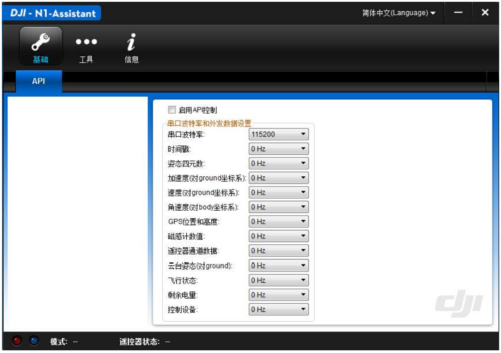
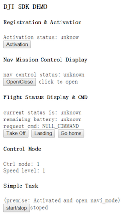

# DJI Onboard API 快速入门

*如发现任何错误，请通过Github issue或开发者论坛或邮件反馈给我们。欢迎提交pull request来帮助我们修正问题，关于文档的修改需要符合[格式标准](https://github.com/dji-sdk/onboard/issues/8#issuecomment-115976289)*

---

DJI 为开发者提供两种功能完善的飞行控制 API 帮助开发飞行应用：Mobile API 和 Onboard API。Mobile API 是 DJI Mobile SDK 的核心部分，开发者可以基于 iOS/Android 系统上的 SDK
库编写控制飞行器的移动端应用。而 Onboard API 则提供串行接口（UART），允许开发者将 自己的计算设备挂载到飞行器上，通过有线的方式直接控制飞行器。 

在本文档中，我们首先对 API 做一个整体的介绍，并且定义一些关键的术语。然后我们用一份示例代码介绍使用 Onboard API 的主要步骤。
 
## 概述 

DJI Matrice 100 开发者飞行器（以下简称 MATRICE 100）是一个为二次开发专门设计的四轴飞行器。这款飞行器有宽阔的甲板可用于安装机载设备。它的可拆卸电池仓、扩展设备安装架、额外的电源接口都允许用户设计紧凑、功能强大的飞行器应用。Onboard API 则是为了辅助 MATRICE 100 的使用而设计的串口 API。
 
### Onboard API 的主要特性

+ 可靠的通讯协议
  
  基于会话的通信可以防止数据丢包。32bit 的 CRC 进一步降低通信异常的可能性。
  
+ 灵活的控制方式
  
  可对飞行器输入多种控制量，包括位置、速度和姿态控制
  
+ 可配置的外发数据
  
  飞控外发的数据可以进行种类和频率的配置，节省带宽

+ 考虑自动飞行的设计

  飞行状态控制指令和外发指令的设计都考虑到自动导航应用的实际需求
   
### 系统综述
 
整个系统的核心设备是 MATRICE 100 以及装载在 MATRICE 100 上的机载设备。机载设备与MATRICE 100 的飞控（N1 飞控）通过串口线连接。机载设备可以是任何能够进行串口通信和 AES 加解密的计算设备。

DJI N1 PC 调参软件用于配置 MATRICE 100 的串口和 MATRICE 100 固件的升级。这款调参软件与 DJI 的其他 PC 软件使用方法相同。由于新一代的 DJI 产品主要通过手机软件 DJI Pilot 进行配置，PC 调参软件只保留了一些无法通过手机软件实现的功能，比如固件升级和串口配置。

根据相关的法律法规，由于 Onboard API 可以让用户设计超视距飞行的自动系统，DJI 必须对 MATRICE 100 采用更严格的监管制度。在使用 MATRICE 100 之前，开发者必须在 dev.dji.com 网站（以下简称 DJI 服务器）上进行注册，然后激活飞行器。DJI 服务器会为开发者生成 AppID 和 AES 密钥。机载设备和 MATRICE 100 之间的大部分通信必须进行加密，这个密钥会在激活过程中由 DJI 服务器发给机载设备。激活和加密过程会在“编程指南-命令集 0x00”中详细介绍。

系统架构框图：


注册和激活的过程图：


激活过程中的一个重要概念是设备许可数量（DAN）。它有以下性质：

+ 每个 App ID 对应一个 DAN。它表示着这个 App ID 可以激活的飞控数量。
+ 每个新的 App ID 的 DAN 上限默认为 5。
+ 在激活过程中，每一个新的飞控都会让 App ID 的 DAN 增加 1。如果某个 App ID 的 DAN 达到上限，那么激活就会失败，新的飞控不能激活。
+ 开发者可以在 dev.dji.com 上申请增加 DAN 的上限。
 
### 遥控器、Onboard API 和 Mobile API

MATRICE 100 被设计为可以使用遥控器、机载设备和移动设备进行控制。为 Inspire 1 和Phantom3 系列设计的标准 DJI 辅助软件“DJI Pilot”也可以在 MATRICE 100 上使用。另外 DJIMobile SDK 也适用于MATRICE 100（请访问 dev.dji.com了解关于DJI Mobile SDK 的更多信息）。因为 MATRICE 100 有三种可能的控制输入，控制输入必须有优先级管理。

我们将遥控器设计为控制权限最高的设备。遥控器可以选择让飞控是否将控制权转给 API 控制。

遥控器模式选择开关 F (function)档可以控制 IOC 等其他功能，API 控制模式只是其中一种。以下条件满足时，飞控切换到 API 控制模式：

1. “启用 API 控制”勾选框被选择（在 PC 调参软件中设置，参见下面的例程）。
2. IOC 模式关闭（在 DJI Pilot App 中设置）
3. 遥控器模式选择开关置于 F 档。

如果遥控器让飞控切换到 API 控制模式，设备通过 Onboard API 和 Mobile API 可以请求获得控制权。移动设备的 API 有更高的控制优先级。如果移动设备先获得了控制权，那么机载设备无法成功获得控制权。


本文档着重介绍 Onboard API。我们假设开发者在使用 Onboard API 的过程中不使用 mobileAPI。**在目前版本中，混合控制（同时使用 Mobile API 和 Onboard API）没有得到完整支持。**
 
### 命令权限等级

开发者在 dev.dji.com 上注册的时候，DJI 服务器会为开发者分配一个 API 命令权限级别，这个级别根据开发者的需求和开发能力决定。开发者在使用机载设备的时候，必须将这个权限级别存入机载设备的程序中用于激活。MATRICE 100 的飞控会在激活过程中检查权限级别的有效性。

不同的 API 级别对应着不同级别的飞行控制命令。

+ Level 0. 激活相关的命令
+ Level 1. 数据读取和非飞行控制命令。包括相机和云台的控制、飞行数据监测、传感器数据读取。这个级别不包含对飞行器的运动控制。
+ Level 2. 飞行控制。包括对飞行器的运动控制，而且可以控制飞行器的飞行状态，比如降落、返航等等。

只有富有经验的开发者才能够使用权限级别高于 2 的飞行控制命令。在未来的 onboard API 中，我们会不断增加各种权限级别的控制命令。
 
## [ROS]通过无线串口控制 MATRICE 100 

在这个示例中，我们使用示例代码“dji_sdk_keyboard_ctrl”对 MATRICE 100 进行远程控制。该代码基于 ROS 软件包 keyboardteleop.js。我们设计了一个简单的 HTML GUI 帮助开发者熟悉如何使用键盘和鼠标控制 MATRICE 100。
 
### 必备硬件

1. MATRICE 100 多轴飞行器
2. DJI 串口连接线（包含在 MATRICE 100 附件当中）
3. 若干杜邦线
4. 一对配置好的 115200 无线串口（淘宝购买）  
   注：也可使用其他比特率的串口线（如230400），只需要在调参软件中设置相应比特率数值即可。
5. USB-TTL 转换接头（淘宝购买）

  注意：Windows/Mac 上使用 USB-TTL 转换接头需要安装 PL2303 驱动
  
6. 5V 输出 DC-DC 电源模块（淘宝购买）

  注意：MATRICE 100 上不提供 5V 的电源输出，所以为了给无线串口供电，开发者需要自己购买 5V 电源模块
 
### 必备软件

1. 装有 DJI N1 PC 调参软件的 windows 电脑
2. 装有 DJI Pilot（最新版本）的可联网移动设备
3. 装有 Ubuntu 14.04 (或更高版本) 和 ROS Indigo（或更高版本）的 Linux 电脑。示例代码在 ROS Indigo 上进行过测试。
4. ROS package rosbridge_server
5. 示例代码 dji_sdk 与 dji_keyboard_ctrl
 
### 步骤

+ MATRICE 100 飞行器配置。给飞控上电，DJI N1 PC 调参软件可以用于升级固件和配置启用 API 模式。

  在页面“基础”当中，开发者可以勾选“启用 API 控制”来配置遥控器和 MATRICE 100 启用API 模式控制相关的功能。开发者能够通过“串口波特率和外发数据设置”区的选项来配置串口波特率和飞控外发数据的内容。

  

  启用 API 控制之后，将遥控器模式开关置为中位（F 档）。

+ 连接无线串口。电脑安装 USB-TTL 软件驱动，通过 USB-TTL 连接一个串口模块。另一个串口模块连接飞控附带的串口转接线。注意放在 MATRICE 100 上的串口模块需要 5V 电源模块单独供电。5V 电源模块可以使用 MATRICE 100 的电源作为输入。

+ 启动示例代码

	**1.** 编译 ROS package dji_sdk
	
	**2.** 启动 roscore, 然后启动 rosbridge_server 
	
	```
   roslaunch rosbridge_server rosbridge_websocket.launch
	```
	      
	**3.** 通过代码中的 launch 文件启动 dji_sdk_node。
	  
	下面的代码是示例 launch 文件
	    
	~~~xml
	<launch>
	<node pkg="dji_sdk" type="dji_sdk_node" name="dji_sdk_node" output="screen">
	<!-- node parameters -->
	<param name="serial_name" type="string" value="/dev/ttySAC0"/> 
	<param name="baud_rate" type="int" value="115200"/>
	<param name="app_id" type="int" value="<!-- your appid -->"/>
	<param name="app_api_level" type="int" value="<!-- your app level -->"/>
	<param name="app_version" type="int" value="<!-- your app version -->"/>
	<param name="app_bundle_id" type="string" value="<!-- your app bundle id ->"/>
	<param name="enc_key" type="string" value="<!-- your app enc key -->"/> 
	</node>
	</launch> 
	~~~
    
	其中的 node parameters 含义如下

	|Name|Type|说明|
	|----|----|----|
	|serial_name|String|g 串口设备名。通常为 “/dev/ttyUSB0”，但是在不同的Linux 设备上可能有不同的名称。 “ls /dev/*”和”dmesg| tail”命令可以用于查询设备名。|
	|baud_rate|Int|串口波特率，必须与通过调参软件设置的相同。|
	|app_id|Int|dev.dji.com 服务器返回的 AppID|
	|app_api_level|Int|dev.dji.com 服务器返回的 API 级别|
	|app_version|Int|开发者设定的应用版本号|
	|app_bundle_id|String|dev.dji.com 服务器返回的 bundle ID|
	|enc_key|String|dev.dji.com 服务器返回的 AES 密钥|
    
	**注意：这条命令一定要在 sudo su 模式下启动，因为打开串口需要 root 权限。**

	```
	sudo su
	roslaunch dji_sdk sdk_demo.launch
	```
     
   **4.** 编辑 “sdk_keyboard_demo.html”, 把 url 中的地址改成 Linux 系统的主机名或者localhost（127.0.0.1）

	~~~c
	function init() {
	  // Connecting to ROS.
	  var ros = new ROSLIB.Ros({
	  url: 'ws://127.0.0.1:9090'
	  });
	} 
	~~~

  **5.** 在浏览器中打开 “sdk_keyboard_demo.html” 。rosbridge_server 会显示有新的 client 连接上，否则请检查步骤 4 中的设置。此时可以在页面中读取到飞行平台的状态信息。

+ 测试通信链路。在 sdk_keyboard_demo 页面中点击“Activation”。如果 PC 和飞行平台之间的链接畅通，页面上可以看到返回码。否则请检查链路连接状况。

+ 激活飞行平台。连接装有 DJI Pilot 的手机和飞行平台的遥控器，确保手机连接到网络。激活过程会在点击“Activation”之后自动完成。

+ 启动飞行器在空中悬停，与周围物体保持安全距离。遥控器切入 F 档，通过程序请求控制权，此时可以通过示例程序发送控制指令。除了下图所示的指令外，键盘“WASD”键控制飞行器向对应方向的倾角，“ZC” 控制竖直速度、“QE”控制偏航旋转。“WASD”控制的倾角度数为 5*speed_level。这个 speed_level 默认为 1，可以通过键盘数字键 123456 来修改。speed_level 修改后，姿态控制指令的数值也会随之改变。请谨慎使用大姿态角度的指令，飞行器会很快加速。

  

+ 安全飞行注意事项：配置完成后用户必须把遥控器切到 F 档 API 控制模式，飞控才会准备接受串口控制。此后机载设备可以发送请求获得控制权。这样的设计是将遥控器的模式切换拨杆作为紧急情况下的保险开关。任何情况下用户拨动遥控器模式切换拨杆，都会退出 API 控制模式。我们建议两位开发者一起合作进行测试，一个人控制网页 GUI，另一个人使用遥控器紧急制动。

  再次进入 API 控制模式之后，机载设备不需要再次请求获得控制权。

  如果遥控器和飞控上电时遥控器已经置于 F 档，则需要切出再切入 F 档一次才可触发API 控制模式，这样可以防止 API 控制模式在用户没有意识到的情况下被打开。
  
