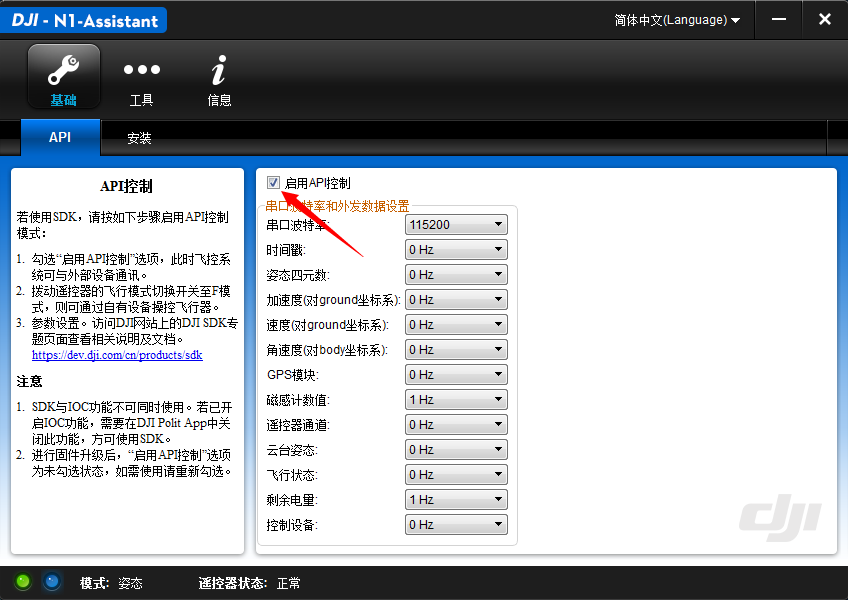
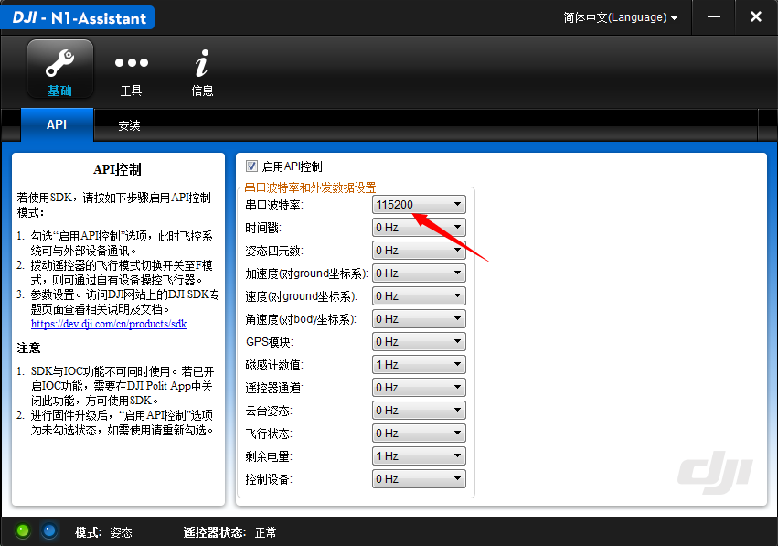
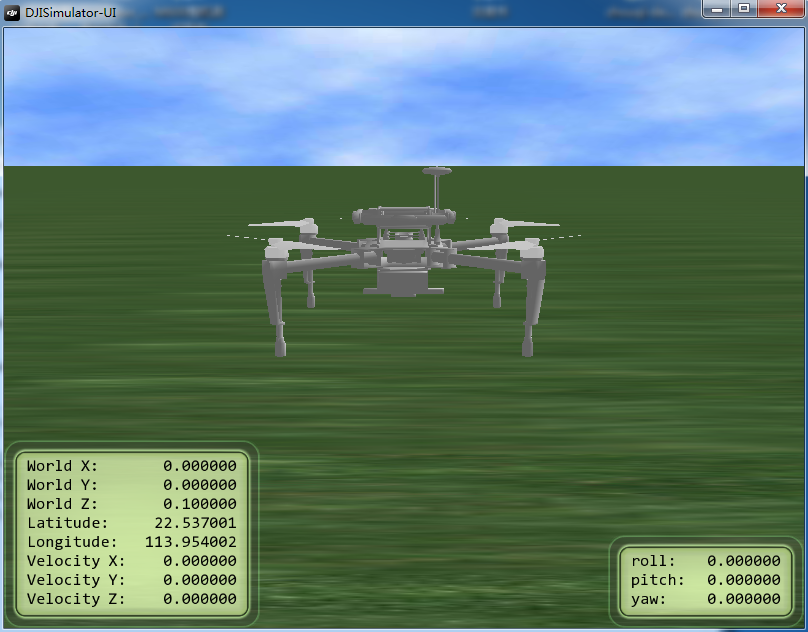
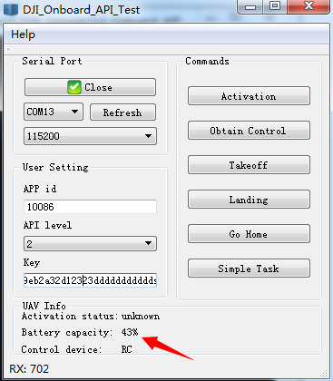

# M100飞行平台激活步骤与指南
这篇文档的目的在于帮助开发者明白并快速对M100飞行平台进行激活。

>备注：在您开始之前，请先卸下螺旋桨。

## 1. 申请开发者账号
您可以在 https://dev.dji.com/cn/products/sdk/onboard-sdk 申请开发者 Level 2 账号，获得 APP id和Key。
## 2. 开启API控制模式
使用USB连接PC和飞机，打开PC端N1调参软件，勾选“启用API控制”

## 3. 配置波特率
配置飞控当前UART API的通信速率
如下图所示，配置飞机UART API口的通信波特率为115200。

## 4. 进入模拟器模式
关闭N1调参软件，重启飞机，保持飞机USB和PC连接，运行模拟器。点击“Display simulator”按钮，然后点击“Start Simulation”进入模拟器。我们建议勾选“Auto Executing UI”，这样下次模拟器启动时能够自动显示模型。

M100在模拟器中如下图所示。

>备注：每次飞机重启，或飞机USB和PC断开后，需重新进入模拟器模式。

## 5. 连接移动设备和遥控器
使用运行android或ios系统的移动设备（手机或平板）连接遥控器，确保移动设备能连接互联网。打开移动设备上的DJI GO APP。
## 6. 连接飞机和Onboard设备
使用串口线连接飞机和Onboard设备。

## 7. 激活
以DJI_Onboard_API_Windows_QT_Sample为例。
* 使用USB转串口线连接飞机UART口和PC；
* 配置PC端的串口通信速率和飞机端的一致（参考步骤3中飞机端配置的速率）
* 打开串口，即可看到飞机端推送过来的数据（如电量数据）
* 将申请得到的APP id、API level以及Key输入到文本框中，单击‘Activation’即可激活Onboard API。

