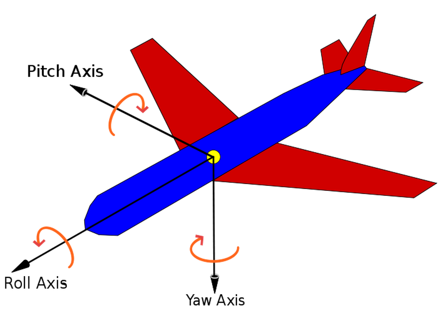

# 飞行控制附加说明 

## 坐标系

1. Body坐标系：

  

2. Ground坐标系（北东地坐标系）：
  
  + 北-x
  + 东-y
  + 指向地心-z *

  坐标系满足右手定则。ground坐标系下通用的航向定义是以北为0，顺时针到180度，逆时针到-180 度。这样用-180到180度的数值表示飞行平台在空间中的朝向。

  **Ground坐标系的高度方向与人对飞行控制的直觉不符，因此DJI将竖直方向的高度和速度都调整成了以天空方向为正，也即发送数值为正的速度会让飞行平台远离地面。但是调整高度方向并不改变Ground坐标系的另外两个轴的方向和顺序。*

## 模式标志字节说明
### 模式标志字节
模式标志字节代表不同模式的配置。因为多旋翼的结构特点，飞行控制的时候，要把控制信息分解成三部分，竖直、水平和偏航，每个部分都有几种选择，通过模式标志字节进行组合。模式标志字节的定义如下。
<table>
<tr>
  <th>名称</th>
  <th>大小</th>
  <th>说明</th>
</tr>
<tr>
  <td rowspan="5">模式标志字节
  <td>bit7:6</td>
  <td>0b00：HORI_ATTI_TILT_ANG 0b01：HORI_VEL 0b10：HORI_POS</td>
</tr>
<tr>
  <td>bit5:4</td>
  <td>0b00：VERT_VEL 0b01：VERT_POS 0b10：VERT_THRUST</td>
</tr>
<tr>
  <td>bit3</td>
  <td>0b0: YAW_ANG 0b1: YAW_RATE</td>
</tr>
<tr>
  <td>bit2:1</td>
  <td>0b00：水平方向坐标系为 Ground 系 0b01：水平方向坐标系为 Body 系</td>
</tr>
<tr>
  <td>bit0</td>
  <td>0b0：偏航坐标系为 Ground 系 0b1：偏航坐标系为 Body 系</td>
</tr>
</table>

### 控制模式

我们建议用户在室内环境中，如果没有安装Gudiance或者飞行高度超过3m时，不要使用竖直方向的位置控制，因为室内环境中气压计读数不准，影响控制器的表现。

>备注：部分控制模式有进入条件限制：

>- 当且仅当GPS信号正常（health\_flag >=3）时，才可以使用水平**位置**控制（HORI_POS）相关的控制指令
- 当GPS信号正常（health\_flag >=3），或者Gudiance系统正常工作（连接安装正确）时，可以使用水平**速度**控制（HORI_VEL）相关的控制指令

<table>
<tr>
  <th>类别</th>
  <th>模式</th>
  <th>说明</th>
</tr>
<tr>
  <td rowspan="3">竖直方向</td>
  <td>VERT_POS</td>
  <td>垂直方向上控制的是位置，输入的控制量为相对地面的高度</td>
</tr>
<tr>
  <td>VERT_VEL</td>
  <td>垂直方向上控制的是速度</td>
</tr>
<tr>
  <td>VERT_THRUST</td>
  <td>垂直方向上控制的是油门百分比(0-100)（危险，请小心使用）</td>
</tr>

<tr>
  <td rowspan="3">水平方向</td>
  <td>HORI_ATTI_TILT_ANG*</td>
  <td>水平方向控制的是飞行器水平倾角，根据坐标系确定水平分量</td>
</tr>
<tr>
  <td>HORI_POS**</td>
  <td>水平方向控制的是飞行器飞行距离**，根据坐标系确定水平分量</td>
</tr>
<tr>
  <td>HORI_VEL</td>
  <td>水平方向控制的是飞行器速度，根据坐标系确定水平分量</td>
</tr>

<tr>
  <td rowspan="2">偏航</td>
  <td>YAW_ANG</td>
  <td>偏航控制一个 Ground 坐标系下的目标角度</td>
</tr>
<tr>
  <td>YAW_RATE</td>
  <td>偏航控制目标角速度，航控制目标可以定义在 Ground 坐标系或 Body 坐标系</td>
</tr>
</table>

**HORI_ATTI_TILT_ANG模式控制量如下图，DJI飞控采用水平面直接进行整个平面旋转。其中平面旋转角度为Θ,旋转方向与x轴或roll轴方向角度为γ。输入参量Θx=Θ*cos(γ),Θy=Θ*sin(γ)。(当采用Ground坐标系时γ为飞行方向与正北方向夹角，此时飞行器飞行状态与IOC模式相似；当采用Body坐标系时γ为飞行方向与飞行器机头方向夹角，此时飞行器飞行状态与遥控器下的姿态模式相似)*  

***HORI_POS模式的输入量是相对位置的净输入量。净输入量通过GPS或Guidance等传感器获得位置移动的反馈信息，与输入作差后得到。为完成飞行的位置控制，需要连续获得反馈并发送该命令，以达到平稳的控制效果。*  
*开发者自己使用时可以根据需求封装，例如[xuhao1封装的SDK包](https://github.com/xuhao1/dji_sdk/blob/master/src/modules/dji_services.cpp)采用了GPS的封装。*

### 模式的组合
允许的模式的组合，共有 14 种模式。  

|模式编号|组合形式|输入数值范围 (VERT/HORI/YAW)|模式标志字节*|  
|-------|-----|-----------------------------------------|--------|  
|1|VERT_VEL HORI_ATTI_TILT_ANG YAW_ANG|-4 m/s ~ 4 m/s -30 度 ~ 30 度 -180 度 ~ 180 度|0b00000xx0|
|2**|VERT_VEL HORI_ATTI_TILT_ANG YAW_RATE|-4 m/s ~ 4 m/s -30 度 ~ 30 度 -100 度/s ~ 100 度/s|0b00001xxy|
|3|VERT_VEL HORI_VEL YAW_ANG|-4 m/s ~ 4 m/s -10 m/s ~ 10 m/s -180 度 ~ 180 度|0b01000xx0|
|4|VERT_VEL HORI_VEL YAW_RATE|-4 m/s ~ 4 m/s -10 m/s ~ 10 m/s -100 度/s ~ 100 度/s|0b01001xxy|
|5|VERT_VEL HORI_POS YAW_ANG|-4 m/s ~ 4 m/s 米为单位的相对位置，数值无限制 -180 度 ~ 180 度|0b10000xx0|
|6|VERT_VEL HORI_POS YAW_RATE|-4 m/s ~ 4 m/s 米为单位的相对位置，数值无限制 -100 度/s ~ 100 度/s|0b10001xxy|
|7|VERT_POS HORI_ATTI_TILT_ANG YAW_ANG|0m 到最大飞行高度 -30 度 ~ 30 度 -180 度 ~ 180 度|0b00010xx0|
|8|VERT_POS HORI_ATTI_TILT_ANG YAW_RATE|0m 到最大飞行高度 -30 度 ~ 30 度 -100 度/s ~ 100 度/s|0b00011xxy|
|9|VERT_POS HORI_VEL YAW_ANG|0m 到最大飞行高度 -10 m/s ~ 10 m/s -180 度 ~ 180 度|0b01010xx0|
|10|VERT_POS HORI_VEL YAW_RATE|0m 到最大飞行高度 -10 m/s ~ 10 m/s -100 度/s ~ 100 度/s|0b01011xxy|
|11|VERT_POS HORI_POS YAW_ANG|0m 到最大飞行高度 米为单位的相对位置，数值无限制 -180 度 ~ 180 度|0b10010xx0|
|12|VERT_POS HORI_POS YAW_RATE|0m 到最大飞行高度 米为单位的相对位置，数值无限制 -100 度/s ~ 100 度/s|0b10011xxy|
|13|VERT_THRUST HORI_ATTI_TILT_ANG YAW_ANG|10 ~ 100 （危险，请小心使用） -30 度 ~ 30 度 -180 度 ~ 180 度|0b00100xx0|
|14|VERT_THRUST HORI_ATTI_TILT_ANG YAW_RATE|10 ~ 100（危险，请小心使用） -30 度 ~ 30 度 -100 度/s ~ 100 度/s|0b00101xxy|

**模式标识位低3位决定水平方向及偏航坐标系，部分模式下可根据开发者需要决定使用哪种坐标系。*  
*xx表示水平方向坐标系的控制位，00表示Ground 系，01表示Body 系*  
*y表示偏航坐标系的控制位，0表示Ground 系，1表示Body 系*

***在该模式下，若输入姿态控制指令为0，飞行器会进入刹车悬停，实现位置增稳，具有一定的抗风能力。*

## 飞行状态说明
### 飞行状态
|飞行状态|状态名称|说明| 
|-------|-------|---|
|1|standby|飞行器待机|
|2|take_off|飞行器起飞|
|3|in_air|飞行器在空中|
|4|landing|飞行器降落|
|5|post_landing|飞行器降落完成|

*备注：我们建议开发者使用传感器数据作为飞行器状态的判断标准。*
