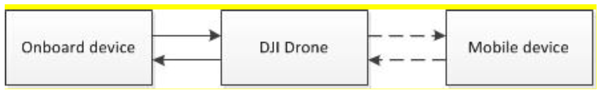
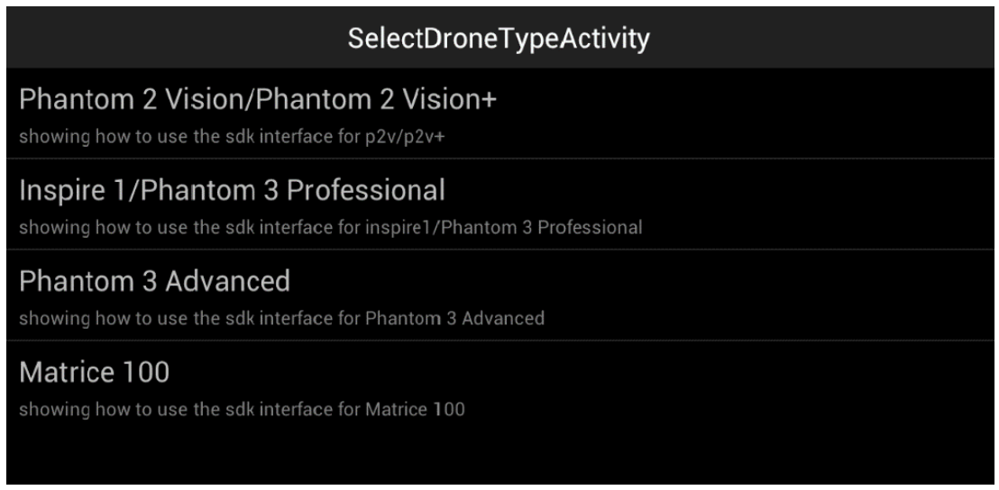

# User Guide for Transparent Data Transmission between Mobile and Onboard Devices 

*In case of any mistake or bug, please report to us using Github issue or DJI forum or email. You are welcome to send your pull request helping us fix issue. However, all pull requests related to document must follow the [document style](https://github.com/dji-sdk/onboard/issues/8#issuecomment-115976289)*

## Introduction

This guide gives an overview of the Transparent Data Transmission function between onboard and mobile devices. Topics covered include development purpose, methods of use and sample codes.

**Note that the upstream bandwidth (mobile to onboard) is around _1KB/s_, while the downstream bandwidth (onboard to mobile) is around _8KB/s_.**

### Development Purpose

DJI provides two types of APIs for developers to create their own applications: Mobile API and Onboard API. Mobile API allows developers to monitor and control the UAV from a mobile device running iOS or Android, which is connected with the remote controller. Onboard API allows developers to monitor and control the UAV from any system directly connected to the UAV through serial port (UART),

Mobile API can be used without any other devices and allows developers to monitor the flight status easily. However, this configuration has a relatively low computing power and the wireless connect between mobile and UAV restricts the bandwidth for real-time or complex control.

Onboard API is implemented through the computing device which is mounted on the UAV. Communication with the UAV is done directly through their serial ports. It provides sufficient computing power and stability for developers to run complex and demanding applications. But due to the computing device is mounted on the UAV, developers are not able to monitor the flight status. If the program crashes, developers will have to manually control the UAV with remote controller.

Transparent Data Transmission was developed to combine the benefits of these two APIs by establishing a connection between the mobile device and the onboard device. With this method, developers are able to send data from their mobile devices to the onboard devices to control over the program running on the onboard device. The onboard device can also send data to the mobile device for flight status monitoring and other functions.

In short, Transparent Data Transmission serves as a linkage between Mobile API and Onboard API, granting developers a greater flexibility in creating their applications.

## Transparent Data Transmission (Onboard to Mobile)

### Onboard Device to UAV

The communication protocol between the onboard device and the UAV is introduced in *onboard_SDK_introduction. This section explains it in more detail.

The communication protocol is described as below:

    Command set: 0x00
    Command ID: 0xFE
 
 
|Data Type|Offset|Size|Description|
|---------|------|----|-----------|
|Request Data|0|0~100|Data needs to be sent to Mobile Device|
|Return Data|0|2| Return code 0: Success|

~~~c
char cmd_buf[10];
cmd_buf[0] = 0x00;
cmd_buf[1] = 0xFE;
memcpy(&cd_buf[2], "Hello!", 7);
Linklayer_Send(SESSION_MODE3,
                cmd_buf,
                9,
                0,
                200,
                3,
                0
);
~~~

### UAV to Mobile Device

This section use the Android system as an example. Users can enter the DJI-SDK-DEMO application to monitor the UAV status through relevant functions and use the Transparent Data Transmission function on the Controller State page.

**Note: so far only the DJI Matrice 100 supports this function.**

The relative sample codes are shown as below:

- iOS

~~~cSharp
//Setting Delegation
inspireMC.mcDelegate = self;
  
//The legation function is called when receiving data
(void)mainController:(DJIMainController*)mc didReceivedDataFromExternalDevice:(NSData*)data {
//Here is the receiving data
NSLog(@"%@",data);
}
~~~
  
- Android

~~~java
//Receiving the data callback interface sent from UAV
DJIMainControllerExternalDeviceRecvDataCallBack mExtDevReceiveDataCallBack = null;
  
//Instantiate callback interface
mExtDevReceiveDataCallBack = new DJIMainControllerExternalDeviceRecvDataCallBack() {
@override
public void onResult(byte[] data) {
  //Here is the receiving data
}
};
  
//Setting callback interface
DJIDrone.getDjiMC().setExternalDeviceRecvDataCallBack(mExtDevReceiveDataCallBack);
~~~

## Transparent Data Transmission (Mobile to Onboard)

### Mobile Device to UAV

The relevant sample code are shown as below:

#### iOS

  - Initialization
  
~~~cSharp
//Create DJI Drone object according to relative UAV type.
DJIDrone* drone = [DJIDrone droneWithType:DJIDrone_Inspire];
//Obtain Main controller object from DJI Drone object.
DJIInspireMainController* inspireMC = (DJIInspireMainController*)drone.mainController;
//Start data connection.
[drone connectToDrone];
~~~
  
  - Sending data.
  
~~~cSharp
  //Please note that data size should be no larger than 100 bytes.
  NSData* data = [NSData dataWithByte:"..."];
  //Sending data to peripheral and check the sending status through callback function.
  [inspireMC sendDataToExternalDevice:data withResult:(^(DJIError* error)){
    if(error.errorCode == ERR_Successed){
      //Data sent successfully.
    }
    else if(error.errorCode == ERR_InvalidParam) {
      //Data size is null or larger than 100 bytes.
    }
    else {
      //Data sent failed
    }
  }];
~~~
  
#### Android

~~~java
  //Data needs to be sent, please note that data size should be no larger than 100 bytes.
  byte[] data = {0};
  //Sending data to UAV
  DJIDrone.getDjiMC().sendDataToExternalDevice(data,new DJIExecuteResultCallback(){
    @override
    public void onResult(DJIError result) {
      //result is the callback status after sending data
      //1. result == DJIError.ERR_PARAM_IILEGAL,  Data size is null or larger than 100 bytes.
      //2. result == DJIError.ERR_TIMEOUT,        Data sent failed.
      //3. result == DJIError.RESULT_OK,          Data sent successfully.
    }
  });
~~~

### UAV to Onboard Device

Use this function with the same method mentioned previously. The communication protocol is described as below:

    Command Set: 0x02
    Command ID: 0x02

|Data Type|Offset|Size|Description|
|---------|------|----|-----------|
|Request Data|0|1~100|User defined data|
|Return Data|0|0|No return data|

