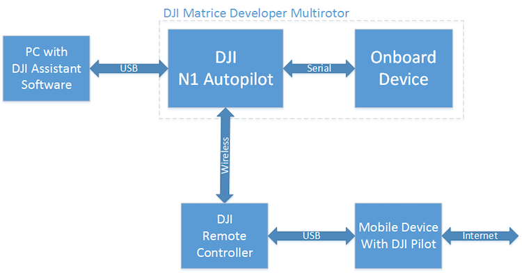
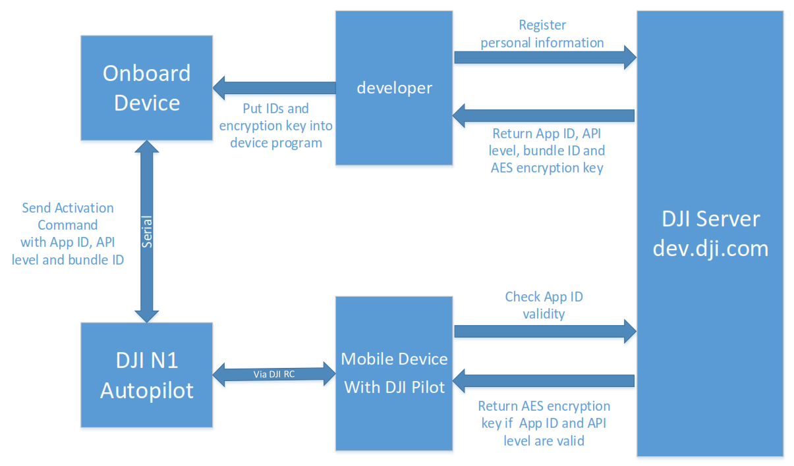
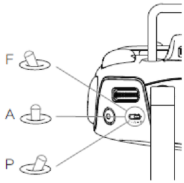
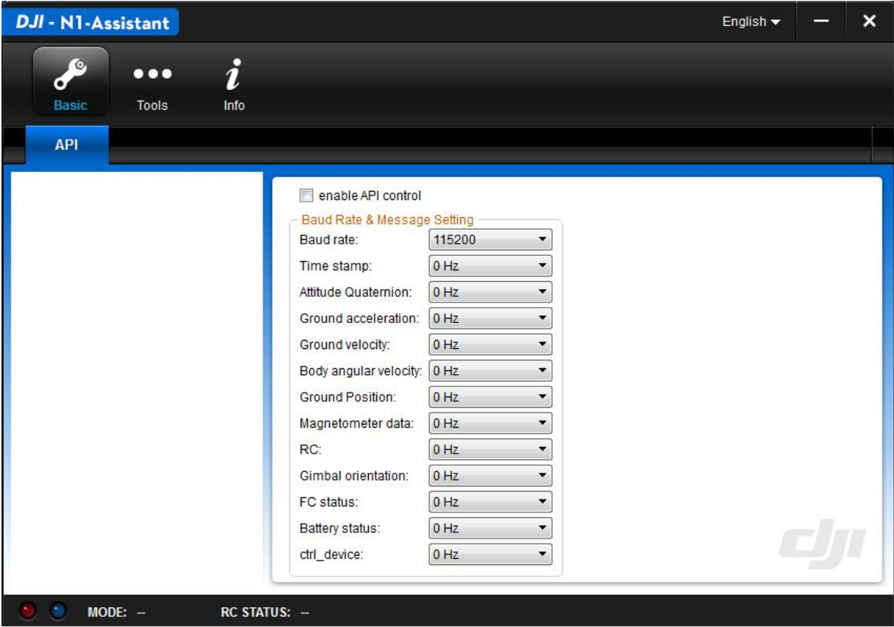
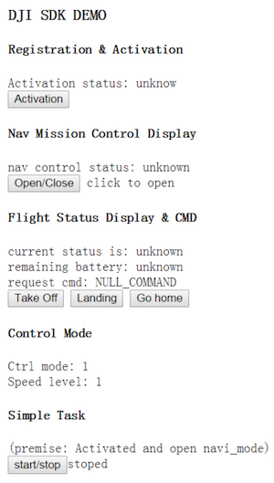

# DJI Onboard API Quick Start 

*If you come across any mistakes or bugs in this tutorial, please let us know using a Github issue, a post on the DJI forum, or email. Please feel free to send us Github pull request and help us fix any issues. However, all pull requests related to document must follow the [document style](https://github.com/dji-sdk/onboard/issues/8#issuecomment-115976289)*

---

DJI offers two powerful APIs for developers to create custom applications: the Mobile Device API, and the UAV Onboard API. The Mobile Device API is part of the DJI Mobile SDK and lets developers monitor and control the UAV from a mobile device running iOS or Android that is connected to the remote controller. The UAV Onboard API allows developers to monitor and control the UAV from any wired connected system through the serial (UART) interface. 

In this documentation, we first introduce the onboard API and explain some terminology. Then a sample code is used to demonstrate key steps to get started. 

## Introduction

DJI MATRICE 100 is a specially designed quadrotor UAV that has a wide dock to put various equipment onboard. Its detachable battery compartment, expansion bars, expansion bays and extra XT60 power ports give developer great convenience to design a compact UAV application system. DJI Onboard API is for developers who want to directly control MATRICE 100 via a serial interface.  

### Key Features of Onboard API

+ Reliable Communication

  Session-based link protocol to prevent package loss with 32-bit CRC.
  
+ Flexible Control Inputs

  Different control methods including position, velocity and attitude control.
  
+ Configurable Monitoring Data

  Flight data can be obtained with configurable number of items and frequency.
  
+ Autonomous Application Oriented

  Flight mode control and flight data are designed to aid autonomous control and navigation.

### General System Description

The core components are MATRICE 100 and a device installed on it. The onboard device connects to the autopilot of MATRICE 100 (N1 Autopilot) by a serial cable. The onboard device can be any small sized computing device that is able to perform serial communication and AES encryption.

DJI N1 PC assistant software can configure MATRICE 100 serial port and upgrade firmware of MATRICE 100. It is a tool similar to other DJI PC-based software. This software is simplified  to have only a few functions that cannot be done by DJI new generation assistant software - DJI Pilot, such as firmware upgrade and serial port configuration.

Due to the safety concern, since onboard API allows developers to implement autonomous UAV systems beyond line-of-sight, DJI has to impose more restricted control registration methods for MATRICE 100. Before using MATRICE 100, a developer must register his personal information on _dev.dji.com_ and then activate his MATRICE 100. DJI Server will provide an APP ID and an AES key to the developer. Most parts of the communication between the onboard device and MATRICE 100 is encrypted by this key, which reaches MATRICE 100 separately during activation progress. The activation and encryption will be explained in detail in the "Active Command Set" section.

Diagram of System Structure:


Diagram of registration and activation process:


An important concept in the activation process is the Device Available Number (DAN). It has following properties:

+ Each APP ID has a DAN, which means the maximum number of autopilots to be activated to support the APP by developer with the same APP ID.
+ By default, DAN is limited to 5 for a new APP ID.
+ When autopilot reaches DJI Server during an activation process, the DAN of the APP ID increases 1. If the DAN equals to the limit, new activation request will not be permitted.
+ Developers should apply on _dev.dji.com_ to increase the limit of DAN of their APP IDs.

### Remote Controller, Onboard API & Mobile API

DJI Matrice Multirotor is designed to be controlled by Remote Controller (RC), onboard device and mobile device. The standard assistant software “DJI Pilot” for DJI Inspire 1 and Phantom 3 can also be used on the platform. Also DJI Mobile SDK is applicable to the platform, so the platform can be controlled via mobile API (please visit _dev.dji.com_ to learn more about DJI Mobile SDK). Since there are three possible control inputs, it is necessary to prioritize them.  

RC is designed to be the primary input source. It can decide whether the flight control is allowed to grant control authority to onboard device and mobile device or not. The F (stands for function) position of the RC controls the flight controller to enter several functions including IOC and API control mode. The flight controller can enter API control mode if the following settings are done:

1. “enable API control” box is ticked in PC assistant software (See example below for more details).
2. IOC mode is turned off (Use DJI Pilot App to check this setting).
3. RC mode selection bar to F position (see the below figure).

If RC allows the flight controller to enable API control, onboard API and mobile API can request control authority using their API request functions. Mobile API is designed to have higher control priority than onboard API. If mobile API has the control authority, onboard API cannot obtain the control authority.



This document focuses on introducing the onboard API. It assumes mobile API is not used along with onboard API.

**In the current version, hybrid control (using both mobile API and onboard API) is not fully supported.** 

### Command Authorization Levels

When a developer registers on _dev.dji.com_, an authorization level will be assigned to him according to his programming experience and the application requirements. The developer must save his authorization level (app_api_level) to the onboard device. This app_api_level will be checked during activation process.  

Different authorization levels unlock different commands the developer can use.  

+ Level 0, activation related commands
+ Level 1, monitor and non-flight control, including camera and gimbal control, flight data monitoring. This level does not involve direct control of craft motion.
+ Level 2, flight control. It contains not only motion control, but also some flight mode changing control commands. 

In future onboard API, we will release more commands with different authorization levels. 
 
## [ROS based] Wireless control of DJI MATRICE 100 

This example uses sample code `dji_keyboard_ctrl` to control MATRICE 100 remotely. The code is based on ROS package `keyboardteleopjs`. We have created a simple HTML GUI to make developers familiar with controlling MATRICE 100 using keyboard and mouse.  
 
### Hardware Checklist

1. DJI Matrice Developer Multirotor MATRICE 100
2. DJI serial cable (included in the MATRICE 100 accessories)
3. [DuPont line](http://miniimg.rightinthebox.com/images/384x384/201211/mfbiot1354248218185.jpg) 10-20pcs (can be purchased from any electronic components distributor)
4. [433(434)](http://www.seeedstudio.com/depot/434Mhz-Wireless-Serial-Transceiver-Module-40-Meters-p-1732.html) wireless serial transceiver module 2pcs 
5. [USB to TTL](http://www.adafruit.com/product/954) serial cable 1pc <br>
**Note**: PL2303 driver is needed to use the USB to TTL serial cable on Windows/Mac. 
6. [5V DC-DC Converter](http://www.adafruit.com/products/1385) <br>
**Note**:  MATRICE 100 does not provide 5V power, so the serial transceiver module must be powered with external DC-DC converter. 

### Software Checklist

1. Windows PC with DJI N1 PC assistant software.
2. Mobile Device with DJI Pilot (newest version) installed. The device must have Internet access.
3. Linux PC (or embedded device) with Ubuntu 14.04 (or higher) and ROS Indigo (or higher). The sample code is tested on ROS Indigo only.
4. ROS package rosbridge_server 
5. Sample code "dji_sdk" and "dji_keyboard_ctrl"

### Setup Step

#### Prepare MATRICE 100

Power on MATRICE 100 and connect it to PC. DJI N1 PC assistant software allows users to update firmware and configure MATRICE 100 in order to enable API control mode.

On tab `Basic`, developers can select `enable API control` to enable remote controller and make MATRICE access functions related to API control. Developers may alter the serial baud rate and data package content in `Baud Rate & Message Setting`.



After API control mode enabled, developers can switch to mode selection bar on remote controller into the middle position (F position) to enable API control.

#### Establish communication link

Configure the 433 transceivers to the baud rate 115200 (different transceivers may have different initialization steps). Connect one transceiver to PC through the USB to TTL cable and the other transceiver to the autopilot of MATRICE using DJI serial cable. Be careful with the transceiver on MATRICE 100, whose power must come from the 5V DC-DC converter and it can draw power from MATRICE 100 battery.

#### Run sample code

**1.** Compile ROS package dji_sdk.

**2.** Start roscore, and then start rosbridge server in a new terminal.

```
roslaunch rosbridge_server rosbridge_websocket.launch
```

**3.** Use the launch file in the sample code to start dji_sdk_node.

  Following is the sample launch file
  
  ```xml
  <launch>
  <node pkg="dji_sdk" type="dji_sdk_node" name="dji_sdk_node" output="screen">
  <!-- node parameters -->
  <param name="serial_name" type="string" value="/dev/ttySAC0"/> 
  <param name="baud_rate" type="int" value="115200"/>
  <param name="app_id" type="int" value="<!-- your appid -->"/>
  <param name="app_api_level" type="int" value="<!-- your app level -->"/>
  <param name="app_version" type="int" value="<!-- your app version -->"/>
  <param name="app_bundle_id" type="string" value="<!-- your app bundle id ->"/>
  <param name="enc_key" type="string" value="<!-- your app enc key -->"/> 
  </node>
  </launch> 
  ```
  
 The node parameters are:
 
|Name|Type|Explanation|
|----|----|-----------|
|serial_name|String|Serial device's name. Usually it looks like `/dev/ttyUSBx` but different Linux Distribution may have different device name. `ls /dev/` and `dmesg | tail` commands can be used to identify the device name.|
|baud_rate|Int|The serial port baud rate. It must be the same as the one in MATRICE 100's configuration.|
|app_id|Int|The APP ID assigned by _dev.dji.com_ server to developer when registration.|
|app_api_level|Int|The APP API control level assigned by _dev.dji.com_ server to developer when registration.|
|app_version|Int|Developer assigned application version|
|app_bundle_id|String|The APP bundle ID assigned by _dev.dji.com_ server to developer when registration.|
|enc_key|String|The encryption key assigned by dev.dji.com server to developer when registration.|
 
 **Note: This command must be run as root. (i.e. `sudo su` first).**
     
      sudo su
      roslaunch dji_sdk sdk_demo.launch

**4.** Edit `sdk_keyboard_demo.html`. Change the address in the URL to the Linux machine hostname, localhost/127.0.0.1 when single machine and the LAN IP when running ROS multi-machine.

~~~c
function init() {
  // Connecting to ROS.
  var ros = new ROSLIB.Ros({
  url: 'ws://127.0.0.1:9090'
  });
} 
~~~

**5.** Open `sdk_keyboard_demo.html` in web browser. `rosbridge_server` will print log showing new client connected. If not, please check your connection settings in step 4. After the html page is connected to `rosbridge_server`, the web GUI will display flight status and it is also possible to check flight status directly by `rostopic`.

#### Test communication link

On the web GUI, click button `Activation`. If the communication link is ready to use, MATRICE 100 will acknowledge the GUI. If not, please debug your transceivers and MATRICE 100 settings.

#### Activate MATRICE 100 to use API

Using DJI Pilot APP to connect the mobile device with the remote controller of MATRICE 100 and make sure the mobile device has Internet access. Then the activation process will be executed automatically after clicking the `Activation` button.

#### Control MATRICE 100

The web GUI has control buttons as shown below. Moreover, key `W`,`A`,`S`,`D` allows MATRICE move horizontally, `Z`, `C` changes vertical velocity and `Q`,`E` controls yaw movement. Developers can try these functionalities via web GUI but please make sure you have enough testing space first.

The horizontal movement is controlled by angle command associated with button `W`,`A`,`S`,`D`. The angular speed is `5*speed_level`. `speed_level` is an inner variable with default value 1. The value can be changed using key `123456`. Be careful when you are working with high angular speed, MATRICE 100 will accelerate quickly.



#### Safety Flight

MATRICE 100 only responses to serial control command when the remote controller’s mode selection bar is at its middle position (F position).  Anytime when user switches the mode away from F position, the API control mode is turned off. We recommend two developers work together during the testing. One developer controls the web GUI, while the other developer hold the remote controller for emergency use.  
If the user wants to switch back to F position and reenter the API mode, onboard application does not need to send control request again to get control authority. If the mode selection bar is already at F position when MATRICE 100 is powered on, then user must switch back and forth to enable API control mode. This mechanism can prevent MATRICE 100 from executing automatic applications without user permission.  