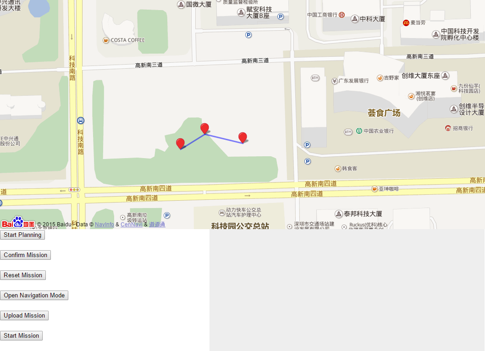

#DJI Onboard SDK
##Map Waypoint Navigation Demo
---

Date: 2015/10/22
Version: 1.0

---
###Description
This demo is designed for planning a waypoint line to command the quadcopter to fly along.
There are two parts inside the demo. One of them is a ROS sever program, and the other one is the webpage client. Users can set a waypoint line on the map interface in the webpage and then send the mission to the onboard server. And the server will talk to the controller and execute the mission.


###Usage

####1.Setup Demo Server
#####a) Setup Environment
Firstly, follow the instruction of Onboard SDK and build up the onboard computer. A ubuntu 14.04 with ROS indigo fully installed is required.

#####b) Install Rosbridge
To communicate with webpage client, a rosbridge package should be installed:
```
sudo apt-get install ros-indigo-rosbridge-server
```

#####c) Launch Main SDK Monitor Program
The main SDK monitor program provide some services interface to communicate with the flight controller layer. It is necessary for this demo:
```
roslaunch dji_ros sdk_demo.launch
```

#####d) Launch Demo
Finally, launch the demo:
```
roslaunch dji_ros map_nav_srv.launch
```
This launch file will fire up both rosbridge websocket server and the demo server. Default 19871 port is monitored by the websocket server. You can modify it in the launch file.

####2. Put the Webpage Client to Use
#####a) Setup the network
The webpage client will comunicate with rosbridge on default localhost:19871. If you are not testing the webpage on the onboard computer, you need to modify this network address in line 11 of wp_control.js.

#####b) Create a Mission
On the webpage, click "Start Planning" to begin a mission. One the map a initial marker will be created to show current position.
Then create more waypoints by clicking on the map directly. You can also right click upon the markers to modify height. The default of height is 10m.
After that, you can click "Confirm Mission" to check the waypoint list data. If you want to do more modification, drag the markers or right click upon them. Or you can use "Reset Mission" to clean up current mission.

#####c) Execution
Before this, make sure the quadcopter has been turn on and the RC has been switched to "F" mode. Remember to unlock the quadcopter using RC. What's more, the demo server should be fire up in onboard computer.
Then click "Open Navigation Mode" to acquire control of the quadcopter.
Next, click "Upload Mission" to upload the mission to onboard server.
Finally, click"Start Mission" to execute.
During the execution, if you want to cancel the mission, click "Cancel Mission" and stop the quadcopter.


