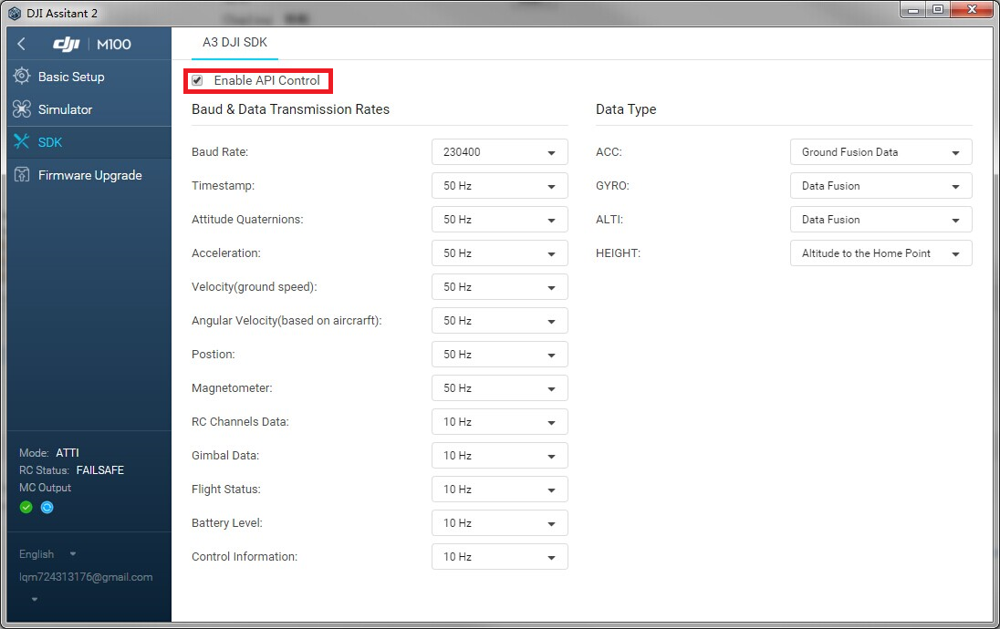
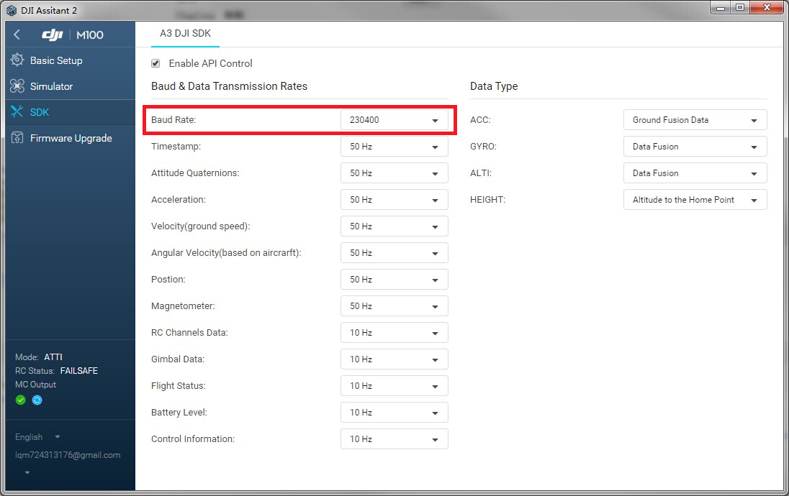
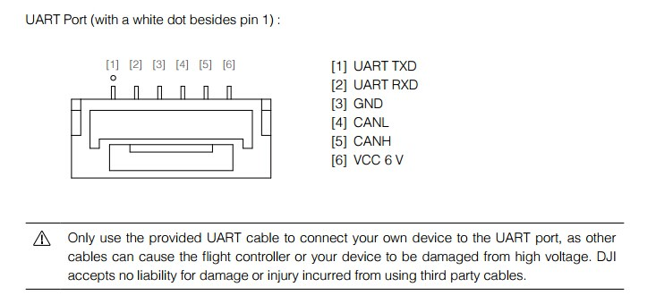
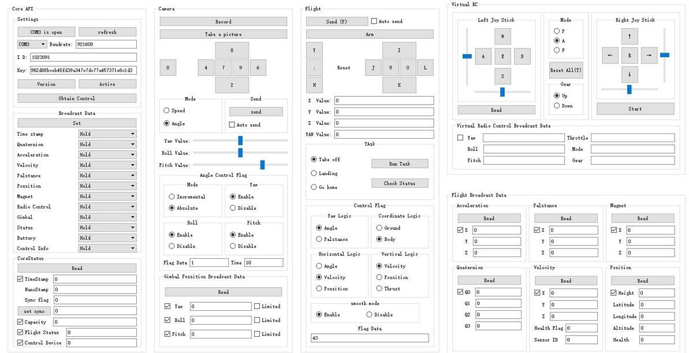

#### 本文档已停止维护, 请移步到DJI开发者官网的 <https://developer.dji.com/onboard-sdk/documentation/quick-start/index.html> 查看最新版本. 

# 激活指南
本文档的目的在于帮助开发者明白并快速对飞行平台进行激活。

>备注：在您开始之前，请先卸下螺旋桨。

---

## 1. 申请开发者账号
您可以在https://developer.dji.com/register/ 申请开发者账号，以获得APP id和Key。
## 2. 开启API控制模式
使用USB连接PC和飞机，打开PC端调参软件，勾选“启用API控制”

## 3. 配置波特率
配置飞控当前UART API的通信速率
如下图所示，配置飞机UART API口的通信波特率为230400。

## 4. 连接移动设备和遥控器
使用运行android或ios系统的移动设备（手机或平板）连接遥控器，确保移动设备能连接互联网。打开移动设备上的DJI GO APP。
## 5. 连接飞机和Onboard设备
使用串口线连接飞机和Onboard设备。

**注意：请将Onboard设备串口的RX（接收针脚）连接至飞机串口的TX（发送针脚）；
将Onboard设备串口的TX（发送针脚）连接至飞机串口的RX（接收针脚）；
将Onboard设备接口的GND（信号共地针脚）连接至飞机串口的GND（信号共地针脚）**

## 6. 激活
以下我们将使用DJI_Onboard_API_Windows_QT_Sample为例演示如何进行激活。
* 使用USB转串口线连接飞机UART口和PC；
* 配置PC端的串口通信速率和飞机端保持一致（参考步骤3中飞机端配置的速率）
* 打开串口，即可看到飞机端推送过来的数据（如电量数据）
* 将申请得到的APP id、API level及Key输入到文本框中，单击‘Activation’以完成激活过程。

