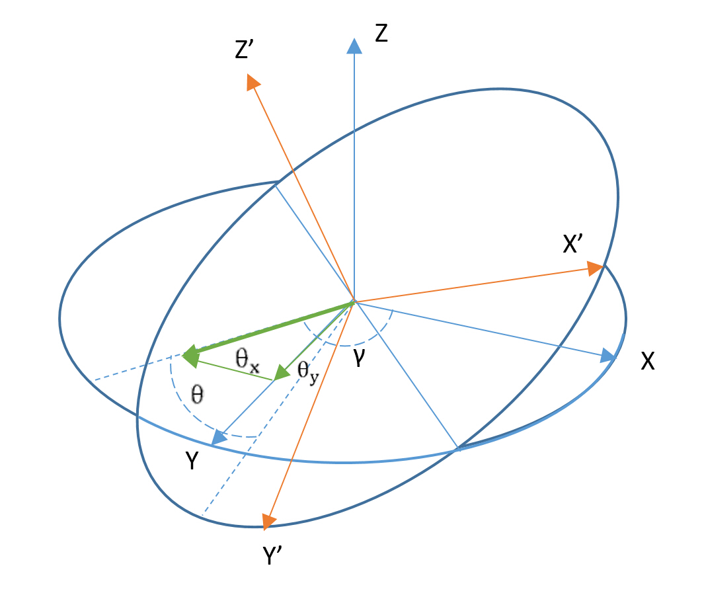

#### 本文档已停止维护, 请移步到DJI开发者官网的 <https://developer.dji.com/onboard-sdk/documentation/appendix/index.html> 查看最新版本. 

# 附录

## 坐标系

1. Body坐标系：

  

2. Ground坐标系（北东地坐标系）：
  
  + 北-x
  + 东-y
  + 指向地心-z *

  坐标系满足右手定则。ground坐标系下通用的航向定义是以北为0，顺时针到180度，逆时针到-180 度。这样用-180到180度的数值表示飞行平台在空间中的朝向。

  **Ground坐标系的高度方向与人对飞行控制的直觉不符，因此DJI将竖直方向的高度和速度都调整成了以天空方向为正，也即发送数值为正的速度会让飞行平台远离地面。但是调整高度方向并不改变Ground坐标系的另外两个轴的方向和顺序。*

## 模式标志字节说明
### 模式标志字节
模式标志字节代表不同模式的配置。因为多旋翼的结构特点，飞行控制的时候，要把控制信息分解成三部分，竖直、水平和偏航，每个部分都有几种选择，通过模式标志字节进行组合。模式标志字节的定义如下。
<table>
<tr>
  <th>名称</th>
  <th>大小</th>
  <th>说明</th>
</tr>
<tr>
  <td rowspan="5">模式标志字节
  <td>bit7:6</td>
  <td>0b00：HORI_ATTI_TILT_ANG 0b01：HORI_VEL 0b10：HORI_POS</td>
</tr>
<tr>
  <td>bit5:4</td>
  <td>0b00：VERT_VEL 0b01：VERT_POS 0b10：VERT_THRUST</td>
</tr>
<tr>
  <td>bit3</td>
  <td>0b0: YAW_ANG 0b1: YAW_RATE</td>
</tr>
<tr>
  <td>bit2:1</td>
  <td>0b00：水平方向坐标系为 Ground 系 0b01：水平方向坐标系为 Body 系</td>
</tr>
<tr>
  <td>bit0</td>
  <td>0b0：非增稳模式 0b1：增稳模式</td>
</tr>
</table>

### 控制模式

我们建议用户在室内环境中，如果没有安装Gudiance或者飞行高度超过3m时，不要使用竖直方向的位置控制，因为室内环境中气压计读数不准，影响控制器的表现。

>备注：部分控制模式有进入条件限制：

>- 当且仅当GPS信号正常（health\_flag >=3）时，才可以使用水平**位置**控制（HORI_POS）相关的控制指令
- 当GPS信号正常（health\_flag >=3），或者Gudiance系统正常工作（连接安装正确）时，可以使用水平**速度**控制（HORI_VEL）相关的控制指令

<table>
<tr>
  <th>类别</th>
  <th>模式</th>
  <th>说明</th>
</tr>
<tr>
  <td rowspan="3">竖直方向</td>
  <td>VERT_POS</td>
  <td>垂直方向上控制的是位置，输入的控制量为相对地面的高度</td>
</tr>
<tr>
  <td>VERT_VEL</td>
  <td>垂直方向上控制的是速度</td>
</tr>
<tr>
  <td>VERT_THRUST</td>
  <td>垂直方向上控制的是油门百分比(0-100)（危险，请小心使用）</td>
</tr>

<tr>
  <td rowspan="3">水平方向</td>
  <td>HORI_ATTI_TILT_ANG*</td>
  <td>水平方向控制的是飞行器水平倾角，根据坐标系确定水平分量</td>
</tr>
<tr>
  <td>HORI_POS**</td>
  <td>水平方向控制的是飞行器飞行距离**，根据坐标系确定水平分量</td>
</tr>
<tr>
  <td>HORI_VEL</td>
  <td>水平方向控制的是飞行器速度，根据坐标系确定水平分量</td>
</tr>

<tr>
  <td rowspan="2">偏航</td>
  <td>YAW_ANG</td>
  <td>偏航控制一个 Ground 坐标系下的目标角度。此模式下，飞控会将YAW坐标系强制为Ground系</td>
</tr>
<tr>
  <td>YAW_RATE</td>
  <td>偏航控制目标角速度</td>
</tr>
</table>

**HORI_ATTI_TILT_ANG模式控制量如下图，DJI飞控采用水平面直接进行整个平面旋转。其中平面旋转角度为Θ,旋转方向与x轴或roll轴方向角度为γ。输入参量Θx=Θ*cos(γ),Θy=Θ*sin(γ)。(当采用Ground坐标系时γ为飞行方向与正北方向夹角，此时飞行器飞行状态与IOC模式相似；当采用Body坐标系时γ为飞行方向与飞行器机头方向夹角，此时飞行器飞行状态与遥控器下的姿态模式相似)*  

***HORI_POS模式的输入量是相对位置的净输入量。净输入量通过GPS或Guidance等传感器获得位置移动的反馈信息，与输入作差后得到。为完成飞行的位置控制，需要连续获得反馈并发送该命令，以达到平稳的控制效果。**

### 模式的组合 

姿态控制精度大约为0.5 度，速度控制精度大约为0.2 m/s。

|模式编号|组合形式|输入数值范围 (VERT/HORI/YAW)|模式标志字节|  
|-------|-----|-----------------------------------------|--------|  
|1|VERT_VEL HORI_ATTI_TILT_ANG YAW_ANG|-4 m/s ~ 4 m/s -30 度 ~ 30 度 -180 度 ~ 180 度|0b00000xxy|
|2|VERT_VEL HORI_ATTI_TILT_ANG YAW_RATE|-4 m/s ~ 4 m/s -30 度 ~ 30 度 -100 度/s ~ 100 度/s|0b00001xxy|
|3|VERT_VEL HORI_VEL YAW_ANG|-4 m/s ~ 4 m/s -10 m/s ~ 10 m/s -180 度 ~ 180 度|0b01000xxy|
|4|VERT_VEL HORI_VEL YAW_RATE|-4 m/s ~ 4 m/s -10 m/s ~ 10 m/s -100 度/s ~ 100 度/s|0b01001xxy|
|5|VERT_VEL HORI_POS YAW_ANG|-4 m/s ~ 4 m/s 米为单位的相对位置，数值无限制 -180 度 ~ 180 度|0b10000xxy|
|6|VERT_VEL HORI_POS YAW_RATE|-4 m/s ~ 4 m/s 米为单位的相对位置，数值无限制 -100 度/s ~ 100 度/s|0b10001xxy|
|7|VERT_POS HORI_ATTI_TILT_ANG YAW_ANG|0m 到最大飞行高度 -30 度 ~ 30 度 -180 度 ~ 180 度|0b00010xxy|
|8|VERT_POS HORI_ATTI_TILT_ANG YAW_RATE|0m 到最大飞行高度 -30 度 ~ 30 度 -100 度/s ~ 100 度/s|0b00011xxy|
|9|VERT_POS HORI_VEL YAW_ANG|0m 到最大飞行高度 -10 m/s ~ 10 m/s -180 度 ~ 180 度|0b01010xxy|
|10|VERT_POS HORI_VEL YAW_RATE|0m 到最大飞行高度 -10 m/s ~ 10 m/s -100 度/s ~ 100 度/s|0b01011xxy|
|11|VERT_POS HORI_POS YAW_ANG|0m 到最大飞行高度 米为单位的相对位置，数值无限制 -180 度 ~ 180 度|0b10010xxy|
|12|VERT_POS HORI_POS YAW_RATE|0m 到最大飞行高度 米为单位的相对位置，数值无限制 -100 度/s ~ 100 度/s|0b10011xxy|
|13|VERT_THRUST HORI_ATTI_TILT_ANG YAW_ANG|10 ~ 100 （危险，请小心使用） -30 度 ~ 30 度 -180 度 ~ 180 度|0b00100xxy|
|14|VERT_THRUST HORI_ATTI_TILT_ANG YAW_RATE|10 ~ 100（危险，请小心使用） -30 度 ~ 30 度 -100 度/s ~ 100 度/s|0b00101xxy|
 
>xx表示水平方向坐标系的控制位，00表示Ground系，01表示Body系    
>y表示增稳模式的控制位，0表示非增稳模式，1表示增稳模式，增稳模式只作用于水平方向。

## 飞行数据说明
### 飞行数据
<table>
<tr>
  <th>状态包</th>
  <th>状态包字段</th>
  <th>数据段类型</th>
  <th>描述</th>
  <th>单位</th>
  <th>默认频率</th>
</tr>

<tr>
  <td rowspan="3">时间戳</td>
  <td>time</td>
  <td>uint32_t</td>
  <td>400hz时间戳</td>
  <td>1/400s</td>
  <td rowspan="3">100Hz</td>
</tr>
<tr>
  <td>asr_ts</td>
  <td>uint32_t</td>
  <td>ns级时间戳</td>
  <td>ns</td>
</tr>
<tr>
  <td>sync_flag</td>
  <td>uint8_t</td>
  <td>同步信号标志位</td>
  <td>---</td>
</tr>
<tr>
  <td rowspan="4">姿态四元数</td>
  <td>q0</td>
  <td>float32</td>
  <td rowspan="4">姿态四元数 从Ground坐标系到Body坐标系</td>
  <td rowspan="4">---</td>
  <td rowspan="4">100Hz</td>
</tr>
<tr>
  <td>q1</td>
  <td>float32</td>
</tr>
<tr>
  <td>q2</td>
  <td>float32</td>
</tr>
<tr>
  <td>q3</td>
  <td>float32</td>
</tr>

<tr>
  <td rowspan="3">加速度</td>
  <td>agx</td>
  <td>float32</td>
  <td rowspan="3">加速度（原始值/融合值）</td>
  <td rowspan="3">融合值: m/s2 原始值: G</td>
  <td rowspan="3">100Hz</td>
</tr>
<tr>
  <td>agy</td>
  <td>float32</td>
</tr>
<tr>
  <td>agz</td>
  <td>float32</td>
</tr>

<tr>
  <td rowspan="4">速度</td>
  <td>vgx</td>
  <td>float32</td>
  <td rowspan="3">Ground系下的速度</td>
  <td rowspan="3">m/s</td>
  <td rowspan="4">100Hz</td>
</tr>
<tr>
  <td>vgy</td>
  <td>float32</td>
</tr>
<tr>
  <td>vgz</td>
  <td>float32</td>
</tr>

<tr>
  <td>vgstatus</td>
  <td>uint8_t</td>
  <td>速度信息状态字节<ul>
  <li>bit 0：数据有效位</li>
    <ul>0：速度数据无效</ul>
    <ul>1：速度数据有效</ul>
  <li>bit 1:7 ：保留</li>
  </ul></td>
  <td>---</td>
</tr>

<tr>
  <td rowspan="3">角速度</td>
  <td>wx</td>
  <td>float32</td>
  <td rowspan="3">角速度（原始值/融合值）</td>
  <td rowspan="3">rad/s</td>
  <td rowspan="3">100Hz</td>
</tr>
<tr>
  <td>wy</td>
  <td>float32</td>
</tr>
<tr>
  <td>wz</td>
  <td>float32</td>
</tr>

<tr>
  <td rowspan="5">GPS及高度</td>
  <td>longti</td>
  <td>double</td>
  <td rowspan="2">GPS 位置</td>
  <td rowspan="2">rad</td>
  <td rowspan="5">100Hz</td>
</tr>
<tr>
  <td>lati</td>
  <td>double</td>
</tr>
<tr>
  <td>alti</td>
  <td>float32</td>
  <td>气压高度（原始值/融合值）</td>
  <td>m</td>
</tr>
<tr>
  <td>height</td>
  <td>float32</td>
  <td>对地高度（原始值/融合值）</td>
  <td>m</td>
</tr>
<tr>
  <td>health_flag</td>
  <td>uint8_t</td>
  <td>GPS 健康度 </td>
  <td>0-5, 5 为最好</td>
</tr>
<tr>
  <td rowspan="8"> GPS详细信息（只适用于A3）</td>
  <td>date</td>
  <td>uint32_t</td>
  <td>日期</td>
  <td>yy-mm-dd</td>
  <td rowspan="8">50Hz</td>
</tr>
<tr>
  <td>time</td>
  <td>uint32_t</td>
  <td>时间</td>
  <td>hh-mm-ss</td>
</tr>
<tr>
  <td>longitude</td>
  <td>int32_t</td>
  <td>经度</td>
  <td>degree*10^7</td>
</tr>
<tr>
  <td>latitude</td>
  <td>int32_t</td>
  <td>纬度</td>
  <td>degree*10^7</td>
</tr>
<tr>
  <td>AMSL</td>
  <td>int32_t</td>
  <td>海拔高度</td>
  <td>mm</td>
</tr>
<tr>
  <td>vel_N</td>
  <td>float32</td>
  <td>北方向速度</td>
  <td>cm/s</td>
</tr>
<tr>
  <td>vel_E</td>
  <td>float32</td>
  <td>东方向速度</td>
  <td>cm/s</td>
</tr>
<tr>
  <td>vel_D</td>
  <td>float32</td>
  <td>地方向速度</td>
  <td>cm/s</td>
</tr>
<tr>
  <td rowspan="11"> RTK详细信息（只适用于A3）</td>
  <td>date</td>
  <td>uint32_t</td>
  <td>日期</td>
  <td>yy-mm-dd</td>
  <td rowspan="11">50Hz</td>
</tr>
<tr>
  <td>time</td>
  <td>uint32_t</td>
  <td>时间</td>
  <td>hh-mm-ss</td>
</tr>
<tr>
  <td>longitude_RTK</td>
  <td>double</td>
  <td>RTK测量经度</td>
  <td>degree</td>
</tr>
<tr>
  <td>latitude_RTK</td>
  <td>double</td>
  <td>RTK测量纬度</td>
  <td>degree</td>
</tr>
<tr>
  <td>AMSL_RTK</td>
  <td>float32</td>
  <td>RTK测量海拔高度</td>
  <td>m</td>
</tr>
<tr>
  <td>vel_N</td>
  <td>float32</td>
  <td>北方向速度</td>
  <td>cm/s</td>
</tr>
<tr>
  <td>vel_E</td>
  <td>float32</td>
  <td>东方向速度</td>
  <td>cm/s</td>
</tr>
<tr>
  <td>vel_D</td>
  <td>float32</td>
  <td>地方向速度</td>
  <td>cm/s</td>
</tr>
<tr>
  <td>yaw</td>
  <td>int16_t</td>
  <td>天线基线与正南夹角</td>
  <td>degree</td>
</tr>
<tr>
  <td>position_flag</td>
  <td>uint8_t</td>
  <td>定位标志位</td>
  <td></td>
</tr>
<tr>
  <td>yaw_flag</td>
  <td>uint8_t</td>
  <td>偏航标志位</td>
  <td>---</td>
</tr>
<tr>
  <td rowspan="3">磁感计</td>
  <td>mx</td>
  <td>int16_t</td>
  <td rowspan="3">磁感计数值</td>
  <td rowspan="3">磁感计数值</td>
  <td rowspan="3">0Hz</td>
</tr>
<tr>
  <td>my</td>
  <td>int16_t</td>
</tr>
<tr>
  <td>mz</td>
  <td>int16_t</td>
</tr>

<tr>
  <td rowspan="6">遥控器通道</td>
  <td>roll</td>
  <td>int16_t</td>
  <td>Roll 数值</td>
  <td rowspan="6">---</td>
  <td rowspan="6">50Hz</td>
</tr>
<tr>
  <td>pitch</td>
  <td>int16_t</td>
  <td>Pitch 数值</td>
</tr>
<tr>
  <td>yaw</td>
  <td>int16_t</td>
  <td>Yaw 数值</td>
</tr>
<tr>
  <td>throttle</td>
  <td>int16_t</td>
  <td>Throttle 数值</td>
</tr>
<tr>
  <td>mode</td>
  <td>int16_t</td>
  <td>Mode 数值（模式选择开关）</td>
</tr>
<tr>
  <td>gear</td>
  <td>int16_t</td>
  <td>Gear 数值（返航键外圈拨杆）</td>
</tr>

<tr>
  <td rowspan="4">云台姿态</td>
  <td>roll</td>
  <td>float32</td>
  <td rowspan="3">云台在Ground 坐标系下的姿态</td>
  <td rowspan="3">º</td>
  <td rowspan="4">50Hz</td>
</tr>
<tr>
  <td>pitch</td>
  <td>float32</td>
</tr>
<tr>
  <td>yaw</td>
  <td>float32</td>
</tr>
<tr>
  <td>limit_byte</td>
  <td>uint8_t</td>
  <td>限位标志<ul>
    <li>bit 0: Pitch限位标志</li>
    <li>bit 1: Roll限位标志</li>
    <li>bit 2: Yaw限位标志</li>
    <li>bit 3:7 保留</li></ul>
  <td>---</td>
</tr>
<tr>
  <td>飞行状态</td>
  <td>status</td>
  <td>uint8_t</td>
  <td>飞行状态</td>
  <td>---</td>
  <td>10Hz</td>
</tr>

<tr>
  <td>电量</td>
  <td>status</td>
  <td>uint8_t</td>
  <td>剩余电量百分比</td>
  <td>%</td>
  <td>1Hz</td>
</tr>

<tr>
  <td rowspan="2">控制信号源</td>
  <td>cur_mov_control_mode</td>
  <td>uint8_t</td>
  <td>当前飞机模式值</td>
  <td>---</td>
  <td rowspan="2">0Hz</td>
</tr>

<tr>
  <td>status</td>
  <td>uint8_t</td>
  <td>控制设备<ul>
     <li>bit 0:2 ：控制设备</li>
     <ul>0b000 ：遥控器</ul>
     <ul>0b001 ：移动设备</ul>
     <ul>0b010 ：机载设备</ul>
     <li>bit 3 ：机载设备控制命令标志位</li>
     <ul>0：未命令</ul>
     <ul>1：已命令</ul>
     <li>bit 4 ：虚拟遥控标志位</li>
     <ul>0：未启用</ul>
     <ul>1：已启用</ul>
     <li>bit 5:7 ：保留</li>
  </ul></td>
  <td>---</td>

</tr>
</table>

**飞机模式值**
~~~c
typedef enum 
{
  ATTI_STOP                    = 0,
  HORIZ_ANG_VERT_VEL_YAW_ANG   = 1,
  HORIZ_ANG_VERT_VEL_YAW_RATE  = 2,
  HORIZ_VEL_VERT_VEL_YAW_ANG   = 3,
  HORIZ_VEL_VERT_VEL_YAW_RATE  = 4,
  HORIZ_POS_VERT_VEL_YAW_ANG   = 5,
  HORIZ_POS_VERT_VEL_YAW_RATE  = 6,
  HORIZ_ANG_VERT_POS_YAW_ANG   = 7,
  HORIZ_ANG_VERT_POS_YAW_RATE  = 8,
  HORIZ_VEL_VERT_POS_YAW_ANG   = 9,
  HORIZ_VEL_VERT_POS_YAW_RATE  = 10,
  HORIZ_POS_VERT_POS_YAW_ANG   = 11,
  HORIZ_POS_VERT_POS_YAW_RATE  = 12,
  HORIZ_ANG_VERT_THR_YAW_ANG   = 13,
  HORIZ_ANG_VERT_THR_YAW_RATE  = 14,
  HORIZ_VEL_VERT_THR_YAW_ANG   = 15,
  HORIZ_VEL_VERT_THR_YAW_RATE  = 16,
  HORIZ_POS_VERT_THR_YAW_ANG   = 17,
  HORIZ_POS_VERT_THR_YAW_RATE  = 18,
  GPS_ATII_CTRL_CL_YAW_RATE    = 97,
  GPS_ATTI_CTRL_YAW_RATE       = 98,
  ATTI_CTRL_YAW_RATE           = 99,
  ATTI_CTRL_STOP               = 100
}
~~~
### 原始值/融合值

原始值/融合值可通过调参软件进行选择。

因为原始数据来自与飞行器上实际的传感器，因此使用DJI模拟器时，选择原始数据输出将无法得到相应的输出数据。请选择使用融合数据。

<table>
<tr>
  <th>数据类型</th>
  <th>原始值/融合值</th>
  <th>说明</td>
  <th>单位</td>
</tr>
<tr>
  <td rowspan="3">加速度</td>
  <td>融合值（大地坐标系）</td>
  <td>融合数据</td>
  <td>m/s2</td>
</tr>
<tr>
  <td>融合值（机体坐标系）</td>
  <td>融合数据</td>
  <td>m/s2</td>
</tr>
<tr>
  <td>原始值（机体坐标系）</td>
  <td>加速度计数据</td>
  <td>G</td>
</tr>
<tr>
  <td rowspan="2">角速度</td>
  <td>融合值（机体坐标系）</td>
  <td>融合数据</td>
  <td rowspan="2">rad/s</td>
</tr>
<tr>
  <td>原始值（机体坐标系）</td>
  <td>陀螺仪数据</td>
</tr>
<tr>
  <td rowspan="2">气压高度</td>
  <td>融合值</td>
  <td>气压计、IMU融合数据</td>
  <td rowspan="2">m</td>
</tr>
<tr>
  <td>原始值</td>
  <td>气压计数据</td>

</tr>
<tr>
  <td rowspan="2">对地高度*</td>
  <td>融合值</td>
  <td>气压计、IMU和超声波融合数据</td>
  <td rowspan="2">m</td>
</tr>
<tr>
  <td>原始值</td>
  <td>超声波数据（3米内有效）</td>
</tr>
</table>

>在室内使用飞行器时若没有安装Guidance，或飞行高度超过3米,对地高度将由气压计及IMU
计算得出。由于室内无法准确获取气压值，此数据将不可靠。

### 飞行状态
|飞行状态|状态名称|说明| 
|-------|-------|---|
|1|standby|飞行器待机|
|2|take_off|飞行器起飞|
|3|in_air|飞行器在空中|
|4|landing|飞行器降落|
|5|finish_landing|飞行器降落完成|

>finish_landing状态2s后会进入standby状态。  
>飞行器离开地面随即进入in_air状态。

### 遥控器通道
|遥控器通道|数值范围|说明| 
|-------|-------|---|
|roll|[-10000,10000]|左: -10000 右: 10000|
|pitch|[-10000,10000]|下: -10000 上: 10000|
|yaw|[-10000,10000]|左: -10000 右: 10000|
|throttle|[-10000,10000]|下: -10000 上: 10000|
|mode|-8000, 0, 8000|P: -8000 A: 0 F: 8000|
|gear|-10000, -4545|放下起落架: -4545 收起起落架: -10000|
