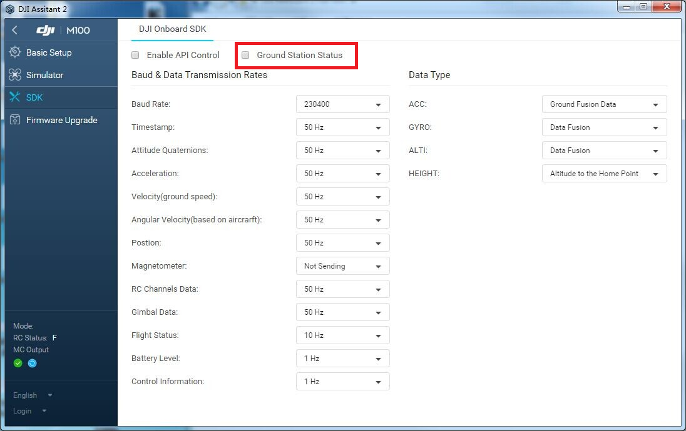

#### 本文档已停止维护, 请移步到DJI开发者官网的 <https://developer.dji.com/onboard-sdk/documentation/application-development-guides/ground-station-programming-guide.html> 查看最新版本. 

# 地面站编程指南

本文档记录了如何使用地面站接口进行航点、热点和跟随飞行的工作流程。

请参阅[地面站协议](GroundStationProtocol_cn.md)来查询具体的接口定义与参数。


## 航点任务

航点任务是地面站任务重的重要角色，开发者可以通过航点接口来控制飞机飞过一连串的坐标点（GPS经纬度）。

### 如何使用

1. 初始化航点任务

  在开始航点任务之前，开发者需要首先上传航点任务信息，再分别上传每一个航点的索引与具体参数。当两部分均上传完成后，开发者便可以命令开始执行航点任务。
  
  为了上传航点任务信息，开发者需要初始化如下信息：
  
  ```c
  typedef struct WayPointInitData
  {
    uint8_t indexNumber;
    float32_t maxVelocity;
    float32_t idleVelocity;

    uint8_t finishAction;
    uint8_t executiveTimes;
    uint8_t yawMode;
    uint8_t traceMode;
    uint8_t RCLostAction;
    uint8_t gimbalPitch;
    float64_t latitude;
    float64_t longitude;
    float32_t altitude;

    uint8_t reserved[16];
} WayPointInitData;
```

2. 上传航点信息

  当成功上传航点任务信息后，开发者可以根据索引上传每一个航点的具体内容。
  除了基本的参数之外，开发者也可以设定飞机在到达航点后执行的动作。
  
  ```c
  typedef struct WayPointData
  {
    uint8_t index;

    float64_t latitude;
    float64_t longitude;
    float32_t altitude;
    float32_t damping;

    int16_t yaw;
    int16_t gimbalPitch;
    uint8_t turnMode;

    uint8_t reserved[8];
    uint8_t hasAction;
    uint16_t actionTimeLimit;

    uint8_t actionNumber : 4;
    uint8_t actionRepeat : 4;

    uint8_t commandList[16];//! @note issues here list number is 15
    int16_t commandParameter[16];
  } WayPointData;
  ```
  
3. 开始航点任务

  当所有航点的信息都上传完毕后，开发者可以启动航点任务，飞机将自行进行航点飞行。

4. 其他航点接口

  除了上面提到的基本功能外，地面站协议中还提供了其他航点功能的接口，如暂停、回复、停止航点任务和设置任务的速度和速度上限。

  请参阅[地面站协议](GroundStationProtocol_cn.md)来查询具体的接口定义与参数。
  
## 热点环绕任务

热点环绕任务使得飞机可以围绕指定的兴趣点以特定半径进行环绕运动。

1. 初始化并开始热点环绕任务

  不同于航点任务，当开发者成功上传任务之后，热点环绕任务将会立即开始。
  
  热点环绕任务的初始化需要开发者设定兴趣点坐标，环绕半径、环绕速度和其他参数并上传。
  
  ```c
  typedef struct HotPointData
  {
    uint8_t version;

    float64_t latitude;
    float64_t longitude;
    float64_t height;

    float64_t radius;
    float32_t yawRate; // degree

    uint8_t clockwise;
    uint8_t startPoint;
    uint8_t yawMode;
    uint8_t reserved[11];
  } HotPointData;
  ```

2. 其他热点环绕任务接口

  除了开始任务之外，我们还提供了其他热点环绕任务的控制接口，比如暂停、恢复和停止任务。开发者也可以设置环绕的速度与环绕半径。

  请参阅[地面站协议](GroundStationProtocol_cn.md)来查询具体的接口定义与参数。
  
## 跟随任务

跟随任务允许飞机跟随目标点飞行，但开发者需要不断向飞机发送当前目标点的位置。


1. 初始化并开始跟随任务

  同热点环绕任务一样，跟随任务一旦上传成功后便会立即开始。
  
  初始化跟随任务的时候需要填写目标点的初始位置。

  ```c
  typedef struct FollowData
  {
    uint8_t mode;
    uint8_t yaw;
    float64_t latitude;
    float64_t longitude;
    uint16_t height;
    uint16_t angle;
    uint8_t sensitivity;
  } FollowData;
  ```
  
2. 更新目标点位置

  当开始跟随任务后，开发者需要不断更新当前目标点的位置。不然飞控会误以为目标点并没有移动而悬停在原地。
  
  ```c
  typedef struct FollowTarget
  {
    float64_t latitude;
    float64_t longitude;
    uint16_t height;
    uint16_t angle;
  } FollowTarget;
  ```

3. 其他跟随任务接口

  同样的，我们还提供了其他跟随任务的控制接口，比如暂停、恢复和停止任务。
  
  请参阅[地面站协议](GroundStationProtocol_cn.md)来查询具体的接口定义与参数。

## 状态推送和事件推送

  2.3 固件中有飞机状态信息的推送，在 3.0 固件中我们加入了地面站相关的推送信息。

  注意：开发者需要提前在调参中打开地面站消息推送选项。

  
  
1. 状态推送信息

  状态推送信息使用命令集 0x02，命令码 0x03。
  
  状态推送中一共包含四种状态信息，包括行点任务状态、热点任务状态、跟随任务状态和其他任务状态。
  
  请参阅[地面站协议](GroundStationProtocol_cn.md)来查询详细的推送内容。

2. 事件推送信息

  事件推送信息使用命令集 0x02，命令码 0x04。
  
  事件推送信息中只包含航点任务的事件，包括航点上传事件、任务结束事件和航点到达事件。
  
  请参阅[地面站协议](GroundStationProtocol_cn.md)来查询详细的推送内容。
