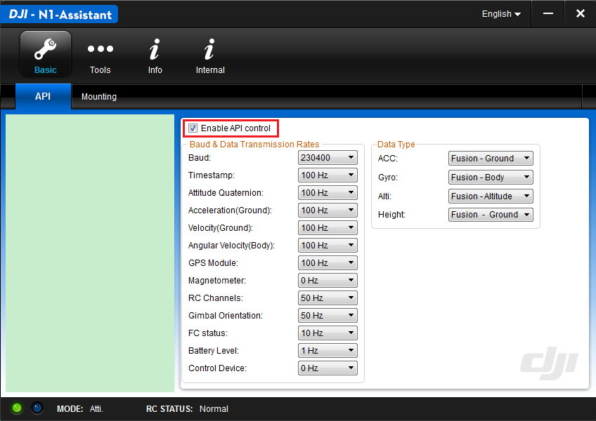
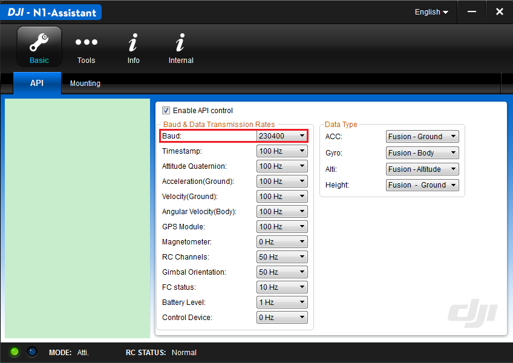

#### This documentation is now deprecated, please refer to <https://developer.dji.com/onboard-sdk/documentation/quick-start/index.html> in DJI Developer Website.

# Activation Guide
This document aims to help developers to understand and quickly activate the flight platform.

>Note: Please remove the propellers from your uav when following the steps.

## 1.	Become a DJI Developer
Please go to https://developer.dji.com/register/ and apply for an Onboard SDK access. You will receive your APP ID and Key once your application is approved.

## 2.	Enable API Control
Connect your UAV to your PC via a USB-to-MicroUSB cable. Launch the DJI Assistant and check the box next to "Enable API control”.

## 3.	Configure the Baud Rate
In case of the QT Sample, the baud rate is set to be 230400. Close the Assistant after finish.

## 4.	Connect Your Mobile Device
Ensure your Android or iOS mobile device has the internet connection ready, and connect it to the remote controller. Afterthat, launch the DJI GO app.

## 5.	Connect Your Onboard Devices
Connect your Onboard Devices to the Autopilot’s UART port.

**Note: Please connect the RX pin of Onboard device to Autopilot’s TX pin. Please connect the TX pin of Onboard device to Autopilot’s RX pin. Please the GND pin of Onboard device to Autopilot’s GND pin.**

## 6.	Activation
The following are using the “DJI_Onboard_SDK_Windows_QT_Sample” as an demonstration:
* Connect the Autopilot to your PC using a UART-to-USB cable.
* Launch the Windows QT Sample on your PC , configure the Baud rate on your PC so that it matches the rates of the UAV (For detail, please refer to step 3).
* Open the Serial Port and check the UAV info under the UAV Info Section on screen.
* Click the 'Activation' button to activate the Autopilot.

