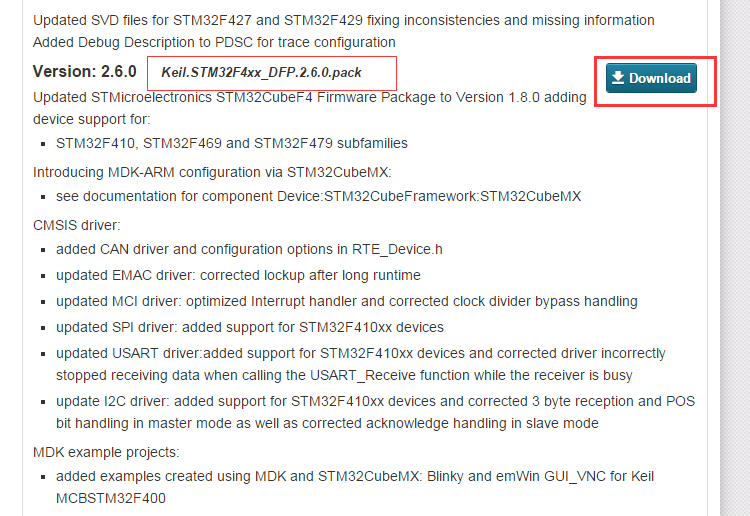
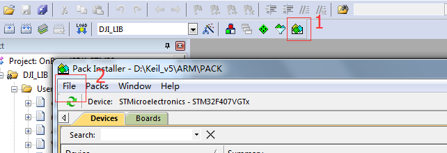
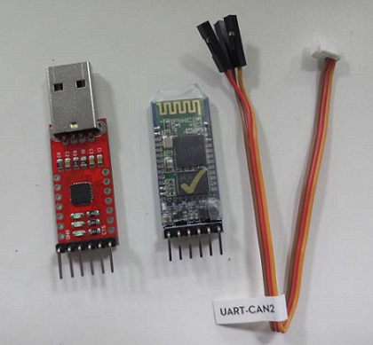
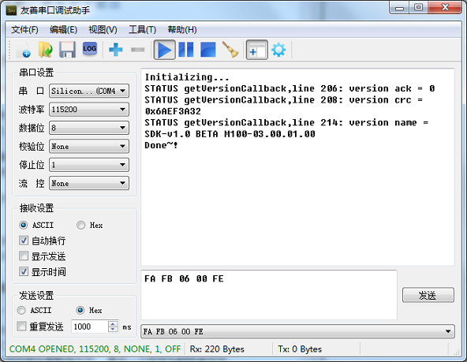
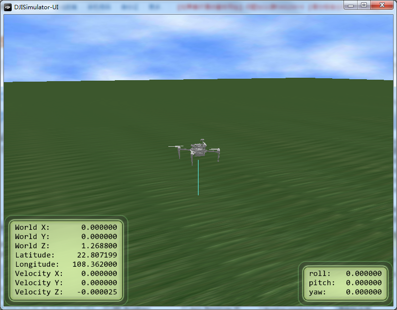
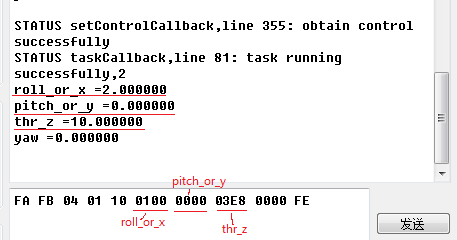
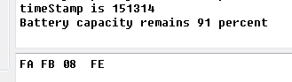
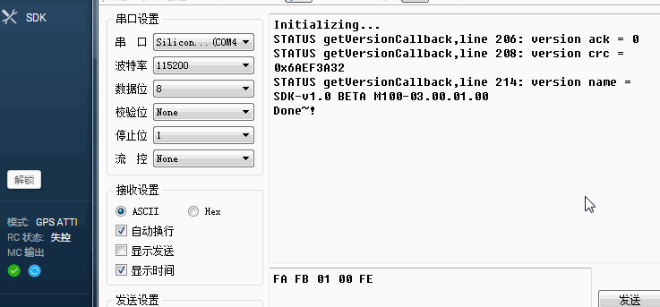
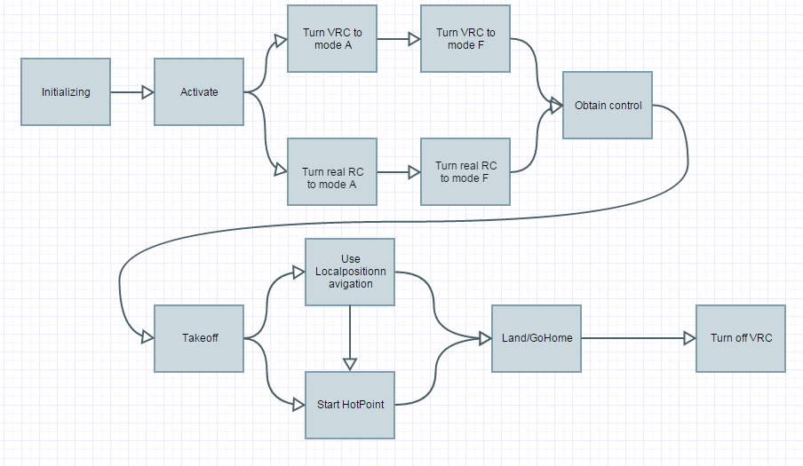

[English](#dji-onboard-stm32-example-program) |  [中文](#dji-onboard-stm32-例程)

#DJI Onboard STM32 例程

https://github.com/Awilonk/OnBoardSDK_STM32

##简介
本工程使用stm32f407Discovery开发板测试，使用Keil uVision5编译。使用串口和开发板通信，发送指令。  
采用四线串口协议，如果PC上没有串口，建议使用USB转串口模块，如MAX232、PL2303、CP2102等
在使用本例程前请确认你已经**仔细阅读过**有关OnboardSDK的**所有文档**

##目录
1. [硬件接口](#硬件接口)
2. [环境配置](#环境配置)
3. [开始使用](#开始使用)
   - [操作步骤](#操作步骤)
   - [指令格式](#指令格式)
   - [姿态控制模式](#姿态控制模式)
   - [获取广播数据](#获取广播数据)
   - [发送指令的顺序](#发送指令的顺序)
4. [动画示范](#动画示范)  

----------

##环境配置

本例程使用的是keil 5.12版本进行创建的。推荐使用更新版本的keil进行开发。

keil5系列软件中没有包含芯片器件库，需要自行安装否则会提示缺少芯片器件库。

安装方法如下： 在 http://www.keil.com/dd2/Pack/ 中找到Keil.STM32F4xx_DFP.2.6.0.pack并下载

然后在keil中选择 Pack Installer 选择File->Import

将下载到的器件库导入到keil中即可。

##硬件接口
  使用USART2作为Debug通道。端口为PB10，PB11分别对应stm32上USART2的TX、RX，连接串口等外部设备时将外部串口的TX端接到stm32的Rx上，波特率为115200，此处的波特率必须和串口调试助手的波特率一致；
使用USART3作为和M100上的N1飞控通信的接口。端口为PA2、PA3分别对应USART3的TX、RX，和N1飞控的“USART_CAN2”端口连接。波特率为 921600.此处的波特率必须和N1飞控的波特率一致，可以在DJI调参软件中调整； 

##开始使用
>第一次使用前请连接手机和遥控器，并按照官网提示激活飞机。[更多关于激活](https://developer.dji.com/cn/onboard-sdk/documentation/ActivationGuide/)  
第一次激活后可以使用虚拟遥控功能替代实体遥控器  

###操作步骤
1. 将M100上电（**注意，测试时请将螺旋桨拆下**）

2. 待M100启动后将stm32与之连接。由于M100没有提供3/5V电源接口，**请自行给stm32供电**。

3. 用串口将PC和stm32连接起来，建议购入usb延长线、各种无线透传模块，方便调试。  

本例程中所有通信方式都**已经设置为不加密**，如果需要加密，请自行配置。

硬件正确配置后，复位stm32。如果一切正常，你将会看到M100发送回来的版本信息，此时可以向M100发送测试指令

###指令格式

+ 一帧指令由帧头，指令集，指令，数据(可选),帧尾 构成;  
- 第一第二个字节为帧头，固定为0xFA 0xFB。
- 第三、第四个字节为指令。
- 中间可能会有数据字节，
+ 最后一个字节为帧结束字节。

单片机接收到帧结束字节0xFE后会立即开始一次命令响应。

>注意：这里所指的指令是PC向stm32发送的命令，发送时请勾选**Hex发送**而不是ASCII发送。M100发回来的调试信息也会发送到
PC上，所以在PC上的串口调试助手中**发送端选择HEX发送**，**接收端选择ASCII接收**，波特率为115200

例如：0xFA 0xFB 0x02 0x01 0xFE

已经支持的命令如下，需要更多指令请自行添加

|指令内容           | 指令代码             |
|:-----------------|:------------------|  
| 获取当前版本信息   | 0xFA 0xFB 0x00 0xFE |
|发送激活指令 		| 0xFA 0xFB 0x01 0xFE | 
|请求控制权   		|0xFA 0xFB 0x02 0x01 0xFE|  
|释放控制权   	 	|0xFA 0xFB 0x02 0x00 0xFE | 
|解锁电机   		 	|0xFA 0xFB 0x03 0x01 0xFE|  
|锁定电机  		 	|0xFA 0xFB 0x03 0x00 0xFE|  
|一键返航  		 	|0xFA 0xFB 0x05 0x01 0xFE|  
|一键起飞  		 	|0xFA 0xFB 0x05 0x02 0xFE|  
|一键降落  		 	|0xFA 0xFB 0x05 0x03 0xFE|  
|虚拟遥控开启（A档） |0xFA 0xFB 0x06 0x01 0xFE  |
|虚拟遥控开启（F档） |0xFA 0xFB 0x06 0x02 0xFE  |
|虚拟遥控关闭 	 	|0xFA 0xFB 0x06 0x00 0xFE | 
|开启热点功能 	 	|0xFA 0xFB 0x07 0x00 0xFE (参数已经预设,可以根据需要在程序中调整)| 
航点功能需自己输入参数 具体参见官方文档
这里给出一份样例

0xFA 0xFB 0x04 0x01 0x91 0x00 0x00 0x00 0x00 0x00 0x20 0x00 0x00 0xFE

其中 0x04 0x01为选择航点模式   
0x91 为模式标志字节  选择的模式为*VERT_POS* ，*HORI_POS* ，*YAW_RATE*， *Ground系* ，*增稳模式*  

+ 0x00 0x00 为X方向距离为0   
- 0x00 0x00 为Y方向距离为0  
- 0x01 0xf4 为Z方向距离为5.00m  
+ 0x00 0x00 为YAW方向不旋转  

*注意:HORI_POS模式的输入量是相对位置的净输入量。净输入量通过GPS或Guidance等传感器获得位置移动的反馈信息，与输入作差后得到。为完成飞行的位置控制，需要连续获得反馈并发送该命令，以达到平稳的控制效果。*

###姿态控制模式
姿态控制模式必须在起飞后开启。  
姿态控制模式需要用户自己向飞机发送数据。数据包括  
+ 模式标志字节 ctrl_flag
- Roll 轴或 X 轴控制量  roll_or_x
- Pitch 轴或 Y 轴控制量 pitch_or_y
- Throttle 或 Z 轴控制量 thr_z
- Yaw 轴控制量   yaw

由于例程使用串口助手给飞控发送命令，使用以下格式给飞机发送姿态数据  

0xFA 0xFB 0x04 0x01 **ctrl_flag,  roll_or_x_L,  roll_or_x_H,   pitch_or_y_L,  pitch_or_y_H,   thr_z_L,   thr_z_H,  yaw_L,  yaw_H** 0xFE

其中每个数据用两个八位的数据组合而成。默认是整数类型int,数据会被除以100。  
组合方式是先输入低八位，再输入高八位。  
例如：输入十进制的2564到 roll_or_x.则先转化为十六进制0x0A04.然后先发送低八位0x04，再发送高八位
0x0A。    
即:0xFA 0xFB 0x04 0x01 0x91 **0x0A 0x04**.......0xFE  
下面是一个示范：  
+ 第一步，起飞。  
- 第二部，发出期望的姿态指令。例如这里希望飞机的roll以2°的姿态在10m的高度飞行则发出相应指令    
+ 第三步，注意观察模拟器的右下角，飞机正在以指定的姿态飞行。    

如果对数据换算不是很熟练。可以使用换算姿态数据模式(0x04 0x02)。这个模式的输入逻辑和写入姿态数据的逻辑是一样的，区别是这个模式不会真的往飞机发送命令，而只是返回换算后的值供用户检验。可以把它当成一个计算器使用

值得注意的是，只要写入一次数据，stm32就会不断地向飞机发送之前已经写入的数据。要让stm32停止发送只要发送不是 0x04 0x01开头的命令就可以了。

更多关于姿态控制请参看手册    

###获取广播数据

获取广播数据只要发送0x08就可以了。现在打印了当前的时间戳和剩余电量，需要更多数据请自行添加
  

###发送指令的顺序

指令的发送是有顺序的

正确的顺序如下

如果使用了虚拟遥控，在正常飞行中物理遥控器**不能控制飞机**。程序中可以选择失去虚拟遥控信号1s后 *降落* 或者 *切换到物理遥控*。  
本例程中选择了失去虚拟遥控后直接降落模式。   

##动画示范
下面这个小动画演示了 读取版本信息->激活->打开虚拟遥控A档->虚拟遥控F档->获取控制权->一键起飞->打开热点功能->一键返航->关闭虚拟遥控功能。的过程

----------

#DJI Onboard STM32 Example Program

https://github.com/Awilonk/OnBoardSDK_STM32

##Introduction
This project uses stm32f407Discovery demoboard for testing, Keil uVision5 to complie. Serial port works as an interface to communicate with demoboard or send out command to M100.  
Use 4-wire-serial interface. If your computer do no has one, USB-TTL serial cable is necessary. CP2102 is recommend. Before using this example program, make sure you have **read all [documents](https://developer.dji.com/cn/onboard-sdk/documentation/ProgrammingGuide/) about OnboardSDK carefully.**  

##content
1. [Hardware Installation](#hardware-installation) 
2. [Environment Setup](#environment-setup)
3. [Getting Start](#getting-start)
   - [How to operate](#how-to-operate)
   - [Command Format](#command-format)
   - [Movement control mode](#movement-control-mode)
   - [Get Broadcastdata](#get-broadcastdata)
   - [How to send command](#how-to-send-command)
4. [Gif Demonstration](#gif-demonstration)

##Environment Setup

This sample code needs Keil v5.12 or later.

Deverlopers should install the MCU libaray by themselves from http://www.keil.com/dd2/Pack/ by downloading `Keil.STM32F4xx_DFP.2.6.0.pack`

and then import this file from Keil's `Pack Installer`

##Hardware Installation

Choose USART2 for debug. PB10, PB11 as stm32's TX, RX. When connect to an external device, link stm32-board's Rx to your device's TX. BaudRate is 115200.BaudRate here must be the same as BaudRate in your Serial debugging assistant.

Use USART3 for communicating with M100. PA2, PA3 as TX, RX, which should be plug in the "USART_CAN2" prot. The BaudRate here should equal to BaudRate of N1 flight control system on M100, which can be adjust on "DJI Assistant". 

##Getting Start

>The first connection between stm32f4 and M100 **MUST** use your mobile device and remote control. [More about activate](https://developer.dji.com/cn/onboard-sdk/documentation/ActivationGuide/)  
>After the first activate, a VIRTUAL REMOTE CONTROL can take the place of remote control.  

###How to operate

1. power on your M100 **WARNING! Remove the propellers if they are no in use!!**
2. when it's booted,connect stm32 with M100. Since there is no 3v/5v power interface on M100. **Please settle it by yourself. **Using a 26v to 5v Voltage Converter or UBEC(Ultra Battery Elimination Circuit) or ever a carrying a POWER BANK is OK.
3. Connect stm32 with PC by serial interface.Extension cord and wireless seral port are recommened when you are doing a test.

All the communication in this program **has been set to UNENCRYPTED**. If necessary, configre it in the program by yourself.

If the Hardware has been set correctly,reset your stm32. If everything is ok,there would be a version infomation callback by M100. Therefrom, system is ready for your command.

###Command Format

+ The protocol frame consist of Frame Header,Command,Data(optional),Frame Footer;  
- The first and second byte is frame header.  
- The third and fourth is command.  
- Followed is data(optional).  
+ The last byte is frame booter.  

When the microcontroller receive a "0xfe" would lead to a command response immediately.  

>Attention:Please configure your serial debugging assistant on **Hex transmit** and **ASCII receive**,BuadRate is 115200.

For instance:  0xFA 0xFB 0x02 0x01 0xFE

Command as below has been added to program.More command should adapter by yourself if needed.

|Command          | Code for command             |
|:-----------------|:------------------|  
|Get current version   | 0xFA 0xFB 0x00 0xFE |
|Send activate information | 0xFA 0xFB 0x01 0xFE | 
|Obtain control   		|0xFA 0xFB 0x02 0x01 0xFE|  
|Relese control   	 	|0xFA 0xFB 0x02 0x00 0xFE | 
|Arm    		 	|0xFA 0xFB 0x03 0x01 0xFE|  
|Disarm 		 	|0xFA 0xFB 0x03 0x00 0xFE|  
|Return to home(RTH)|0xFA 0xFB 0x05 0x01 0xFE|  
|Auto take off  	|0xFA 0xFB 0x05 0x02 0xFE|  
|Auto landing  		|0xFA 0xFB 0x05 0x03 0xFE|  
|Virtual RC on(mode A) |0xFA 0xFB 0x06 0x01 0xFE  |
|Virtual RC on(mode F) |0xFA 0xFB 0x06 0x02 0xFE  |
|Virtual Rc off 	 	|0xFA 0xFB 0x06 0x00 0xFE | 
|Start HotPoint 	 	|0xFA 0xFB 0x07 0x00 0xFE (paramenters are preset,configure it by yourself)| 

The Localpositionnavigation function need to enter parameter by yourself.Here gives an example.

0xFA 0xFB 0x04 0x01 0x91 0x00 0x00 0x00 0x00 0x00 0x20 0x00 0x00 0xFE

Among them, 0x04 0x01 means local position navigation.  
0x91 is the Control mode byte which is choosing *VERT_POS* ，*HORI_POS* ，*YAW_RATE*， *Frame* ，*Stable Mode*.  

+ 0x00 0x00 is the distance of X direction is 0;
+ 0x00 0x00 is the distance of Y direction is 0;
+ 0x01 0xf4 is the distance of Z direction is 5.00m;
+ 0x00 0x00 is the Yaw direction don't rotate.
  

*Attention:The input of HORI_POS is a position offset instead of an actual position. This design aims to take both GPS flight and vision-based flight into consideration. If the developer wants to use GPS navigation, the GPS information sent by the UAV can be used to calculate position offset. While in vision-based flight application, developers should have their own positioning device (along with Gudiance or GPS to provide velocity measurement) to do position control.*   

###Movement control mode
Movement control mode can no be use before **Take off**.  
Attitude control mode needed user sending flight data.data include:
+ Control mode byte
- Roll or X-axis control value
- Pitch or Y-axis control value
- Throttle or Z-axis control value
+ Yaw control value  

Since this example program use serial assistant to send cmd and data to the UAV, we use data format as below to send flight data to the UAV.  

  
0xFA 0xFB 0x04 0x01 **ctrl_flag,  roll_or_x_L,  roll_or_x_H,   pitch_or_y_L,  pitch_or_y_H,   thr_z_L,   thr_z_H,  yaw_L,  yaw_H** 0xFE
 
Among this frame,every single data consist of two bytes.Default type of data is integer，raw data would be devide by 100.    
 Low byte comes first and Hight byte comes later.  

e.g. To enter 2564 to roll_or_x.First,transform to hexadecimal,which is 0xA04. Low byte 0x04 send first,high byte 0x0A comes later.  
i.e. 0xFA 0xFB 0x04 0x01 0x91 **0x0A 0x04**.......0xFE    

Here is an example:  
+ **step 1**: Take off.  
- **step 2**: Send out flight data that request UAV to excute.   
 
+ **step 3**: Pay attention to the lower right corner of simulator,UAV is flying on the movement you specify.     

If you are unfamiliar with this data transform,a convert flight data displayer is provided. The only difference from the Input flight data mode is it would no really send out data,it just display it. You can also use it as a calculator.

It's worth noting that,once using Input flight data mode, the data you input would sequential send to the UAV. Sending a cmd start with other from 0x04 0x01 would **stop** sending data, UAV would try to stop and hover there. 

###Get Broadcastdata
To get broadcastdata send back by the UAV,send cmd 0x08.Timestamp and battery capacity remain are printed now.Add more if you needed.
   

###How to send command  
The command should be send in sequence.  

A normal order of it are as below:  

  

If using Virtual RC,the real RC **can no control the UAV**. When losing signal of Virtual RC longer than 1s, UAV would Land or cutt off to real RC.  
This program choose to land after losing Virtual RC  

###Gif Demonstration
This little gif demonstrate how to send command using Serial debugging assistant.  
It shows a typical command flow like:
Read current version->Activate->Turn VRC to mode A->Turn VRC to mode F->Obtain control->Take off->Start HotPoint->GoHome->Turn VRC.  
