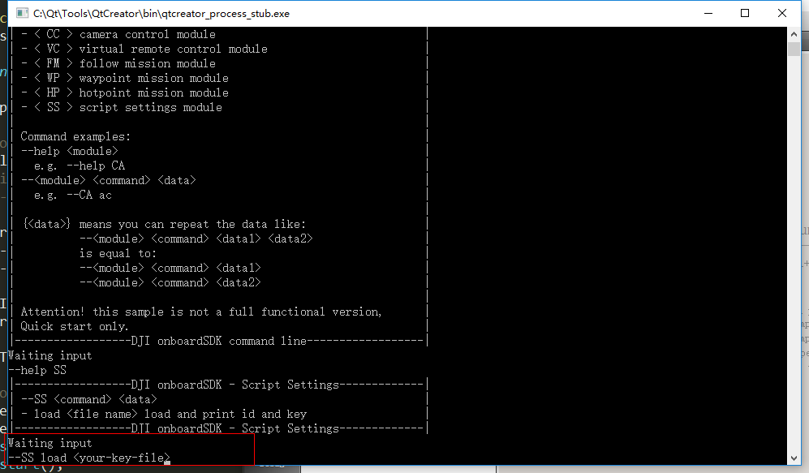

#DJI Onboard SDK Command Line Sample

##Intro

The terminal example is an implementation of DJI Script inside library.

With it you can run the following commands:

* The Activation
* The Flight Control Obtainment
* The Flight control release
* The Take Off Procedure
* The Landing Procedure
* The Go Home Procedure
* The Attitude Control
* The Gimbal Control
* The Camera Control
* The Waypoint Task Control
* The Hotpoint Task Control
* The Follow Me Task Control

## Hardware Installation
* In order to communicate with the N1 Autopilot via the DJI OPEN protocal, a physical connection between your Onboard Device and the N1 Autopilot is required with a USB to TTL serial cable (SOLD Seperately).
* In order to monitor & control the flight, a remote controller connects to your Mobile Device (with the DJI GO APP running) is needed.

##Configs

We provided the sample code in both Linux and Windows platform.
The one in Windows platform is compiled with the help of QT, while the Linux one is running with Makefile.

To setup:

1. Set up the correct serial port and baudrate in `main.cpp` (especially when running in Linux platform)
2. When running the example, you are required to set up the key first, an example format is the `key.txt`, after that you need to link the key file with you program like this:

	

ENJOY your flight!

#DJI Onboard SDK 终端例程

##简介

终端例程是基于库中 DJI Script 的实现。

它可以完成如下命令：

* 激活
* 获取控制权
* 释放控制权
* 起飞
* 降落
* 自动返航
* 姿态控制
* 云台控制
* 相机控制
* 航点指令
* 热点环绕指令
* 智能跟随指令

##硬件安装

* 为了能够与 M100 的 N1 主控进行通信，开发者需要自行购买 USB 转 TTL 的串口转接模块。

* 为了更好的监控飞机状态，我们建议开发者在调试的时候运行 DJI GO 来实时查看飞机当前状态信息。

##配置

我们提供了 Linux 与 Windows 系统下的例程，其中 Windows 版本的需要依赖于 QT 环境进行编译，而 Linux 我们提供好了 Makefile

在开始之前：

1. 开发者需要在 `main.cpp` 中输入合适的串口设备名称和波特率（尤其是 Linux 平台）
2. 在实际运行之时，开发者需要首先配置好自己的key文件，一个格式样例是 `key.txt` ，并且在运行例程时首先在程序中配置 key 文件的位置，如图：

	
	
